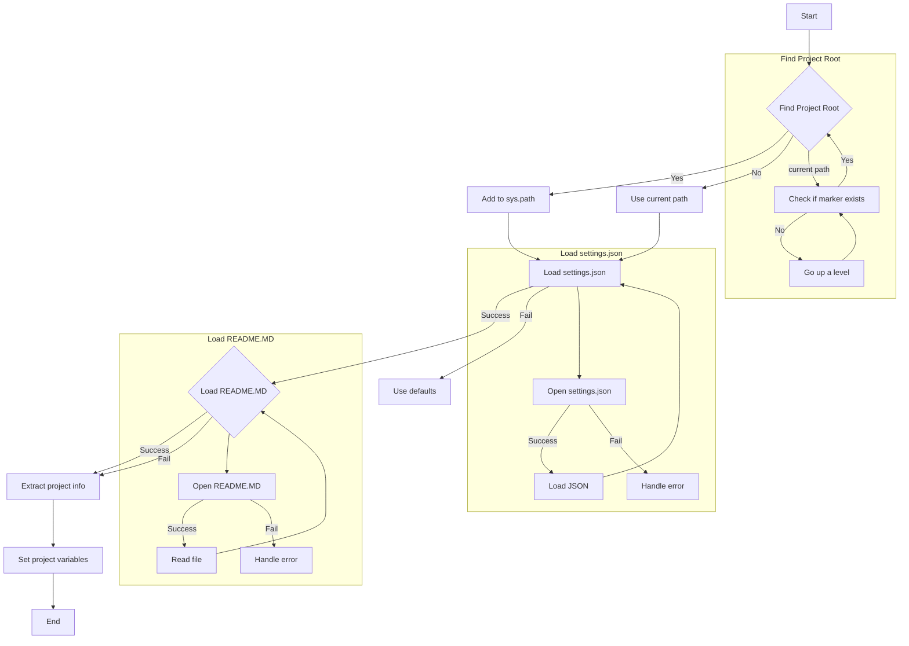
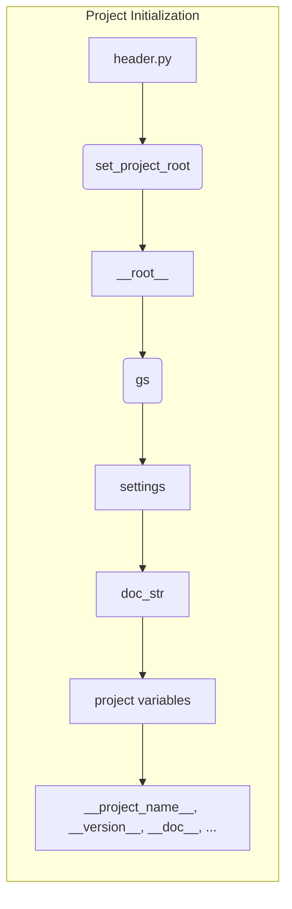

```MD
# Анализ файла `hypotez/src/suppliers/wallmart/header.py`

## <input code>

```python
## \file hypotez/src/suppliers/wallmart/header.py
# -*- coding: utf-8 -*-\n#! venv/Scripts/python.exe
#! venv/bin/python/python3.12
"""
.. module: src.suppliers.wallmart 
	:platform: Windows, Unix
	:synopsis:

"""
MODE = 'dev'


import sys
import json
from packaging.version import Version
from pathlib import Path
def set_project_root(marker_files=('pyproject.toml', 'requirements.txt', '.git')) -> Path:
    """
    Finds the root directory of the project starting from the current file's directory,
    searching upwards and stopping at the first directory containing any of the marker files.

    Args:
        marker_files (tuple): Filenames or directory names to identify the project root.
    
    Returns:
        Path: Path to the root directory if found, otherwise the directory where the script is located.
    """
    __root__:Path
    current_path:Path = Path(__file__).resolve().parent
    __root__ = current_path
    for parent in [current_path] + list(current_path.parents):
        if any((parent / marker).exists() for marker in marker_files):
            __root__ = parent
            break
    if __root__ not in sys.path:
        sys.path.insert(0, str(__root__))
    return __root__


# Get the root directory of the project
__root__ = set_project_root()
"""__root__ (Path): Path to the root directory of the project"""


from src import gs

settings:dict = None
try:
    with open(gs.path.root / 'src' / 'settings.json', 'r') as settings_file:
        settings = json.load(settings_file)
except (FileNotFoundError, json.JSONDecodeError):
    ...


doc_str:str = None
try:
    with open(gs.path.root / 'src' / 'README.MD', 'r') as settings_file:
        doc_str = settings_file.read()
except (FileNotFoundError, json.JSONDecodeError):
    ...


__project_name__ = settings.get("project_name", 'hypotez') if settings  else 'hypotez'
__version__: str = settings.get("version", '')  if settings  else ''
__doc__: str = doc_str if doc_str else ''
__details__: str = ''
__author__: str = settings.get("author", '')  if settings  else ''
__copyright__: str = settings.get("copyrihgnt", '')  if settings  else ''
__cofee__: str = settings.get("cofee", "Treat the developer to a cup of coffee for boosting enthusiasm in development: https://boosty.to/hypo69")  if settings else "Treat the developer to a cup of coffee for boosting enthusiasm in development: https://boosty.to/hypo69"
```

## <algorithm>



Этот алгоритм находит корень проекта, загружает информацию из `settings.json` и `README.MD`, если они существуют, а затем устанавливает переменные проекта. Если файлы не найдены, используются значения по умолчанию.


## <mermaid>



Зависимость: `header.py` использует `gs` для доступа к путям к файлам настроек и README.


## <explanation>

**Импорты:**

- `sys`: Модуль для доступа к системным переменным, включая `sys.path`, что необходимо для корректного импорта модулей из корня проекта.
- `json`: Модуль для работы с JSON-файлами, используемый для загрузки настроек проекта из `settings.json`.
- `packaging.version`: Модуль для работы с версиями пакетов, вероятно, используется для обработки версий.
- `pathlib`: Модуль для работы с путями, позволяет более удобно работать с файловой системой.
- `src.gs`:  Судя по коду, `gs` — это модуль, который содержит информацию о пути к корню проекта.

**Функции:**

- `set_project_root(marker_files)`: Функция находит корневой каталог проекта, начиная с текущего файла и поднимаясь по древу каталогов, пока не найдет директорию, содержащую указанные файлы (например, `pyproject.toml`, `requirements.txt`, `.git`). Это важно для корректной работы импорта и поиска зависимостей проекта. Она возвращает объект `Path` с путем к корню проекта и добавляет этот путь в `sys.path`, если он там еще не присутствует.
   - Аргумент `marker_files` предоставляет список файлов, по наличию которых определяется корень проекта. Это повышает надежность поиска корня проекта, так как не полагается на жестко заданные пути.
   - Возвращает `Path` к корню проекта.
   - Обработка ошибок: не предполагается, но при отсутствии указанных файлов в иерархии каталогов будет возвращен путь к текущему каталогу.


**Классы:**

В файле нет определенных классов.

**Переменные:**

- `MODE`: Строковая переменная, содержащая значение 'dev', скорее всего, для обозначения режима работы программы.
- `__root__`: Переменная, содержащая объект `Path` к корню проекта.
- `settings`: Словарь, содержащий настройки проекта, загруженные из `settings.json`.
- `doc_str`: Строка, содержащая содержимое файла `README.MD`.
- `__project_name__`, `__version__`, `__doc__`, `__details__`, `__author__`, `__copyright__`, `__cofee__`: Переменные, содержащие информацию о проекте, полученные из `settings`.  Используются для метаданных проекта.

**Возможные ошибки/улучшения:**

- **Обработка ошибок:** Блок `try...except` при чтении `settings.json` и `README.MD` обрабатывает возможные ошибки (`FileNotFoundError`, `json.JSONDecodeError`). Однако, эти ошибки могут возникать и по другим причинам.  Стоит добавить более подробную информацию об ошибках, например, сообщать какой файл не найден и в каком месте произошло исключение.
- **Проверка корректности данных:** После загрузки настроек (settings) полезно добавить проверку корректности данных. Например, убедиться, что `project_name` — строка, `version` — строка, подходящая для формата версий, и т.д.
- **Использование `os.path.abspath`**:  Возможно, вместо `Path(__file__).resolve().parent` целесообразно использовать `os.path.abspath` для получения пути, что будет немного более портативно, и возможно, немного быстрее.


**Взаимосвязи с другими частями проекта:**

Файл `header.py` является частью общей структуры проекта, необходимой для инициализации.  Файл `gs` определяет пути к файлам конфигурации (`settings.json`, `README.MD`), что обеспечивает инкапсуляцию и независимость от конкретных путей.  Другие модули проекта будут импортировать необходимые переменные (`__root__`, `settings`, `__version__`), определяющие конфигурацию проекта.