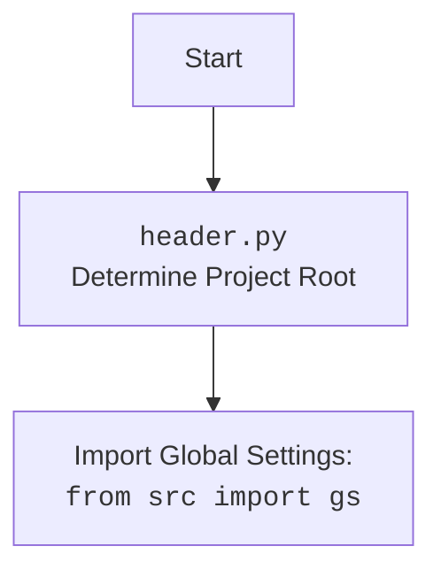

## Анализ кода `hypotez/src/suppliers/wallmart/header.py`

### 1. <алгоритм>

**Пошаговая блок-схема:**

1.  **Начало:** Запуск скрипта `header.py`.
2.  **Определение `set_project_root`:**
    *   Инициализация: `current_path` = путь к директории, где находится `header.py`.
    *   Поиск родительских директорий: Перебор `current_path` и всех его родительских директорий.
        *   Проверка: Для каждой директории проверяется наличие одного из `marker_files` (`__root__`, `.git`).
        *   Если маркер найден:
            *   `__root__` = путь к директории с маркером.
            *   Прерывание цикла.
    *   Добавление `__root__` в `sys.path` (если его там нет).
    *   Возврат: `__root__` (путь к корневой директории проекта).
        *   Пример: Если `header.py` находится в `hypotez/src/suppliers/wallmart`, а `.git` в `hypotez`, то `__root__` будет `hypotez`.
3.  **Инициализация `__root__`:** Вызов `set_project_root()` и присвоение результата переменной `__root__`.
4.  **Импорт `gs`:** Импорт глобальных настроек из `src.gs` (`from src import gs`).
5.  **Загрузка настроек `settings`:**
    *   Попытка открытия файла `settings.json` (путь: `gs.path.root / 'src' / 'settings.json'`).
    *   Если файл существует, загрузка JSON в словарь `settings`.
    *   Если файл не найден или JSON некорректен, `settings` остается `None`.
6.  **Загрузка документации `doc_str`:**
    *   Попытка открытия файла `README.MD` (путь: `gs.path.root / 'src' / 'README.MD'`).
    *   Если файл существует, чтение содержимого в строку `doc_str`.
    *   Если файл не найден, `doc_str` остается `None`.
7.  **Инициализация переменных:**
    *   `__project_name__` = значение из `settings` или 'hypotez'.
    *   `__version__` = значение из `settings` или ''.
    *   `__doc__` = значение из `doc_str` или ''.
    *   `__details__` = ''.
    *   `__author__` = значение из `settings` или ''.
    *   `__copyright__` = значение из `settings` или ''.
    *   `__cofee__` = значение из `settings` или стандартное сообщение.
8.  **Конец.**

**Примеры:**

*   **Пример поиска `__root__`**: Если структура каталогов `hypotez/src/suppliers/wallmart/header.py` и маркер `.git` находится в `hypotez`, функция `set_project_root` вернет путь к директории `hypotez`.
*   **Пример чтения `settings.json`**: Если `settings.json` содержит `{"project_name": "my_project", "version": "1.0.0"}`, то `__project_name__` станет "my_project", `__version__` станет "1.0.0".
*   **Пример обработки ошибок**: Если файл `settings.json` не найден, то переменные будут установлены в значения по умолчанию.

### 2. <mermaid>

```mermaid
flowchart TD
    Start --> SetProjectRoot[set_project_root() <br> Determine Project Root]
    SetProjectRoot --> FindParentDir[Find Parent Directories with Markers]
    FindParentDir --> CheckMarkers[Check for Markers (__root__, .git)]
    CheckMarkers -- Marker Found --> SetRoot[Set __root__ to Parent Directory]
    CheckMarkers -- Marker Not Found --> NextParentDir[Move to Next Parent Directory]
    NextParentDir --> CheckMarkers
    CheckMarkers -- No More Parent Directories --> DefaultRoot[Use Initial Path as __root__]
    SetRoot -->  AddRootToSysPath[Add __root__ to sys.path if needed]
    DefaultRoot --> AddRootToSysPath
    AddRootToSysPath --> ReturnRoot[Return __root__]
    ReturnRoot --> AssignRoot[__root__ = Return Value]
    AssignRoot --> ImportGlobalSettings[Import Global Settings: <br><code>from src import gs</code>]
    ImportGlobalSettings --> LoadSettings[Load Settings from settings.json]
    LoadSettings --> LoadDocString[Load Documentation from README.MD]
    LoadDocString --> InitializeVariables[Initialize Project Variables<br>(__project_name__, __version__, ...)]
    InitializeVariables --> End
    
```

**Импортированные зависимости `mermaid`:**

В данном `mermaid` коде нет импортированных зависимостей. `mermaid` является языком разметки для создания диаграмм, а не программной библиотекой. Код `mermaid` преобразуется в графическое изображение с помощью специального рендера.

**Объяснение:**

*   `Start`: Начало выполнения скрипта.
*   `SetProjectRoot`: Вызов функции `set_project_root()` для определения корневой директории проекта.
*   `FindParentDir`:  Начало поиска родительских директорий.
*   `CheckMarkers`: Проверка наличия маркерных файлов в текущей директории.
*   `SetRoot`: Установка корневой директории проекта, если маркер найден.
*   `NextParentDir`: Переход к следующей родительской директории.
*   `DefaultRoot`:  Установка корневой директории по умолчанию (если маркеры не найдены).
*   `AddRootToSysPath`:  Добавление пути к корневой директории в системный путь, если это необходимо.
*    `ReturnRoot`: Возврат пути к корневой директории.
*    `AssignRoot`: Присвоение возвращенного значения переменной `__root__`.
*   `ImportGlobalSettings`: Импорт глобальных настроек из модуля `src.gs`.
*   `LoadSettings`: Загрузка настроек из файла `settings.json`.
*   `LoadDocString`: Загрузка документации из файла `README.MD`.
*   `InitializeVariables`: Инициализация переменных проекта, таких как `__project_name__`, `__version__` и т.д.
*   `End`: Конец выполнения скрипта.

**Дополнительный `mermaid` блок для `header.py`**

**Объяснение:**
* `Start`: Начало выполнения скрипта
* `Header`: Указание, что рассматривается файл `header.py`
* `import`: Указание, что происходит импорт глобальных настроек.

### 3. <объяснение>

**Импорты:**

*   `sys`: Используется для модификации `sys.path`, чтобы добавить корневую директорию проекта в пути поиска модулей.
*   `json`: Используется для загрузки настроек из файла `settings.json`.
*   `packaging.version.Version`: Импортирован, но не используется в данном коде. Возможно, задел на будущее для работы с версиями.
*   `pathlib.Path`: Используется для работы с путями файловой системы.
*   `src.gs`: Импортируется для доступа к глобальным настройкам проекта, включая путь к корневой директории.

**Функции:**

*   `set_project_root(marker_files: tuple = ('__root__', '.git')) -> Path`:
    *   **Аргументы:**
        *   `marker_files` (tuple): Кортеж имен файлов или директорий, которые определяют корневую директорию. По умолчанию `('__root__', '.git')`.
    *   **Возвращаемое значение:**
        *   `Path`: Объект `Path` корневой директории проекта.
    *   **Назначение:** Находит корневую директорию проекта, начиная с директории, в которой находится текущий скрипт, и ищет родительские директории, пока не найдет одну из директорий или файлов, перечисленных в `marker_files`. Добавляет найденный путь в `sys.path`, чтобы модули из корневой директории могли быть импортированы.
    *   **Пример:**
        ```python
        root_dir = set_project_root(marker_files=('.git', 'project_marker.txt'))
        print(root_dir) # Выведет путь к корневой директории проекта
        ```

**Переменные:**

*   `__root__` (Path): Путь к корневой директории проекта. Определяется функцией `set_project_root` и используется для доступа к файлам проекта.
*   `settings` (dict): Словарь, содержащий настройки проекта, загруженные из `settings.json`. Изначально `None`.
*   `doc_str` (str): Строка, содержащая содержимое файла `README.MD`. Изначально `None`.
*   `__project_name__` (str): Название проекта, загруженное из настроек или 'hypotez'.
*   `__version__` (str): Версия проекта, загруженная из настроек или ''.
*   `__doc__` (str): Строка с документацией проекта.
*   `__details__` (str): Строка с деталями проекта.
*   `__author__` (str): Автор проекта, загружен из настроек или ''.
*   `__copyright__` (str): Копирайт проекта, загружен из настроек или ''.
*    `__cofee__` (str): Строка с сообщением о кофе, загружен из настроек или стандартное сообщение.

**Потенциальные ошибки и области для улучшения:**

*   **Обработка ошибок**:  Ошибка при открытии файла `settings.json` и `README.MD` обрабатывается `try-except` блоком с `pass`, что означает, что ошибки просто игнорируются. Было бы полезно логировать эти ошибки или использовать значения по умолчанию.
*  **`packaging.version`**: Импортирован, но не используется. Возможно, имеет смысл удалить или реализовать функционал, связанный с версиями.
*   **Жестко заданные пути:** Путь к `settings.json` и `README.MD` задан как `'src' / 'settings.json'`. Возможно, имеет смысл вынести `'src'` в отдельную переменную.
*   **Отсутствие типов**: В некоторых переменных нет аннотаций типов.
*    **`__details__`**: Переменная не загружается из какого либо файла, имеет значение по умолчанию ''.

**Взаимосвязи с другими частями проекта:**

*   **`src.gs`**: Используется для доступа к глобальным настройкам и путям, что позволяет `header.py` находить корневую директорию и файлы настроек.

**Цепочка взаимосвязей:**

`header.py` -> `src.gs` -> `settings.json` / `README.MD`

**Итог:**

`header.py` - это важный модуль для проекта `hypotez`, поскольку он определяет корневую директорию, загружает основные настройки проекта и устанавливает переменные, доступные во всем проекте.