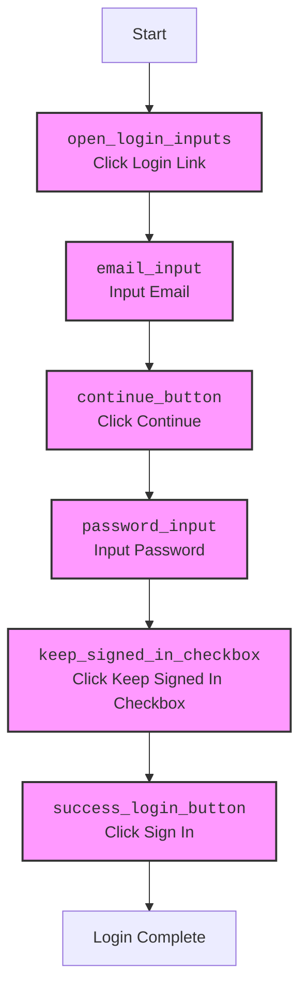

## АНАЛИЗ КОДА:

### 1. <алгоритм>

**JSON файл `login.json`** описывает шаги для автоматизации процесса входа в аккаунт на веб-сайте (скорее всего, это amazon.com). Каждый ключ внутри объекта `login` представляет собой отдельный шаг, а значения ключей — это параметры для этого шага, такие как локатор элемента, тип события и т.д.
Основные шаги процесса авторизации следующие:
1. **`open_login_inputs`**: Нажатие на ссылку для открытия окна ввода логина.

*   **Пример**: Кликаем на "Hello, sign in" - для открытия окна ввода

2.  **`email_input`**: Ввод email в поле ввода.

*   **Пример**: Ввод '972547519449' в поле для email

3. **`continue_button`**: Нажатие кнопки "Continue" для перехода к следующему шагу.

*   **Пример**: Клик на кнопку "Continue" после ввода email

4. **`password_input`**: Ввод пароля.

*   **Пример**: Ввод '52UldxjzWGpdEQxWaNMY' в поле для пароля

5. **`keep_signed_in_checkbox`**: Выбор чекбокса "Keep me signed in", для запоминания сессии

*    **Пример**: Клик на чекбокс "Keep me signed in"

6. **`success_login_button`**: Нажатие кнопки "Sign in" для завершения процесса входа.

*   **Пример**: Клик на кнопку "Sign in" для завершения процесса авторизации

### 2. <mermaid>

### 3. <объяснение>
Этот JSON файл представляет собой набор локаторов и действий для автоматизации процесса входа на веб-сайт. Он содержит информацию о каждом элементе, необходимом для входа, включая его XPath селектор, событие (например, клик или ввод текста), и прочие параметры.

**Структура файла:**
- Основной ключ `"login"` содержит объект, в котором каждый ключ представляет собой отдельный шаг процесса входа.

**Ключи шагов (например, `open_login_inputs`, `email_input`):**
- `"attribute"`: Атрибут HTML элемента. В данном случае, все равны `null`.
- `"by"`: Метод поиска элемента, в данном случае - `XPATH`.
- `"selector"`: Строка XPath селектора для определения местонахождения элемента на веб-странице.
- `"if_list"`:  Указывает, как обрабатывать результаты поиска в списке элементов. Значение `"first"` означает, что нужно выбрать первый элемент из списка.
- `"use_mouse"`: Флаг указывающий на использование мыши, все равны `false`.
- `"mandatory"`: Обязателен ли данный шаг, все равны `true`.
- `"timeout"`: Максимальное время ожидания элемента. Все равны `0`.
- `"timeout_for_event"`: Событие, которое ожидает драйвер. `presence_of_element_located` означает ожидание появления элемента в DOM.
- `"event"`: Описание действия над элементом. Может быть кликом (`click()`) или вводом текста (`send_keys('текст')`).
- `"logic for action[AND|OR|XOR|VALUE|null]"`:  Логика для выполнения действия, все равны `null`.

**Примеры значений:**
- `"selector": "//span[@id='nav-link-accountList-nav-line-1']"` : XPath селектор для поиска элемента по его ID.
- `"event": "click()"`: Событие клика на элементе.
- `"event": "send_keys('972547519449')"`: Событие ввода текста в поле.

**Потенциальные ошибки и улучшения:**
1.  **Жестко закодированные значения:** Пароль и email в `send_keys()` в полях ввода, не должны быть в открытом виде. Их следует получать из внешних источников (например, переменные окружения, конфиги).
2.  **Отсутствие обработки ошибок:** Код не учитывает возможные ошибки при поиске или взаимодействии с элементами.
3. **Ограниченность:** Привязка к конкретной структуре сайта. При изменении HTML-разметки, XPath селекторы станут недействительными.
4. **Timeout:** 0 секунд timeout может не хватить при медленной загрузке страницы.

**Цепочка взаимосвязей:**

Этот файл `login.json` используется в рамках системы автоматизированного тестирования или RPA (Robotic Process Automation), где данные из JSON используются для управления браузером и взаимодействием с веб-элементами. Локаторы и события этого файла могут использоваться классами для выполнения действий на сайте.