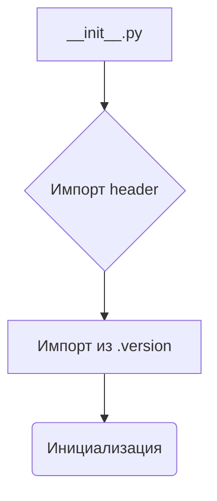

```MD
# Анализ файла `hypotez/src/templates/__init__.py`

## <input code>

```python
## \file hypotez/src/templates/__init__.py
# -*- coding: utf-8 -*-
#! venv/Scripts/python.exe
#! venv/bin/python/python3.12

"""
.. module: src.templates 
	:platform: Windows, Unix
	:synopsis:

"""
MODE = 'dev'

"""
	:platform: Windows, Unix
	:synopsis:

"""


"""
	:platform: Windows, Unix
	:synopsis:

"""


"""
  :platform: Windows, Unix

"""
"""
  :platform: Windows, Unix
  :platform: Windows, Unix
  :synopsis:
"""MODE = 'dev'
  
""" module: src.templates """


""" HERE SHOULD BE A DESCRIPTION OF THE MODULE OPERATION ! """

import header 
...

from packaging.version import Version
from .version import __version__, __doc__, __details__ 
```

## <algorithm>

Этот файл, `__init__.py`, скорее всего, служит файлом инициализации для пакета `templates` внутри проекта `hypotez`.  Поскольку он пуст (кроме импортов), он не содержит какой-либо значимой логики.  Алгоритм состоит исключительно из импорта модулей.  Схема будет простой:




Пример:
Файл просто импортирует необходимые модули для дальнейшего использования в других частях проекта.


## <mermaid>

```mermaid
graph LR
    subgraph "Инициализация пакета templates"
        A[__init__.py] --> B{Импорт header};
        A --> C[Импорт из .version];
        B -- импорт -- > D[header.py];
        C -- импорт -- > E[.version.py];
    end
    style B fill:#f9f,stroke:#333,stroke-width:2px
    style C fill:#ccf,stroke:#333,stroke-width:2px
```


## <explanation>

* **Импорты**:
    * `import header`: Импортирует модуль `header`.  Это ключевой импорт, указывающий на наличие другого модуля, вероятно, содержащего общие функции или константы для пакета `templates`.  Местоположение этого файла (`header.py`) неизвестно из предоставленного кода. Подробнее о его содержимом и использовании нужно узнать из контекста проекта.
    * `from packaging.version import Version`: Импортирует класс `Version` из пакета `packaging`. Он используется для работы с версиями пакетов, вероятно, для проверки версий или сравнения. `packaging` - это сторонний пакет, предоставляющий инструменты для работы с пакетами Python.
    * `from .version import __version__, __doc__, __details__`: Импортирует переменные `__version__`, `__doc__`, `__details__` из модуля `.version` внутри пакета `templates`. Это стандартный способ определения метаданных (версия, документация) для пакета.  `.version` вероятно хранит информацию о версии пакета.

* **Классы**:  В коде нет определенных классов.

* **Функции**:  Нет функций.

* **Переменные**:
    * `MODE = 'dev'`: Переменная, хранящая строковое значение 'dev', вероятно, для определения режима работы (например, "разработка", "производство").

* **Возможные ошибки или области для улучшений**:
    * **Неопределённые пути**: Необходим анализ местоположения и содержимого файла `header.py` и `.version.py` для более полного понимания функциональности.
    * **Отсутствие документации**: Не хватает описания того, как данный модуль работает в целом.


**Цепочка взаимосвязей:**

`hypotez/src/templates/__init__.py` импортирует модули из `header.py` и `.version.py` в пакете `hypotez/src/templates`. Эти модули, вероятно, определяют функции и данные, используемые в пакете `templates`, делая его компонентом более крупной системы. Без знания `header.py` сложно сказать, как этот модуль используется и какую функцию он выполняет, поэтому дальнейшая информация о коде нужна.