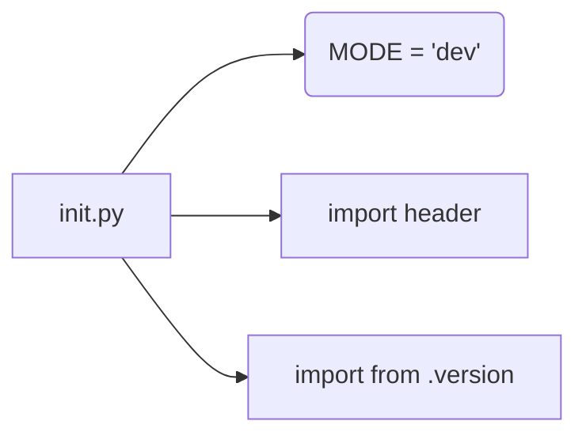

```MD
# Анализ кода hypotez/src/templates/__init__.py

**1. <input code>**

```python
## \file hypotez/src/templates/__init__.py
# -*- coding: utf-8 -*-\
#! venv/Scripts/python.exe
#! venv/bin/python/python3.12

"""
.. module: src.templates 
	:platform: Windows, Unix
	:synopsis:

"""
MODE = 'dev'

"""
	:platform: Windows, Unix
	:synopsis:

"""


"""
	:platform: Windows, Unix
	:synopsis:

"""


"""
  :platform: Windows, Unix

"""
"""
  :platform: Windows, Unix
  :platform: Windows, Unix
  :synopsis:
"""MODE = 'dev'
  
""" module: src.templates """


""" HERE SHOULD BE A DESCRIPTION OF THE MODULE OPERATION ! """

import header 
...

from packaging.version import Version
from .version import __version__, __doc__, __details__ 
```

**2. <algorithm>**

Этот файл `__init__.py` является инициализатором модуля `templates` в пакете `src`.  Поскольку он пуст, кроме импорта и констант, алгоритм работы сводится к инициализации переменных и импорту необходимых модулей.  В нем нет циклов или сложных ветвлений.

**Пример:**

* **Инициализация:** Переменная `MODE` устанавливается в строку `'dev'`.
* **Импорт:** Модуль `header` и другие модули импортируются для последующего использования.

**Перемещение данных:**

Данные не перемещаются, т.к. действия при инициализации и импорте не подразумевают сложных операций перемещения данных между функциями, классами или методами.

**3. <mermaid>**



**4. <explanation>**

* **Импорты:**
    * `import header`: Импортирует модуль `header`, предполагая, что он находится в той же директории или в доступном пути. Связь с проектом — предполагается, что `header` выполняет некоторые предварительные действия или содержит данные, необходимые модулю `templates`. Без определения содержимого `header`, сложно определить точную роль.
    * `from packaging.version import Version`: Импортирует класс `Version` из пакета `packaging`. Этот пакет используется для работы с версиями программного обеспечения. Связь с проектом — это поддержка работы с версиями, скорее всего, в модуле `templates`.
    * `from .version import __version__, __doc__, __details__`: Импортирует переменные `__version__`, `__doc__`, `__details__` из модуля `version`, расположенного в той же папке (`templates`).  Это позволяет обращаться к данным о версии, документации и другим деталям из этого модуля.


* **Классы:**  Нет классов в представленном фрагменте кода.

* **Функции:** Нет функций в представленном фрагменте кода.

* **Переменные:**
    * `MODE = 'dev'`:  Переменная, вероятно, определяет режим работы модуля (`dev` — для разработки).  Без контекста, ее роль сложно определить однозначно.  Учитывая многократное повторение `MODE` и отсутствие других инициализирующих переменных, вероятно, это константа, определяющая конфигурацию.

* **Возможные ошибки или области для улучшений:**
    * **Отсутствие описания:** Не хватает комментариев, объясняющих назначение `MODE`, импорта `header` и других элементов.  Следует добавить документацию к переменной `MODE` для точного описания ее роли в системе.
    * **Недостаток информации:** Необходимо указать, куда идет `...`, после импорта модуля `header`.  Это может быть не завершенный импорт или другие детали, необходимые для полного анализа.
    * **Повторение:** Повторяющиеся комментарии (`:platform: Windows, Unix`,  `:synopsis:`) должны быть объединены и оформлены в стандартных комментариях `"""Документация"""`.
    * **Попытка прокомментировать пустые строки**:  Комментирование пустых строк неуместно и создает лишний шум.


* **Цепочка взаимосвязей:**  Модуль `templates` импортирует `header` и `version`.  `version` скорее всего содержит информацию о версии шаблонов, а `header` — вспомогательные функции или данные для работы шаблонов.  Без дальнейшего анализа кода, невозможно точно определить все взаимосвязи.  Для этого нужна информация о `header`.