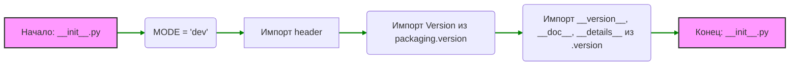

## Анализ кода `hypotez/src/templates/__init__.py`

### <алгоритм>

1.  **Инициализация режима `MODE`**:
    -   Переменной `MODE` присваивается строковое значение `'dev'`.
    -   _Пример:_ `MODE = 'dev'`
2.  **Импорт модуля `header`**:
    -   Выполняется импорт модуля `header` (детали не показаны, так как код `...`).
    -   _Пример:_ `import header`
3.  **Импорт `Version` из `packaging.version`**:
    -   Импортируется класс `Version` из библиотеки `packaging.version`, который используется для работы с версиями.
    -   _Пример:_ `from packaging.version import Version`
4.  **Импорт переменных из `src.templates.version`**:
    -   Импортируются переменные `__version__`, `__doc__`, и `__details__` из модуля `src.templates.version`. Эти переменные обычно содержат информацию о версии, документацию и детали текущего модуля.
    -   _Пример:_ `from .version import __version__, __doc__, __details__`

### <mermaid>

### <объяснение>

**Импорты:**

-   `import header`: Импортирует модуль `header`, предположительно содержащий общие определения или функции для шаблонов. Этот импорт является отправной точкой зависимости, но его содержимое не детализировано, так как в коде он обозначен как `...`.
-   `from packaging.version import Version`: Импортирует класс `Version` из библиотеки `packaging`, который предназначен для работы с версиями пакетов. Это позволяет корректно сравнивать и обрабатывать версии, что важно для управления зависимостями проекта.
-    `from .version import __version__, __doc__, __details__`: Импортирует переменные, связанные с версией, документацией и деталями текущего пакета (в данном случае `src.templates`).

**Переменные:**

-   `MODE = 'dev'`: Строковая переменная, определяющая текущий режим работы. В данном случае устанавливается в `dev` (режим разработки). Эта переменная может влиять на поведение программы, например, при определении настроек логирования или выполнения специфических для среды разработки операций.

**Функциональность:**

-   `__init__.py` в Python является файлом, который делает директорию пакетом.  
   При импорте пакета (например, `from src import templates`), код, содержащийся в `__init__.py`, выполняется.
   В данном случае, файл `__init__.py` инициализирует пакет `src.templates`, присваивая `MODE` значение `dev`, импортируя `header`, а также  импортируя  `Version`  и информацию о версии пакета.
-   Импорт переменных версий (`__version__`, `__doc__`, `__details__`) из `src.templates.version` позволяет другим частям проекта иметь доступ к метаданным о версии пакета.

**Потенциальные улучшения и ошибки:**

-   **Отсутствие детализации `header`**: Так как импорт модуля `header` заканчивается многоточием (`...`), его функциональность и зависимость от других частей проекта не ясны. Необходимо предоставить больше деталей о том, что делает `header` и как он связан с `src.templates`.
-   **Недостаток документации**: Файл `__init__.py` содержит много пустых комментариев, которые не несут никакой смысловой нагрузки.  
    Необходимо заполнить их описаниями с подробным объяснением  назначения модуля, переменных и импортов.

**Цепочка взаимосвязей с другими частями проекта:**

-   **`src.templates.version`**: `__init__.py` напрямую зависит от модуля `version`, так как импортирует из него метаданные о версии.
-   **`packaging.version`**:  Код зависит от пакета `packaging` для обработки версий пакетов.
-   **Другие модули `src`**:  Модуль `header` может быть частью других модулей в директории `src`, поэтому необходим анализ его содержимого для выявления всех зависимостей.