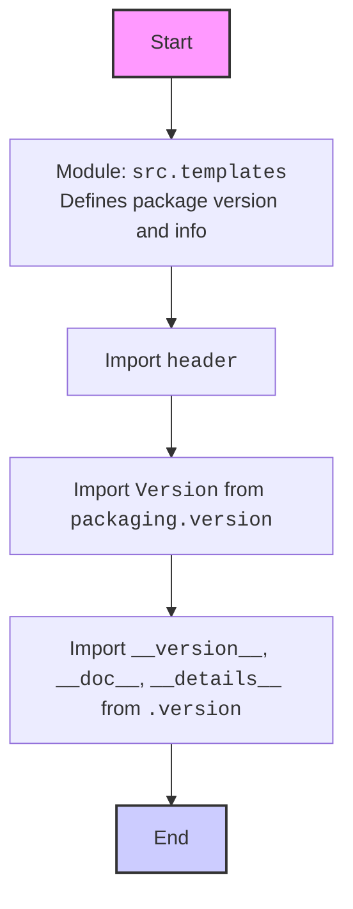
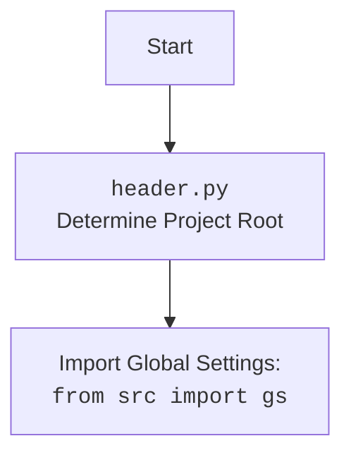

## АНАЛИЗ КОДА: `hypotez/src/templates/__init__.py`

### 1. <алгоритм>

1.  **Начало:** Скрипт начинается с объявления кодировки и shebang.
    *   Пример: `#! venv/bin/python/python3.12` - указывает на используемый интерпретатор Python.
2.  **Описание модуля**: Затем идут docstring, которые описывают модуль `src.templates`, как для разных платформ, Windows и Unix.
    *   Пример: `""".. module:: src.templates\n\t:platform: Windows, Unix\n\t:synopsis:\n\n"""`
3.  **Импорт `header`**: Выполняется импорт модуля `header`. Этот модуль, вероятно, выполняет какие-то действия, общие для всего проекта, например, установку пути проекта.
    *   Пример: `import header`
4.  **Импорт из `packaging.version`**: Импортируется класс `Version` из библиотеки `packaging.version`.
    *   Пример: `from packaging.version import Version`
5.  **Импорт из `.version`**: Импортируются переменные `__version__`, `__doc__` и `__details__` из локального файла `version.py`. Эти переменные вероятно, содержат информацию о версии, документацию и детали этого модуля.
    *   Пример: `from .version import __version__, __doc__, __details__`
6.  **Конец**: Скрипт заканчивается после импорта.

### 2. <mermaid>

### 3. <объяснение>

#### Импорты:

*   `import header`:
    *   **Назначение**: Импортирует модуль `header`, который, предположительно, настраивает окружение проекта, устанавливает путь к корневой директории и, возможно, загружает глобальные настройки проекта.
    *   **Взаимосвязь**: Этот импорт связывает модуль `src.templates` с глобальной конфигурацией проекта.
*   `from packaging.version import Version`:
    *   **Назначение**: Импортирует класс `Version` из библиотеки `packaging.version`. Эта библиотека предназначена для работы с версиями пакетов в Python, позволяя сравнивать и манипулировать версиями.
    *   **Взаимосвязь**: Этот импорт позволяет модулю `src.templates` работать с информацией о версии, возможно, для валидации совместимости или для отображения в пользовательском интерфейсе.
*   `from .version import __version__, __doc__, __details__`:
    *   **Назначение**: Импортирует три переменные из файла `version.py`, который находится в той же директории, что и `__init__.py`.
        *   `__version__`: Содержит строку, представляющую текущую версию пакета.
        *   `__doc__`: Содержит документацию для пакета.
        *   `__details__`: Содержит детальную информацию о пакете (возможно, описание, автор, лицензия и т. д.).
    *   **Взаимосвязь**: Этот импорт связывает модуль с его версионной информацией, которая может быть использована для различных целей (отображение в консоли, проверка совместимости, отслеживание обновлений).

#### Классы:

*   В этом коде нет классов.

#### Функции:

*   В этом коде нет функций.

#### Переменные:

*   `__version__`, `__doc__`, `__details__`:
    *   **Типы**: Строки.
    *   **Использование**: Содержат информацию о версии, документацию и детали модуля, которые используются внутри пакета или могут быть доступны через API.

#### Потенциальные ошибки и области для улучшения:

*   **Отсутствие подробного описания модуля**:  В коде есть docstring, но они не несут никакой полезной информации о назначении модуля. Необходимо добавить подробное описание того, для чего предназначен данный пакет.
*   **`...`**:  В коде присутствует `...`, который указывает на пропущенный код.  Нужно убедиться, что эта часть кода также заполнена.
*   **Зависимость от `header.py`**:  Модуль не будет работать без `header.py`. Зависимость должна быть четко документирована.

#### Цепочка взаимосвязей:

1.  Модуль `src.templates` использует модуль `header` для получения базовых настроек проекта.
2.  Использует библиотеку `packaging.version` для работы с версиями.
3.  Использует файл `version.py` для хранения информации о версии, документации и прочих деталях модуля.

Этот модуль является важной частью пакета `src`, так как он хранит основную информацию о пакете и его версии.