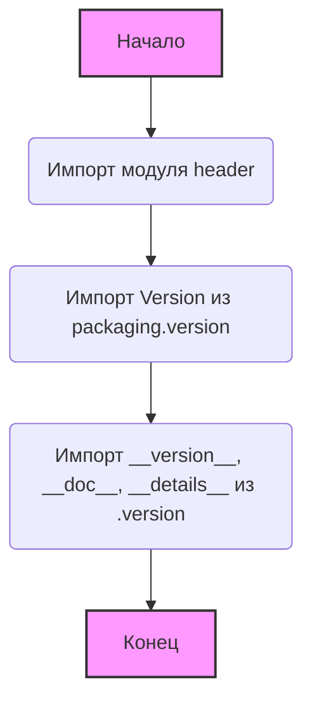
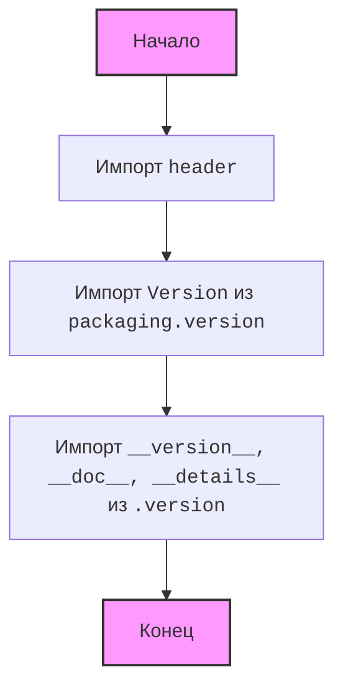
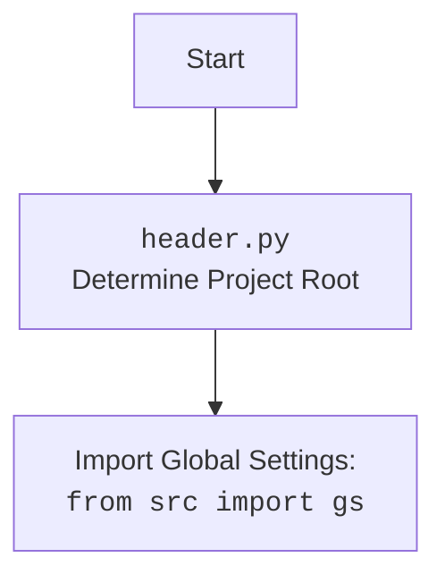

## АНАЛИЗ КОДА: `src/templates/__init__.py`

### 1. <алгоритм>

**Общая блок-схема работы модуля `src.templates`:**

**Пошаговое объяснение:**

1.  **Начало:** Выполнение скрипта `__init__.py` начинается.
2.  **Импорт модуля `header`:** Импортируется модуль `header`, который предположительно содержит функциональность для определения корневой директории проекта и импорта глобальных настроек.
    *   Пример: `import header`
3.  **Импорт `Version` из `packaging.version`:** Импортируется класс `Version` из библиотеки `packaging.version`. Этот класс, вероятно, используется для сравнения и работы с версиями.
    *   Пример: `from packaging.version import Version`
4.  **Импорт `__version__`, `__doc__`, `__details__` из `.version`:** Импортируются переменные `__version__` (строка, представляющая версию модуля), `__doc__` (строка документации модуля) и `__details__` (возможно, дополнительные детали о версии) из модуля `.version` (который предположительно является файлом `src/templates/version.py`).
    *   Пример: `from .version import __version__, __doc__, __details__`
5.  **Конец:** Скрипт `__init__.py` завершает свое выполнение.

### 2. <mermaid>

**Описание зависимостей `mermaid`:**

*   **`Start`**: Начало выполнения скрипта `__init__.py`.
*  **`HeaderImport`**: импортирует модуль `header`, используемый для определения корня проекта и загрузки настроек.
*   **`VersionImport`**: импортирует класс `Version` из библиотеки `packaging.version`, который используется для управления версиями.
*   **`VersionInfoImport`**: импортирует переменные, связанные с версией: `__version__`, `__doc__` и `__details__` из модуля `.version`.
*   **`End`**: Завершение выполнения скрипта `__init__.py`.

*   **`header.py`**:  `header.py` отвечает за определение корневой директории проекта и импорт глобальных настроек из `src`.

### 3. <объяснение>

**Импорты:**

*   `import header`: Импортирует модуль `header`, который вероятно используется для определения корневой директории проекта и загрузки общих настроек. Это типично для Python-проектов, где нужно обеспечить доступ к конфигурационным файлам и другим ресурсам независимо от текущей директории запуска скрипта. Этот модуль является частью проекта и необходим для правильной инициализации окружения.
*   `from packaging.version import Version`: Импортирует класс `Version` из библиотеки `packaging.version`. Эта библиотека предоставляет инструменты для работы с версиями программного обеспечения, например, для их сравнения и проверки совместимости. Использование `packaging.version` позволяет работать с версиями в более стандартизированном формате, чем просто текстовые строки.
*   `from .version import __version__, __doc__, __details__`: Импортирует переменные `__version__`, `__doc__` и `__details__` из модуля `version.py` в той же директории (т.е. из `src/templates/version.py`).
    *   `__version__`: Строка, содержащая версию текущего модуля. Обычно используется для отслеживания релизов и обновлений.
    *   `__doc__`: Строка документации модуля, которая используется для генерации документации.
    *   `__details__`: Возможно, дополнительные детали о версии или состоянии модуля.

**Классы:**

*   В данном коде нет классов. Однако, импортируется класс `Version` из сторонней библиотеки `packaging`. Этот класс предоставляет функциональность для работы с версиями, включая их сравнение и валидацию.

**Функции:**

*   В данном коде нет явных функций. Однако, импортируются переменные, которые могут быть функциями в модуле `.version`, но это не показано в представленном коде.

**Переменные:**

*   `__version__`: Строковая переменная, содержащая информацию о версии модуля.
*   `__doc__`: Строковая переменная, содержащая документацию для модуля.
*  `__details__`: Строковая переменная, содержащая дополнительную информацию о версии модуля.

**Потенциальные проблемы и области для улучшения:**

*   **Отсутствие описания модуля:** Код содержит комментарий `HERE SHOULD BE A DESCRIPTION OF THE MODULE OPERATION !`, что указывает на отсутствие подробного описания модуля. Это затрудняет понимание его назначения и использования.
*  **Не ясна структура header.py:** Не ясно, что именно делает `header.py`, и в будущем могут возникнуть проблемы с изменением структуры проекта, если код header.py не будет описан в документе проекта.
*   **`...`:** В коде присутствует многоточие `...`. Это не является синтаксисом Python и может свидетельствовать о неполном коде, что является проблемой. Его нужно убрать и если что-то было пропущено - заполнить недостающим кодом.
*   **Отсутствие явного использования импортированных переменных:** Код импортирует `__version__`, `__doc__` и `__details__`, но не показано их использование. Это может быть сделано в других частях проекта, но в этом файле не ясно.
*   **Устаревшие комментарии:** Код содержит устаревшие комментарии о платформах и synopsys, которые дублируются и не имеют видимой цели. Их можно было бы убрать или обновить.

**Взаимосвязи с другими частями проекта:**

*   **`header.py`:**  Модуль `header.py` предположительно находится в `src/header.py` и отвечает за определение корневой директории проекта и загрузку глобальных настроек. Это общая практика в Python-проектах для унифицированного доступа к конфигурации.
*   **`.version.py`**: Модуль `.version.py` (предположительно `src/templates/version.py`) содержит информацию о версии текущего модуля и его документацию. Эта информация важна для отслеживания изменений и для понимания назначения модуля.
*   **`src`**:  Модуль является частью пакета `src`, что подразумевает, что он является частью основной кодовой базы проекта.

**Дополнительные замечания:**

Файл `__init__.py` используется для обозначения каталога `templates` как пакета Python. Он также может содержать код инициализации, как в данном случае.