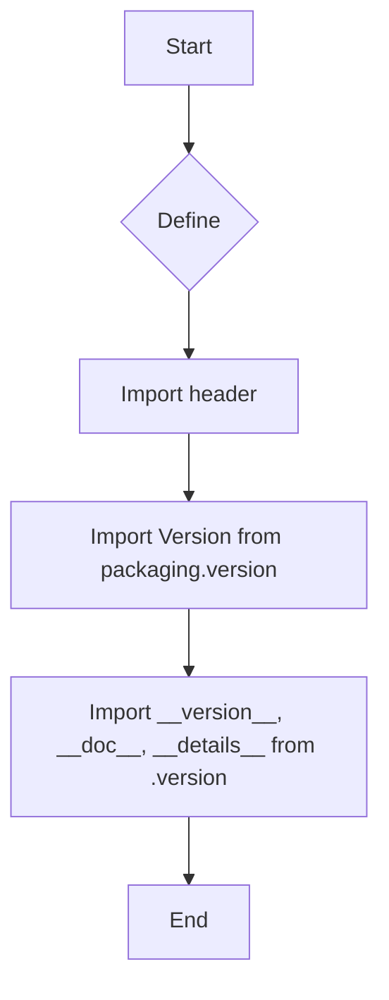
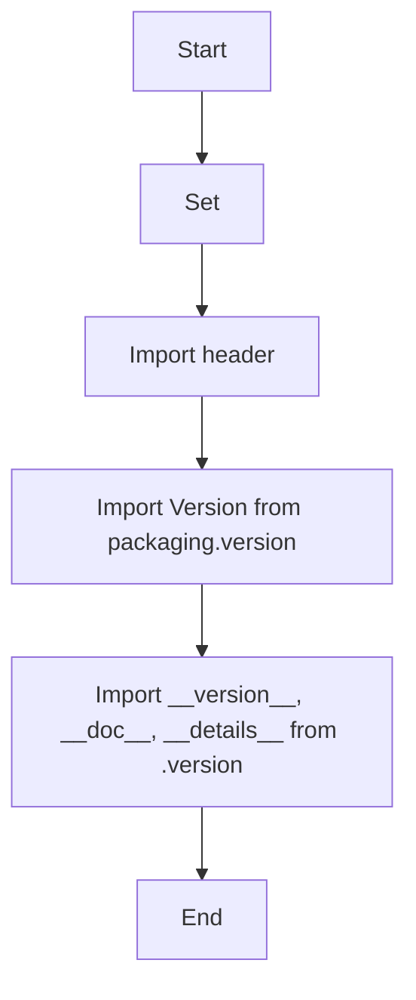
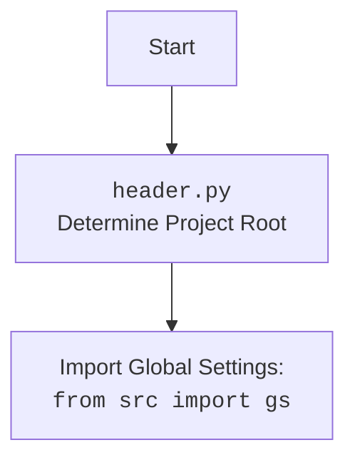

## Анализ кода `hypotez/src/templates/__init__.py`

### 1. <алгоритм>

**Блок-схема:**

**Примеры:**

1. **``**: Устанавливает режим работы модуля как "dev" (разработка). Этот режим, вероятно, используется для включения отладочных функций или для работы в среде разработки.
2. **`import header`**: Импортирует модуль `header`, который, вероятно, содержит общие настройки или функции для всего проекта.
3. **`from packaging.version import Version`**: Импортирует класс `Version` из библиотеки `packaging.version`. Этот класс используется для работы с версиями пакетов.
4. **`from .version import __version__, __doc__, __details__`**: Импортирует переменные `__version__`, `__doc__`, и `__details__` из файла `version.py` в той же директории. `__version__` будет содержать строку версии текущего пакета, `__doc__` может содержать описание пакета, а `__details__` – дополнительные сведения.

**Поток данных:**

1. Инициализация начинается с установки режима `MODE`.
2. Далее импортируется модуль `header` для получения общих настроек.
3. Затем импортируется класс `Version` для обработки версий.
4. В конце импортируется информация о версии и описании пакета из `version.py`.

### 2. <mermaid>

**Анализ зависимостей:**

1.  **`SetMode`**: Устанавливает переменную `MODE` в значение `dev`. Это влияет на поведение модуля, но не зависит от других импортированных модулей.
2.  **`ImportHeader`**: Импортирует модуль `header`, который, как предполагается, содержит общие настройки проекта. Зависит от наличия и содержимого файла `header.py`.
3. **`ImportVersionClass`**: Импортирует класс `Version` из библиотеки `packaging.version`. Эта зависимость позволяет обрабатывать и сравнивать версии пакетов.
4.  **`ImportVersionInfo`**: Импортирует переменные `__version__`, `__doc__`, и `__details__` из файла `version.py`. Эти переменные содержат информацию о текущей версии пакета и его описание. Зависит от наличия и содержимого файла `version.py`.

**Дополнительно: `header.py`**

   
### 3. <объяснение>

**Импорты:**

1.  **`import header`**:
    *   **Назначение**: Импортирует модуль `header`, который, вероятно, содержит общие настройки и константы проекта.
    *   **Взаимосвязь**: Этот модуль обычно содержит общие переменные, пути, и функции, которые используются во всем проекте.
2.  **`from packaging.version import Version`**:
    *   **Назначение**: Импортирует класс `Version` из библиотеки `packaging.version`.
    *   **Взаимосвязь**: `packaging.version` – это библиотека для работы с версиями пакетов, позволяющая сравнивать их, проверять совместимость и т.д.
3.  **`from .version import __version__, __doc__, __details__`**:
    *   **Назначение**: Импортирует переменные `__version__` (версия пакета), `__doc__` (документация пакета), и `__details__` (дополнительные детали) из файла `version.py` в той же директории.
    *   **Взаимосвязь**: Эти переменные содержат метаданные о текущей версии пакета и его описании. Зависят от наличия и содержимого `version.py`.

**Переменные:**

1.  **``**:
    *   **Тип**: Строка
    *   **Использование**: Устанавливает режим работы модуля как "dev" (разработка). Этот режим может использоваться для отладки или активации специфических функций.

**Потенциальные ошибки и области для улучшения:**

1.  **Отсутствие подробной документации**:
    *   В коде есть комментарии вроде `HERE SHOULD BE A DESCRIPTION OF THE MODULE OPERATION !`, которые указывают на отсутствие детального описания.
    *   Необходимо добавить подробное описание модуля и его предназначения, что является важным для понимания кода и его дальнейшей поддержки.
2.  **Неоднозначность константы `MODE`**:
    *   Значение `dev` может быть неясным без дополнительной документации.
    *   Следует уточнить, как именно `MODE` влияет на работу модуля и какие еще значения могут быть использованы.
3.  **Зависимость от `header.py`**:
    *   Зависимость от модуля `header` неявно подразумевает, что он должен существовать и быть правильно настроен.
    *   Необходимо обеспечить наличие и корректную настройку `header.py`.
4. **Неиспользуемые  комментарии:**
   *  В коде есть много  неиспользуемых многострочных комментариев без содержания или пояснений, лучше их удалить.

**Цепочка взаимосвязей:**

1.  `__init__.py` (текущий файл) использует константу `MODE` для установки режима работы.
2.  `__init__.py` импортирует `header.py`, который содержит общие настройки.
3.  `__init__.py` импортирует класс `Version` из `packaging.version` для обработки версий.
4.  `__init__.py` импортирует переменные версии из файла `version.py`, который также находится в той же директории.
5.  Все эти компоненты работают вместе для инициализации и настройки модуля `src.templates`.

Таким образом, `__init__.py` выполняет роль точки входа для модуля `src.templates`, инициализируя необходимые настройки и импортируя зависимости для дальнейшей работы.