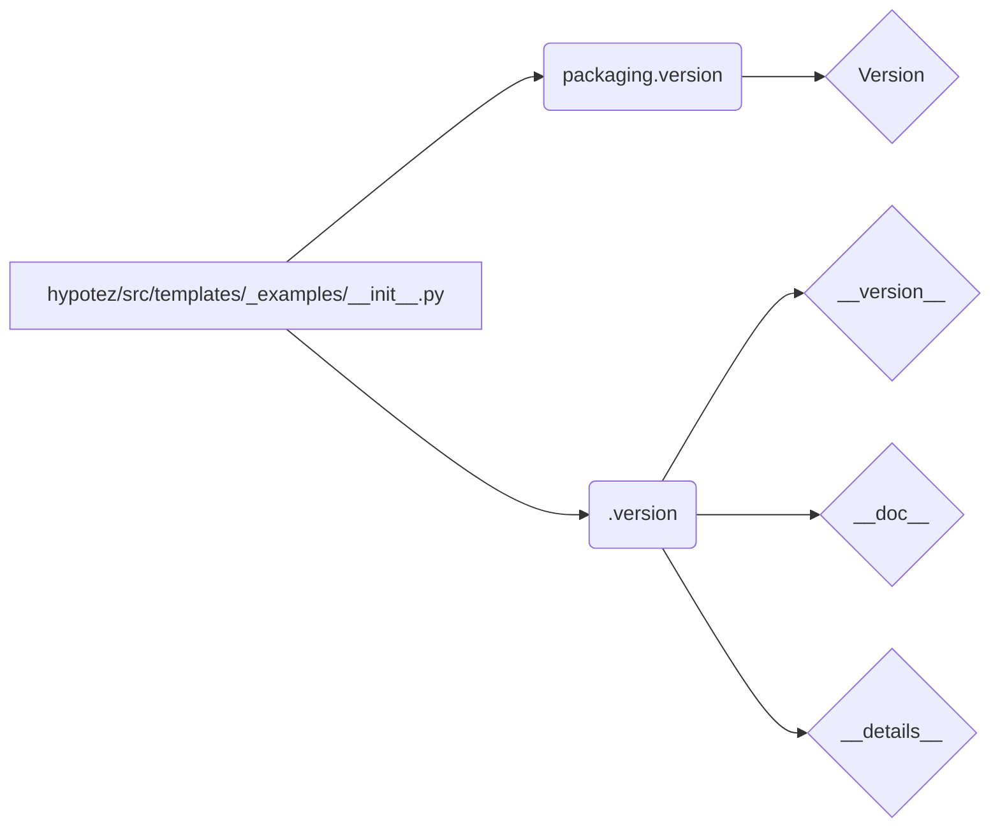

## <input code>

```python
## \file hypotez/src/templates/_examples/__init__.py
# -*- coding: utf-8 -*-
#! venv/Scripts/python.exe
#! venv/bin/python/python3.12

"""
.. module: src.templates._examples 
	:platform: Windows, Unix
	:synopsis:

"""
MODE = 'dev'

"""
	:platform: Windows, Unix
	:synopsis:

"""


"""
	:platform: Windows, Unix
	:synopsis:

"""


"""
  :platform: Windows, Unix

"""
"""
  :platform: Windows, Unix
  :platform: Windows, Unix
  :synopsis:
"""MODE = 'dev'
  
""" module: src.templates._examples """


from packaging.version import Version
from .version import __version__, __doc__, __details__
```

## <algorithm>

Этот код представляет собой инициализационный модуль (`__init__.py`) для пакета `_examples` в проекте `hypotez`.  Алгоритм работы сводится к импорту и доступности данных.  В данном случае нет сложных вычислений или манипуляций с данными, только подготовка к использованию других модулей.

**Пошаговая блок-схема:**

1. **Импортирование:** Модуль импортирует `Version` из пакета `packaging`. Это указывает на использование данного модуля для работы с версиями программного обеспечения. 
2. **Импортирование:** Далее импортируются переменные `__version__`, `__doc__` и `__details__` из подмодуля `version`. Предполагается, что `version` содержит информацию о версии, документации и других деталях модуля `_examples`.

**Примеры:**

* Импортирование `Version`:  Этот импорт необходим для обработки версий, например, при сравнении версий или обеспечении совместимости.
* Импортирование `__version__`: Это может быть строковая переменная, содержащая строку версии.

**Перемещение данных:**

Данные (переменные `__version__`, `__doc__`, `__details__`)  не перемещаются между функциями или классами в этом файле. Они доступны как переменные в пространстве имен модуля `_examples` после импорта.


## <mermaid>



**Объяснение диаграммы и зависимостей:**

Диаграмма иллюстрирует импортирование из других модулей.  `packaging.version` является внешней зависимостью, а `_examples/version` -  зависимостью из собственного проекта.

* **hypotez/src/templates/_examples/__init__.py**: Модуль, который импортирует.
* **packaging.version**:  Внешняя зависимость, предоставляет класс `Version` для работы с версиями.
* **./version**: Модуль в той же директории, предоставляющий `__version__`, `__doc__`, `__details__`.


## <explanation>

**Импорты:**

* `from packaging.version import Version`: Импортирует класс `Version` из пакета `packaging`. Этот пакет, скорее всего, используется для работы с версиями программного обеспечения.  Это стандартная библиотека для Python, используемая для управления версиями пакетов.
* `from .version import __version__, __doc__, __details__`: Импортирует переменные `__version__`, `__doc__` и `__details__` из модуля `version.py` внутри пакета `_examples`. Эти переменные, скорее всего, содержат метаданные о версии, документации и других деталях пакета.

**Классы:**

В этом файле нет классов.

**Функции:**

В этом файле нет функций.

**Переменные:**

* `MODE = 'dev'`: Переменная, которая, вероятно, используется для определения режима работы (например, разработка, продакшен).

**Возможные ошибки или области для улучшений:**

* **Неясная цель:**  Файл `__init__.py` слишком простой.  Отсутствует функциональность,  вызывающая необходимость такого файла.  Ожидается, что внутри него будут функции или классы. В данном случае, файл скорее служит для организации импортов. 
* **Потенциальные проблемы с импортом:**  Если модуль `version.py` не находится в ожидаемом месте, код может не скомпилироваться.
* **Добавление `__all__`:** В `__init__.py` рекомендуется использовать `__all__`, чтобы явно определить, какие имена можно импортировать из этого пакета.


**Цепочка взаимосвязей:**

Этот `__init__.py` файл, скорее всего, является частью более крупной структуры проекта.  Инициализация `_examples` позволяет использовать содержимое пакета в других частях проекта `hypotez`. Для дальнейшего анализа необходимо увидеть `version.py`.