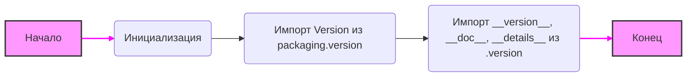

## Анализ кода `hypotez/src/templates/_examples/__init__.py`

### <алгоритм>

1. **Инициализация**:
   -  Устанавливается переменная `MODE` в значение `'dev'`. Это указывает на режим разработки.
   - Импортируются переменные `__version__`, `__doc__`, `__details__` из `src.templates._examples.version` и `Version` из `packaging.version`

2. **Импорт `Version`**:
    -   Пример: `Version('1.2.3')`.  Этот класс позволяет сравнивать версии и проверять их корректность.
    -   `packaging.version` - внешний пакет для работы с версиями.

3. **Импорт из `.version`**:
   -   `__version__` : Представляет строку с версией пакета.
      - Пример: `__version__ = "0.1.0"`.
   -   `__doc__` : Содержит строку с документацией модуля.
      - Пример: `__doc__ = "Примеры шаблонов"`
   -   `__details__`: Содержит строку с дополнительной информацией о модуле.
     - Пример: `__details__ = "Различные примеры использования"`

4. **Конец**: Завершение выполнения модуля.

### <mermaid>

**Объяснение диаграммы `mermaid`:**

- `A[Начало]`: Начало выполнения модуля.
- `B(Инициализация )`: Инициализация переменной `MODE` значением 'dev'.
- `C(Импорт Version из packaging.version)`: Импорт класса `Version` из внешнего пакета `packaging.version`, который используется для работы с версиями.
- `D(Импорт __version__, __doc__, __details__ из .version)`: Импорт переменных `__version__`, `__doc__` и `__details__` из модуля `.version`, который предположительно содержит информацию о версии, документацию и дополнительные детали модуля.
- `E[Конец]`: Конец выполнения модуля.
- Стиль: Начало и Конец подсвечены. Стрелки между этапами имеют особый цвет и толщину.

### <объяснение>

**Импорты:**

- `packaging.version.Version`:  
    -   **Назначение**: Импортирует класс `Version` для работы с версиями.  
    -   **Взаимосвязь**:  Этот пакет используется для сравнения и управления версиями, а в данном случае может использоваться для определения версии текущего модуля или его компонентов. Это внешний пакет, не относится напрямую к src, но является зависимостью.

- `from .version import __version__, __doc__, __details__`:  
    -   **Назначение**: Импортирует переменные `__version__`, `__doc__`, и `__details__` из модуля `version.py`, расположенного в той же директории, что и текущий файл `__init__.py`.  
    -   **Взаимосвязь**:  Эти переменные, как правило, используются для хранения информации о текущей версии модуля, его документации и дополнительных деталей. Они являются частью внутренней структуры модуля и используются для его идентификации и документирования.

**Переменные:**

- ``:  
    -   **Тип**: Строка.  
    -   **Назначение**: Указывает режим работы модуля. В данном случае установлен в режим разработки ('dev'). Это может использоваться для условной логики, которая отличается в разных режимах (например, отладка vs релиз).
    -   **Использование**: Эта переменная вероятно используется в коде для выполнения разных действий в зависимости от режима работы программы, но в текущем коде не видно непосредственного использования.

-   `__version__`:
    -   **Тип**: Строка.
    -   **Назначение**:  Строка, представляющая версию модуля.
    -   **Использование**:  Используется для определения и сравнения версий.

-  `__doc__`:
    -   **Тип**: Строка.
    -   **Назначение**:  Строка с документацией модуля.
    -   **Использование**: Используется для документирования и предоставления описания функциональности модуля.

-   `__details__`:
    -   **Тип**: Строка.
    -   **Назначение**: Строка с дополнительной информацией о модуле.
    -   **Использование**: Используется для хранения деталей или заметок о модуле, которые могут быть полезны для разработчиков.

**Объяснение:**

Данный файл `__init__.py` является точкой входа в пакет `src.templates._examples`. Он инициализирует базовые переменные и импортирует необходимые модули для работы с версиями и документацией. В частности, устанавливается режим разработки и импортируется информация о версии пакета, его документация и дополнительные детали из файла `version.py`.

**Потенциальные ошибки или области для улучшения:**

- **Неиспользуемая переменная `MODE`**: Переменная `MODE` объявлена, но не используется в представленном фрагменте кода. Если она не используется где-либо еще в проекте, то это является избыточной переменной.
- **Отсутствие явного использования импортированных значений**: Импортированные `__version__`, `__doc__`, `__details__` никак не используются в этом файле, что может указывать на необходимость использования этих переменных где-то в другом месте проекта.
- **Общая документация**: Документационные строки в начале кода, которые повторяют platform и synopsis, но не заполнены. Следует указать назначение данного файла.
- **Файл `version.py`**: Важно иметь возможность проанализировать содержимое файла `version.py` для понимания того, как именно устанавливаются `__version__`, `__doc__`, `__details__`.
- **Использование `MODE`**:  Для улучшения кода следует использовать значение переменной `MODE`, например, в логгировании или выборе путей для файлов.

**Взаимосвязь с другими частями проекта:**

- Данный модуль является частью пакета `src.templates`. Следовательно, он может использоваться для управления и инициализации шаблонов.
- Зависимость от `packaging.version` предполагает, что в других частях проекта может потребоваться сравнение версий модулей.
- Информация о версии, документация и детали, импортированные из `.version`, могут использоваться для документирования и контроля версий внутри проекта.