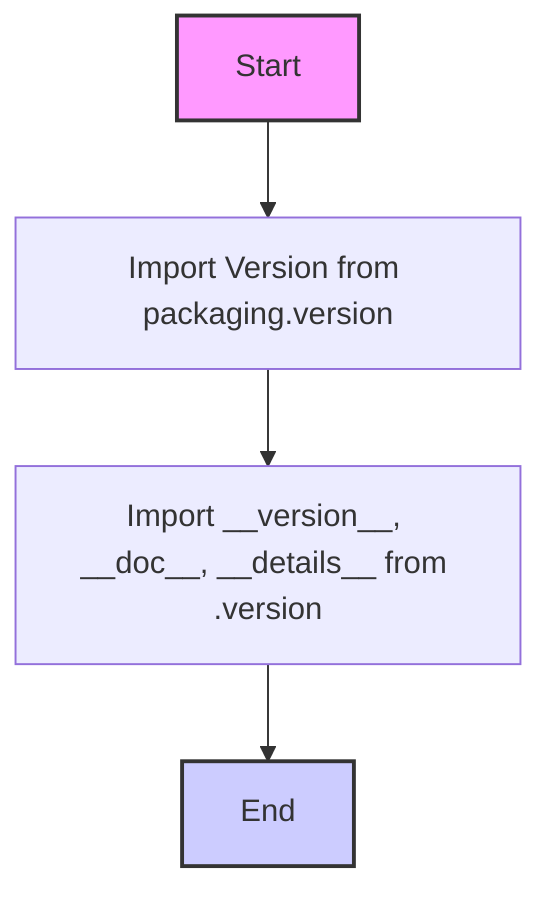

## АНАЛИЗ КОДА: `src/templates/_examples/__init__.py`

### 1. <алгоритм>

1. **Импорт `Version` из `packaging.version`**:
   - Пример: `from packaging.version import Version`. 
   - Этот шаг импортирует класс `Version`, позволяющий работать с версиями пакетов. Класс используется для сравнения, сортировки и других операций над версиями.

2. **Импорт переменных из `.version`**:
    - Пример: `from .version import __version__, __doc__, __details__`.
    - Импортируются переменные `__version__` (строка, представляющая версию), `__doc__` (строка, содержащая документацию), и `__details__` (строка, содержащая подробности) из файла `version.py`, расположенного в том же каталоге.
    - Все три переменные скорее всего являются строками.

### 2. <mermaid>

### 3. <объяснение>

- **Импорты**:
   - `from packaging.version import Version`:
      - `packaging.version` - это модуль из библиотеки `packaging`, который предоставляет инструменты для работы с версиями программного обеспечения.
      -  `Version` - класс из `packaging.version` позволяющий представлять и сравнивать версии программного обеспечения.
   - `from .version import __version__, __doc__, __details__`:
      -  `from .version` -  указывает на импорт из модуля `version.py`, расположенного в той же директории, что и текущий файл `__init__.py`.
      -  `__version__` -  переменная, скорее всего, хранящая строку с номером версии текущего пакета.
      - `__doc__` -  строка, содержащая описание пакета/модуля.
      - `__details__` - строка с более подробной информацией о пакете/модуле.
    
- **Переменные**:
    -  `__version__`:  Строковая переменная, представляющая версию текущего пакета.
    -  `__doc__`:  Строковая переменная, содержащая документацию текущего пакета/модуля.
    -  `__details__`: Строковая переменная, содержащая подробности о пакете/модуле.

- **Общая функциональность**:
   - Файл `__init__.py` в Python-пакете делает директорию `_examples` пакетом, который можно импортировать.
   - Этот конкретный `__init__.py` файл импортирует класс `Version` для работы с версиями и также импортирует переменные, связанные с версией, документацией и подробностями пакета из `version.py`. Это стандартный подход для определения версии, документации и подробностей в Python-пакете.

- **Взаимосвязь с другими частями проекта**:
  -  Импорт `from .version` означает, что этот модуль зависит от файла `version.py`, расположенного в той же директории `src/templates/_examples`. 
  -  Использование `packaging.version` указывает на внешнюю зависимость от сторонней библиотеки `packaging`.

- **Потенциальные ошибки/улучшения**:
    -  Код в целом выполняет свою функцию. 
    -  Можно добавить проверку, что файл `version.py` существует и имеет необходимые переменные, для большей надежности.
    - Также, можно улучшить документацию в самом файле, описав для чего он используется, а не повторять несколько раз одну и туже строчку.

**Цепочка взаимосвязей**:
  - `hypotez/src/templates/_examples/__init__.py` --> `hypotez/src/templates/_examples/version.py` (зависимость от файла `version.py`).
  - `hypotez/src/templates/_examples/__init__.py` --> библиотека `packaging` (зависимость от внешней библиотеки).