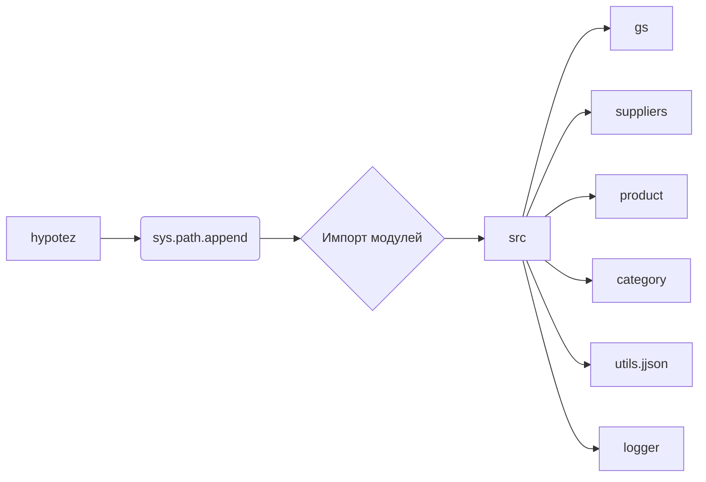

# <input code>

```python
## \file hypotez/src/templates/_examples/header.py
# -*- coding: utf-8 -*-
#! venv/Scripts/python.exe
#! venv/bin/python/python3.12

"""
.. module: src.templates._examples 
	:platform: Windows, Unix
	:synopsis:

"""
MODE = 'dev'

"""
	:platform: Windows, Unix
	:synopsis:

"""


"""
	:platform: Windows, Unix
	:synopsis:

"""


"""
  :platform: Windows, Unix

"""
"""
  :platform: Windows, Unix
  :platform: Windows, Unix
  :synopsis:
"""MODE = 'dev'
  
""" module: src.templates._examples """


import sys
import os
from pathlib import Path

dir_root : Path = Path (os.getcwd()[:os.getcwd().rfind('hypotez')+11])
sys.path.append (str (dir_root) )  # Добавляю корневую папку в sys.path
dir_src = Path (dir_root, 'src')
sys.path.append (str (dir_root) ) 
...

print(dir_root)
# ----------------
from pathlib import Path
import json
import re
# ----------------

from src import gs
from src.suppliers import Supplier
from src.product import Product, ProductFields, ProductFieldsLocators
from src.category import Category
from src.utils.jjson import j_dumps, j_loads,   pprint, save_text_file
from src.logger import logger
, StringNormalizer, ProductFieldsValidator
...
```

# <algorithm>

Алгоритм работы кода включает в себя следующие шаги:

1. **Установка пути поиска модулей:**  Код определяет корневую директорию проекта `hypotez` и добавляет её в системный путь поиска модулей `sys.path`. Это важно для импорта файлов из других директорий проекта.
2. **Импорт библиотек:**  Код импортирует необходимые библиотеки, такие как `sys`, `os`, `pathlib`, `json`, `re`, и собственные модули из пакета `src`.
3. **Инициализация переменных:** Определяет переменную `dir_root`, представляющую корневую директорию проекта.
4. **Печать пути:**  Выводит значение `dir_root` в консоль, подтверждая успешное определение пути.
5. **Импорт дополнительных модулей:** Происходит импорт других модулей, находящихся внутри пакета `src`, включая: `gs`, `Supplier`, `Product`, `Category`, `j_dumps`, `j_loads`,  `pprint`, `save_text_file`, `logger`, `StringNormalizer` и `ProductFieldsValidator`.
6. **Использование данных:** Код далее использует импортированные классы и функции для работы с данными продукта, поставщиками и категориями.


# <mermaid>


**Объяснение к диаграмме:**

Код инициализирует системный путь поиска (`sys.path`) для поиска файлов и модулей из пакета `src`, содержащего различные модули (классы, функции, переменные), отвечающие за работу с данными проекта `hypotez`.

# <explanation>

**Импорты:**

* `sys`, `os`, `pathlib`: Стандартные библиотеки Python, необходимые для работы с системными ресурсами (пути, модули).
* `json`, `re`: Библиотеки для работы с JSON-данными и регулярными выражениями соответственно.
* `pathlib`:  Модуль для работы с файлами и путями более удобным образом.
* `gs`, `Supplier`, `Product`, `ProductFields`, `ProductFieldsLocators`, `Category`, `j_dumps`, `j_loads`, `pprint`, `save_text_file`, `logger`, `StringNormalizer`, `ProductFieldsValidator`: Это импортированные модули из пакета `src`,  вероятно, отвечающие за обработку данных, логику приложения и взаимодействия с данными.


**Классы:**

* `Supplier`, `Product`, `Category`: Классы, вероятно, представляющие сущности приложения (поставщики, продукты, категории).  Нельзя точно определить их функциональность без дополнительного контекста кода этих классов.
* `ProductFields`, `ProductFieldsLocators`: Возможно, описывают поля и локейторы для работы с объектами `Product`.
* `StringNormalizer`, `ProductFieldsValidator`:  Предполагаемые классы, отвечающие за нормализацию строк и валидацию полей продуктов соответственно.
* `logger`: Вероятно, класс для работы с логами (запись в журналы событий).


**Функции:**

*  `j_dumps`, `j_loads`, `pprint`, `save_text_file`: Функции для работы с JSON-данными (сериализация, десериализация, вывод, сохранение).
*  Функции из классов `StringNormalizer`, `ProductFieldsValidator` (не определённые) скорее всего обрабатывают строки и валидируют данные.

**Переменные:**

* `dir_root`: Переменная пути, содержащая корневую директорию проекта.
* `dir_src`: Переменная пути, содержащая подпапку `src`.
* `MODE`: Строковая переменная, вероятно, определяющая режим работы приложения (например, 'dev' или 'prod').

**Возможные ошибки или области для улучшений:**

* **Отсутствие ясности в коде:**  Много комментариев вида `"""..."""`. Не хватает комментариев к конкретным функциям и методам. Необходимы более подробные описания.
* **Непонятны зависимости:** Необходимо понимать, как эти классы и функции взаимодействуют друг с другом для полной картины.
* **Не хватает кода:** Код содержит `...`,  что делает анализ фрагмента неполным.  Нужно рассмотреть полный код `src` и его файлов.
* **Не указана целиком структура проекта:** Невозможно оценить полный функционал приложения, зная только часть кода.

**Взаимосвязи с другими частями проекта:**

Код устанавливает путь поиска модулей в `sys.path`, что подразумевает взаимосвязь с другими частями проекта, находящимися в папке `src`.  Однако, без полного кода `src`  невозможно проследить все взаимосвязи.