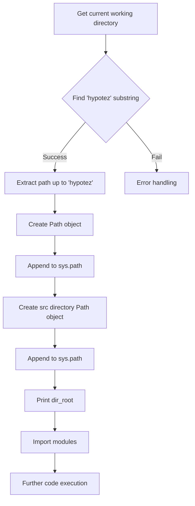
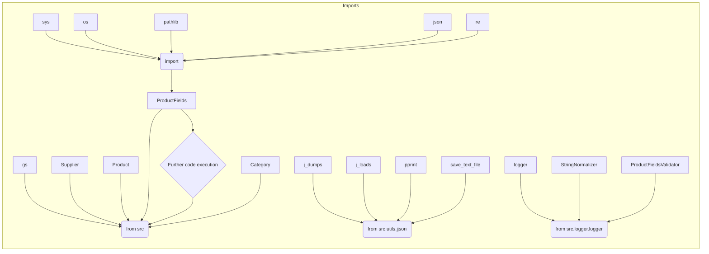

# <input code>

```python
## \file hypotez/src/templates/_examples/header.py
# -*- coding: utf-8 -*-\
#! venv/Scripts/python.exe
#! venv/bin/python/python3.12

"""
.. module:: src.templates._examples 
	:platform: Windows, Unix
	:synopsis:

"""
MODE = 'dev'

"""
	:platform: Windows, Unix
	:synopsis:

"""

"""
	:platform: Windows, Unix
	:synopsis:

"""


"""
  :platform: Windows, Unix

"""
"""
  :platform: Windows, Unix
  :platform: Windows, Unix
  :synopsis:
"""MODE = 'dev'
  
""" module: src.templates._examples """


import sys
import os
from pathlib import Path

dir_root : Path = Path (os.getcwd()[:os.getcwd().rfind('hypotez')+11])
sys.path.append (str (dir_root) )  # Добавляю корневую папку в sys.path
dir_src = Path (dir_root, 'src')
sys.path.append (str (dir_root) ) 
...

print(dir_root)
# ----------------
from pathlib import Path
import json
import re
# ----------------

from src import gs
from src.suppliers import Supplier
from src.product import Product, ProductFields, ProductFieldsLocators
from src.category import Category
from src.utils.jjson import j_dumps, j_loads,   pprint, save_text_file
from src.logger.logger import logger
, StringNormalizer, ProductFieldsValidator
...
```

# <algorithm>



**Example:** If `os.getcwd()` returns `/home/user/project/hypotez/test`, then `dir_root` will be `/home/user/project/hypotez`.


# <mermaid>



**Explanation of Dependencies:**  The code imports various modules from the `src` package and its sub-packages.  This indicates a structured Python project where different functionalities (e.g., `gs`, `suppliers`, `product`, `category`, `utils`, `logger`) are separated into modules.


# <explanation>

**Imports:**

- `sys`, `os`, `pathlib`: Standard Python modules for system interaction, file path manipulation, and controlling Python's import process.
- `json`, `re`: Standard libraries for working with JSON data and regular expressions, respectively.
- `gs`, `Supplier`, `Product`, `ProductFields`, `ProductFieldsLocators`, `Category`, `j_dumps`, `j_loads`, `pprint`, `save_text_file`, `logger`, `StringNormalizer`, `ProductFieldsValidator`: These imports originate from packages within the `src` folder, indicating a well-organized project structure.  This code adds the parent directory to `sys.path`,  allowing Python to find modules located in the `src` folder. This is a crucial step for importing custom modules.

**Variables:**

- `dir_root`, `dir_src`: These variables hold `Path` objects representing paths to the project root and the `src` directory, respectively. The code calculates the `dir_root` using the current working directory and the `hypotez` directory.  This provides a way to reference the project's base directory consistently, independent of the current working directory.

**Potential Errors and Improvements:**

- **Missing `...`:** The `...` in the code suggests missing lines.  These missing parts are essential for completing the logic. Be sure to supply the code following the `...` section to have a complete and executable script.
- **Error Handling:** The code lacks robust error handling. If `os.getcwd()[:os.getcwd().rfind('hypotez')+11]` fails to find 'hypotez', the script will raise an exception. Consider using `try-except` blocks to handle these edge cases and provide informative error messages.
- **Unnecessary repetition**:  The `sys.path.append(str(dir_root))` appears twice. This should be optimized to a single line.
- **Clarity of `...` code:**  The `...` portion likely involves more import statements and/or other functions which should be explained.
- **File paths:**  It's generally preferable to use `importlib.util.find_spec()` for dynamic imports to allow proper error handling and a cleaner approach.


**Relationship to other parts of the project:**

This `header.py` file likely acts as an entry point or initial setup for the project. The imports suggest that other modules within the `src` package are defining classes and functions for handling data and tasks related to products, suppliers, categories, and logging. The `MODE` variable suggests a potential for conditional logic or different behaviors based on a development mode.  The use of `src/logger/logger` indicates that logging is a feature of the project.


```