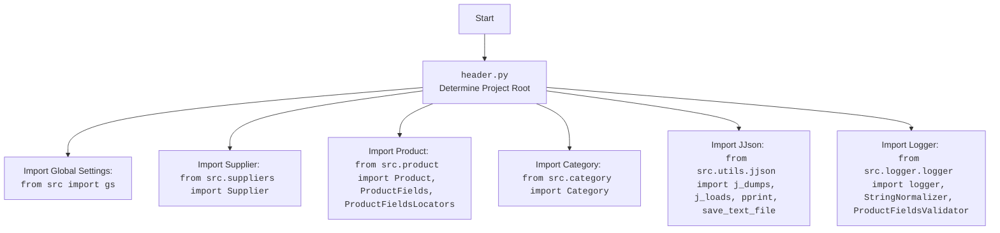

## Анализ кода `hypotez/src/templates/_examples/header.py`

### 1. `<алгоритм>`:

**Блок-схема:**

```mermaid
graph LR
    A[Начало] --> B(Получить текущую рабочую директорию);
    B --> C{Найти индекс последнего вхождения 'hypotez' в пути};
    C -- Найдено --> D(Извлечь путь до корневой папки проекта ('hypotez'));
    C -- Не найдено --> E(Обработка ошибки);
    D --> F(Создать объект Path для корневой директории);
    F --> G(Добавить корневую директорию в sys.path);
    G --> H(Создать объект Path для папки 'src');
    H --> I(Добавить корневую директорию в sys.path (повторно));
    I --> J(Импортировать модули);
    J --> K(Инициализация модулей и классов);
    K --> L(Печать корневой директории);
    L --> M(Конец);
    E --> M
```

**Примеры:**

*   **`B`**: Если текущая рабочая директория `/Users/user/projects/hypotez/src/templates`, то `os.getcwd()` вернет эту строку.
*   **`C`**: `os.getcwd().rfind('hypotez')` вернет 21.
*   **`D`**: `os.getcwd()[:os.getcwd().rfind('hypotez')+11]` вернет `/Users/user/projects/hypotez`.
*   **`F`**: `Path('/Users/user/projects/hypotez')` создаст объект `Path`.
*   **`G`**: `sys.path.append('/Users/user/projects/hypotez')` добавит путь в список путей импорта.
*   **`H`**: `Path(Path('/Users/user/projects/hypotez'), 'src')` создаст `Path('/Users/user/projects/hypotez/src')`
*   **`J`**: `from src import gs, from src.suppliers import Supplier` импортирует нужные модули.
*   **`K`**: Создаются экземпляры классов, используемых в проекте.
*   **`L`**: `print(Path('/Users/user/projects/hypotez'))` напечатает путь до корневой директории.

### 2. `<mermaid>`:

```mermaid
flowchart TD
    Start --> FindHypotezIndex[Find index of 'hypotez' in current working directory]
    FindHypotezIndex -- Index Found --> ExtractRootDirPath[Extract root directory path]
    FindHypotezIndex -- Index Not Found --> ErrorHandling[Handle Error];
    ExtractRootDirPath --> CreateRootDirPathObject[Create Path object for root directory];
    CreateRootDirPathObject --> AppendRootDirToSysPath[Append root directory to sys.path];
    AppendRootDirToSysPath --> CreateSrcDirPathObject[Create Path object for 'src' directory];
    CreateSrcDirPathObject --> AppendRootDirToSysPathAgain[Append root directory to sys.path again (duplicate)];
    AppendRootDirToSysPathAgain --> ImportModules[Import modules from src];
     ImportModules --> InitializeModules[Initialize modules and classes];
     InitializeModules --> PrintRootDir[Print Root directory];
    PrintRootDir --> End;
     ErrorHandling --> End;
    
    
    
    
    
   

    style Start fill:#f9f,stroke:#333,stroke-width:2px
    style End fill:#ccf,stroke:#333,stroke-width:2px

    classDef box fill:#f9f,stroke:#333,stroke-width:2px
    class FindHypotezIndex,ExtractRootDirPath,CreateRootDirPathObject,AppendRootDirToSysPath,CreateSrcDirPathObject,AppendRootDirToSysPathAgain,ImportModules,InitializeModules, PrintRootDir box;
```



**Объяснение зависимостей:**

*   **`os`**: Модуль `os` используется для взаимодействия с операционной системой, в данном случае для получения текущей рабочей директории и манипуляций с путями.
*   **`sys`**: Модуль `sys` используется для добавления путей в список поиска модулей, что позволяет импортировать модули из разных директорий.
*   **`pathlib.Path`**: Класс `Path` из модуля `pathlib` используется для создания объектов, представляющих пути к файлам и директориям, что упрощает работу с путями.
*   **`src.gs`**: Импортирует глобальные настройки проекта из модуля `src.gs`.
*   **`src.suppliers.Supplier`**: Импортирует класс `Supplier` из модуля `src.suppliers`, представляющий поставщика.
*   **`src.product.Product`, `src.product.ProductFields`, `src.product.ProductFieldsLocators`**: Импортирует классы, связанные с продуктами, из модуля `src.product`.
*   **`src.category.Category`**: Импортирует класс `Category` из модуля `src.category`, представляющий категорию продукта.
*   **`src.utils.jjson`**:  Импортирует функции `j_dumps`, `j_loads`, `pprint` и `save_text_file` из модуля `src.utils.jjson` для работы с JSON.
*  **`src.logger.logger`, `StringNormalizer`, `ProductFieldsValidator`**: Импортирует логгер и классы для обработки и валидации данных продукта.

### 3. `<объяснение>`:

**Импорты:**

*   `sys`:  Используется для добавления пути к корню проекта в список путей поиска модулей. Это позволяет импортировать модули из `src`, независимо от того, где выполняется скрипт.
*   `os`:  Предоставляет функции для взаимодействия с операционной системой. Здесь используется для получения текущей рабочей директории (`os.getcwd()`).
*   `pathlib.Path`:  Предоставляет объектно-ориентированный способ работы с путями. Позволяет создавать объекты `Path` и выполнять с ними операции.
*   `json`:  Используется для работы с JSON-данными.
*   `re`: Модуль для работы с регулярными выражениями.
*   `from src import gs`:  Импортирует глобальные настройки проекта, которые могут включать общие параметры или константы.
*   `from src.suppliers import Supplier`: Импортирует класс для работы с поставщиками.
*   `from src.product import Product, ProductFields, ProductFieldsLocators`: Импортирует классы, связанные с продуктами и их полями.
*    `from src.category import Category`:  Импортирует класс для работы с категориями товаров.
*   `from src.utils.jjson import j_dumps, j_loads, pprint, save_text_file`:  Импортирует функции для работы с JSON, включая сериализацию, десериализацию, форматированный вывод и сохранение в файл.
*   `from src.logger.logger import logger, StringNormalizer, ProductFieldsValidator`: Импортирует логгер и классы для обработки и валидации данных продукта.

**Переменные:**

*   `dir_root`:  Объект `Path`, представляющий корневую директорию проекта. Вычисляется динамически на основе текущей рабочей директории.
*   `dir_src`: Объект `Path`, представляющий директорию `src`.

**Функции:**

*   В данном коде нет явно определенных функций, кроме импортированных из других модулей. Основная логика выполняется в глобальной области видимости.

**Логика:**

1.  **Определение корневой директории:** Код динамически определяет корневую директорию проекта (`hypotez`), вычисляя путь на основе текущей рабочей директории. Это позволяет запускать скрипты из любого места внутри проекта.
2.  **Добавление пути в `sys.path`:** Путь к корневой директории добавляется в `sys.path`. Это необходимо для импорта модулей из `src`.
3.  **Импорт модулей:** Импортируются необходимые модули и классы из `src`.

**Потенциальные проблемы и улучшения:**

*   **Дублирование `sys.path.append`**: Код дважды добавляет корневую директорию в `sys.path`. Это можно исправить, оставив только одно добавление.
*  **Неиспользуемый код**: В коде есть многоточия (`...`), которые указывают на неполный фрагмент кода. Это следует исправить.
*   **Жесткая зависимость от 'hypotez'**: Поиск строки `'hypotez'` в пути может стать проблемой, если структура проекта изменится. Можно использовать более надежные методы определения корневой директории (например, поиск маркера).
* **Не используются импортированные модули:** Часть импортированных модулей не используется в данном фрагменте кода.

**Цепочка взаимосвязей:**

*   `header.py` является частью системы инициализации проекта, настраивая `sys.path` для правильного импорта модулей из `src`.
*   Он зависит от структуры директорий проекта, включая наличие папки `src`.
*   `header.py` обеспечивает начальную настройку для дальнейшей работы других модулей проекта, предоставляя им доступ к глобальным настройкам, классам и функциям.
*   Модули импортированные в header.py являются частью проекта `hypotez` и используются в других частях проекта.
*   `header.py` косвенно зависит от содержимого  `src.gs`, `src.suppliers`, `src.product`, `src.category`, `src.utils.jjson` и `src.logger.logger`

**Вывод:**

Файл `header.py` представляет собой скрипт инициализации, который обеспечивает правильную настройку путей и импорта модулей для проекта. Он вычисляет корневую директорию и добавляет ее в `sys.path`, позволяя импортировать модули из `src` в других частях проекта.