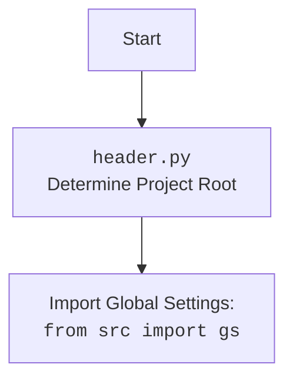

## АНАЛИЗ КОДА: `src/templates/_examples/header.py`

### 1. `<алгоритм>`:

1.  **Определение корневой директории проекта `dir_root`:**
    *   Получить текущую рабочую директорию с помощью `os.getcwd()`.
    *   Найти последнее вхождение строки `hypotez` в текущей рабочей директории.
    *   Извлечь подстроку от начала до конца последнего вхождения `hypotez` + 11 символов (длина слова `hypotez` = 7 + 4, где 4 это `/src`).
    *   Преобразовать полученную строку в объект `Path` и присвоить переменной `dir_root`.
    *   Пример: Если `os.getcwd()` возвращает `/home/user/projects/hypotez/src/templates/_examples`, `dir_root` станет `/home/user/projects/hypotez`.

2.  **Добавление корневой директории в `sys.path`:**
    *   Преобразовать `dir_root` в строку.
    *   Добавить строку в `sys.path`, чтобы Python мог находить модули в корневой директории проекта.

3.  **Определение директории `src` проекта `dir_src`:**
    *   Создать объект `Path` для директории `src` внутри корневой директории.
    *   Пример: `dir_src` станет `/home/user/projects/hypotez/src`.

4.  **Добавление корневой директории в `sys.path` (повторно)**
    *   Дублирование шага 2, возможно, ошибка или преднамеренное дублирование (для текущего анализа дублирование проигнорируем).

5. **Вывод `dir_root`**
    * Вывод на экран текущей корневой директории.

6. **Импорт необходимых библиотек:**
    *   Импортируются необходимые библиотеки для работы с файлами, JSON, регулярными выражениями и пользовательскими модулями `src`.

7.  **Импорт пользовательских модулей:**
    *   Импортируются пользовательские модули из пакета `src` и его подпакетов:
        *   `gs` (вероятно, глобальные настройки),
        *   `Supplier` из `src.suppliers`,
        *   `Product`, `ProductFields`, `ProductFieldsLocators` из `src.product`,
        *   `Category` из `src.category`,
        *   `j_dumps`, `j_loads`, `pprint`, `save_text_file` из `src.utils.jjson`,
        *   `logger`, `StringNormalizer`, `ProductFieldsValidator` из `src.logger.logger`.

### 2. `<mermaid>`:

```mermaid
flowchart TD
    Start[Начало] --> DetermineRootDirectory[Определение корневой директории проекта]
    DetermineRootDirectory --> AddRootToSysPath[Добавление корневой директории в sys.path]
    AddRootToSysPath --> DefineSrcDirectory[Определение директории 'src' проекта]
    DefineSrcDirectory --> AddRootToSysPathAgain[Добавление корневой директории в sys.path (повторно)]
    AddRootToSysPathAgain --> PrintRootDir[Вывод корневой директории]
    PrintRootDir --> ImportLibs[Импорт стандартных библиотек]
    ImportLibs --> ImportSrcModules[Импорт модулей из пакета 'src']
    ImportSrcModules --> End[Конец]

    style Start fill:#f9f,stroke:#333,stroke-width:2px
    style End fill:#ccf,stroke:#333,stroke-width:2px

```

**Анализ зависимостей в `mermaid`:**

*   **Start**: Начало выполнения скрипта.
*   **DetermineRootDirectory**: Определяет корневую директорию проекта.
*   **AddRootToSysPath**: Добавляет корневую директорию в `sys.path`, что позволяет импортировать модули из нее.
*   **DefineSrcDirectory**: Определяет директорию `src`, которая находится внутри корневой директории.
*   **AddRootToSysPathAgain**: Повторно добавляет корневую директорию в `sys.path` (возможно, ошибка).
*   **PrintRootDir**: Выводит корневую директорию, что позволяет разработчику увидеть, что корневая директория определена корректно.
*   **ImportLibs**: Импортирует стандартные библиотеки Python, которые используются в дальнейшем.
*   **ImportSrcModules**: Импортирует пользовательские модули из пакета `src`, необходимые для работы программы.
*   **End**: Конец выполнения скрипта.

### 3. `<объяснение>`:

#### Импорты:

*   **`import sys`**: Предоставляет доступ к некоторым переменным и функциям, взаимодействующим с интерпретатором Python. В данном случае используется для добавления пути к каталогу в `sys.path`, что позволяет импортировать модули из этого каталога.
*   **`import os`**: Предоставляет функции для взаимодействия с операционной системой, такие как получение текущей директории (`os.getcwd()`).
*   **`from pathlib import Path`**: Предоставляет класс `Path` для работы с путями к файлам и директориям.
*   **`import json`**: Предоставляет инструменты для работы с JSON-данными.
*   **`import re`**: Предоставляет инструменты для работы с регулярными выражениями.
*   **`from src import gs`**: Импортирует модуль `gs` (вероятно, глобальные настройки) из пакета `src`. Это означает, что проект имеет структуру пакета и использует этот модуль для хранения и доступа к общим параметрам.
*   **`from src.suppliers import Supplier`**: Импортирует класс `Supplier` из модуля `suppliers` в пакете `src`. Скорее всего, класс представляет поставщиков товаров в рамках проекта.
*   **`from src.product import Product, ProductFields, ProductFieldsLocators`**: Импортирует классы `Product`, `ProductFields` и `ProductFieldsLocators` из модуля `product` в пакете `src`. Эти классы, вероятно, связаны с представлением и управлением информацией о продуктах.
*   **`from src.category import Category`**: Импортирует класс `Category` из модуля `category` в пакете `src`. Вероятно, класс представляет категории товаров.
*   **`from src.utils.jjson import j_dumps, j_loads, pprint, save_text_file`**: Импортирует функции для работы с JSON из `src.utils.jjson`, включая `j_dumps` для сериализации в JSON, `j_loads` для десериализации из JSON, `pprint` для форматированного вывода и `save_text_file` для сохранения текстового файла.
*   **`from src.logger.logger import logger, StringNormalizer, ProductFieldsValidator`**: Импортирует из модуля `logger` в пакете `src` логгер, нормализатор строк `StringNormalizer` и валидатор полей продукта `ProductFieldsValidator`.

#### Переменные:

*   **`dir_root: Path`**: Объект `Path` для хранения пути к корневой директории проекта. Тип `Path` помогает работать с путями в кроссплатформенном виде.
*   **`dir_src: Path`**: Объект `Path`, представляющий путь к директории `src` внутри проекта.

#### Функции (хотя в коде нет явно определенных функций, можно рассмотреть код как последовательность действий):

1.  **Определение `dir_root`**:
    *   `os.getcwd()` возвращает текущую рабочую директорию как строку.
    *   `.rfind('hypotez')` находит индекс последнего вхождения строки `hypotez`.
    *   `[:os.getcwd().rfind('hypotez') + 11]` извлекает подстроку до конца `hypotez` + `/src/` (11 символов).
    *   `Path(...)` создает объект `Path` из полученной строки.
2.  **Добавление путей в `sys.path`**:
    *   `str(dir_root)` преобразует объект `Path` в строку.
    *   `sys.path.append(...)` добавляет строку в список путей поиска модулей Python.
3.  **Вывод `dir_root`**:
    *   `print(dir_root)` выводит корневую директорию.

#### Проблемы и улучшения:

*   **Повторное добавление корневой директории:** Добавление `dir_root` в `sys.path` дважды может привести к дублированию путей в списке поиска модулей. Это, вероятно, ошибка и следует удалить повторное добавление.
*   **Магические числа**: В коде используется число `11` для определения длины `/src/`, но если изменить имя директории или изменить ее расположение, то это может сломать этот скрипт. В будущем лучше вынести длину в константу.
*   **Уточнение комментариев**: Многочисленные пустые комментарии в начале файла не несут никакой смысловой нагрузки.

#### Взаимосвязь с другими частями проекта:

*   **`gs`**: Глобальные настройки, которые используются во всем проекте.
*   **`src.suppliers`**: Модуль, отвечающий за поставщиков, вероятно, используется для получения данных о поставщиках продуктов.
*   **`src.product`**: Модуль, отвечающий за работу с продуктами, вероятно, используется для управления данными о продуктах и их свойствах.
*   **`src.category`**: Модуль, отвечающий за категории товаров, вероятно, используется для структурирования продуктов по категориям.
*   **`src.utils.jjson`**: Модуль с утилитами для работы с JSON, используется для сериализации и десериализации данных.
*   **`src.logger.logger`**: Модуль, предоставляющий функционал логгирования, используется для записи информации о событиях, происходящих в программе.

Этот код выполняет начальную настройку среды, определяя корневую директорию и добавляя ее в список путей поиска модулей Python, что позволяет правильно импортировать другие модули проекта.