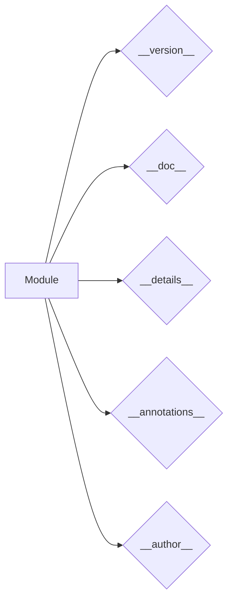

# <input code>

```python
## \file hypotez/src/templates/_examples/version.py
# -*- coding: utf-8 -*-\
#! venv/Scripts/python.exe
#! venv/bin/python/python3.12

"""
.. module: src.templates._examples 
	:platform: Windows, Unix
	:synopsis:

"""
MODE = 'dev'

"""
	:platform: Windows, Unix
	:synopsis:

"""


"""
	:platform: Windows, Unix
	:synopsis:

"""


"""
  :platform: Windows, Unix

"""
"""
  :platform: Windows, Unix
  :platform: Windows, Unix
  :synopsis:
"""MODE = 'dev'
  
""" module: src.templates._examples """


"""
- `__version__`: This variable holds the version of the module or package.
- `__name__`: Contains the name of the module. If the script is being run directly, the value will be `"__main__"`.
- `__doc__`: The module's documentation string.
- `__details__`: This variable likely contains additional details about the module, but the exact purpose depends on the specific module or package.
- `__annotations__`: Contains type annotations for variables and functions in the module.
- `__author__`: The name(s) of the author(s) of the module.
"""
__name__:str
__version__="3.12.0.0.0.4"
__doc__:str
__details__:str="Details about version for module or class"
__annotations__

__author__='hypotez '
```

# <algorithm>

Этот код не содержит алгоритма в традиционном понимании. Это скорее определение модуля или класса с некоторыми метаданными, такими как версия, документация и автор.  Нет циклов, условных операторов или вызовов функций, которые бы управляли потоком данных.

# <mermaid>



# <explanation>

Этот файл `version.py` определяет метаданные для модуля, который вероятно находится в пакете `hypotez/src/templates/_examples`.  

**Импорты:** Нет импортируемых модулей. Файл содержит только определения переменных, относящихся к метаинформации о модуле.

**Классы:** Нет определений классов.

**Функции:** Нет определений функций.

**Переменные:**

- `MODE`:  Строковая переменная, содержащая значение 'dev'.  Вероятно, эта переменная используется для управления режимом работы модуля (например, разработка/производство).
- `__version__`: Строковая переменная, содержащая версию модуля (`3.12.0.0.0.4`). Это важная информация, которая позволяет отслеживать изменения.
- `__doc__`: Строковая переменная, содержащая документацию модуля.  Документирующие строки  (`"""..."""`) необходимы для использования инструментов, которые генерируют документацию.
- `__details__`: Строковая переменная, содержащая дополнительные детали о версии модуля (скорее всего).
- `__annotations__`: Пустая переменная, предназначенная для хранения типов данных переменных и функций (с помощью типов аннотаций).
- `__author__`: Строковая переменная, содержащая имя автора (`'hypotez '`).
- `__name__`:  Строковая переменная, содержащая имя модуля. Внешне, она используется для проверки, запускается ли текущий модуль напрямую (если `__name__ == "__main__":`).


**Возможные ошибки/улучшения:**

- Не описано назначение  `__details__`,  должно быть описано назначение переменной.
- Нет валидации типов для переменных (например, `__version__`),  лучше использовать более строгие типы аннотаций.
- Не указана взаимосвязь с другими частями проекта. Непонятно, каким образом данный файл будет использоваться другими частями проекта `hypotez`.  Может быть, это просто файл с метаданными, который используется при сборке или для документирования.

**Взаимосвязи с другими частями проекта:**  Это скорее всего вспомогательный файл, который нужен для внутренних целей проекта `hypotez`.  Без дополнительных контекста сложно определить точную роль этого файла, его назначение и связь с другими файлами.