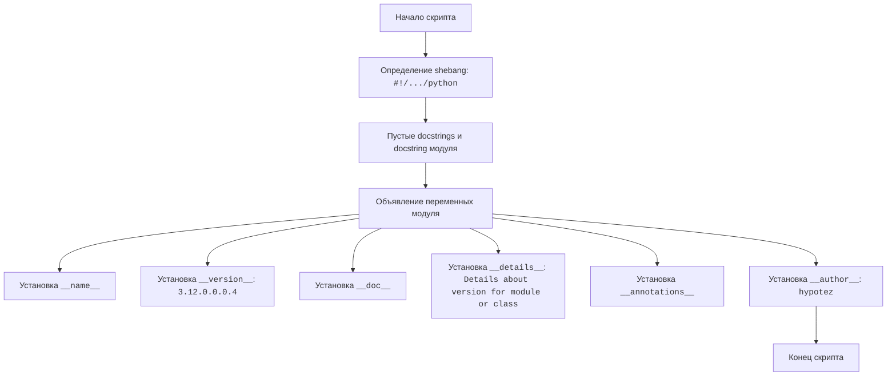

## ИНСТРУКЦИЯ:

Анализируй предоставленный код подробно и объясни его функциональность. Ответ должен включать три раздела:  

1. **<алгоритм>**: Опиши рабочий процесс в виде пошаговой блок-схемы, включая примеры для каждого логического блока, и проиллюстрируй поток данных между функциями, классами или методами.  
2. **<mermaid>**: Напиши код для диаграммы в формате `mermaid`, проанализируй и объясни все зависимости, 
    которые импортируются при создании диаграммы. 
    **ВАЖНО!** Убедитесь, что все имена переменных, используемые в диаграмме `mermaid`, 
    имеют осмысленные и описательные имена. Имена переменных вроде `A`, `B`, `C`, и т.д., не допускаются!  
    
    **Дополнительно**: Если в коде есть импорт `import header`, добавьте блок `mermaid` flowchart, объясняющий `header.py`:\
    ```mermaid
    flowchart TD
        Start --> Header[<code>header.py</code><br> Determine Project Root]
    
        Header --> import[Import Global Settings: <br><code>from src import gs</code>] 
    ```

3. **<объяснение>**: Предоставьте подробные объяснения:  
   - **Импорты**: Их назначение и взаимосвязь с другими пакетами `src.`.  
   - **Классы**: Их роль, атрибуты, методы и взаимодействие с другими компонентами проекта.  
   - **Функции**: Их аргументы, возвращаемые значения, назначение и примеры.  
   - **Переменные**: Их типы и использование.  
   - Выделите потенциальные ошибки или области для улучшения.  

Дополнительно, постройте цепочку взаимосвязей с другими частями проекта (если применимо).  

Это обеспечивает всесторонний и структурированный анализ кода.
## Формат ответа: `.md` (markdown)
**КОНЕЦ ИНСТРУКЦИИ**

## <алгоритм>

1. **Начало**: Скрипт начинается с определения магических комментариев (`` и `#! venv/bin/python/python3.12`), указывающих интерпретатор Python для выполнения скрипта.
    *   **Пример**: ``
2. **Определение строк документации (docstring)**: В начале файла есть несколько пустых docstring, а также docstring с описанием модуля.
    *   **Пример**: `""".. module:: src.templates._examples \n\t:platform: Windows, Unix\n\t:synopsis:\n\n"""`
3. **Объявление переменных модуля**:  Объявляются и инициализируются глобальные переменные: `__name__`, `__version__`, `__doc__`, `__details__`, `__annotations__` и `__author__`. 
    *   **Пример**: `__version__="3.12.0.0.0.4"`
    *   **Поток данных**: Инициализация переменных осуществляется напрямую при объявлении.
4. **Конец**: Завершение скрипта.

## <mermaid>



**Анализ зависимостей:**

В данном коде нет импортов, поэтому диаграмма не показывает импортированных модулей. Все объявленные переменные и их значения относятся к текущему модулю. Диаграмма показывает последовательность операций по определению переменных, которые являются частью метаданных модуля.

## <объяснение>

**Импорты:**

В данном коде нет инструкций `import`, что означает, что данный файл не зависит от внешних модулей или пакетов в рамках проекта. 

**Классы:**

В данном коде нет определения классов. Код состоит из последовательности объявлений и присваивания значений глобальным переменным модуля.

**Функции:**

В данном коде нет определения функций. Код занимается инициализацией метаданных модуля.

**Переменные:**

-   `__name__`: Строковая переменная, которая по умолчанию содержит имя модуля. Если скрипт запускается напрямую, то она будет равна `"__main__"`.
-   `__version__`: Строковая переменная, содержащая версию модуля. В данном случае `"3.12.0.0.0.4"`.
-   `__doc__`: Строковая переменная, которая предназначена для хранения docstring модуля (в данном случае docstring не определен).
-   `__details__`: Строковая переменная, содержащая дополнительную информацию о модуле `"Details about version for module or class"`.
-   `__annotations__`: Переменная, предназначенная для хранения аннотаций типов для переменных и функций (в данном случае, не задана).
-   `__author__`: Строковая переменная, содержащая имя автора модуля: `"hypotez"`.

**Дополнительные замечания:**

-   **Магические комментарии (`#!`)**: Эти строки указывают интерпретатор Python, который должен использоваться для запуска скрипта. Они важны для Unix-подобных систем, где скрипты могут запускаться напрямую. В данном случае, указаны пути к интерпретаторам Python внутри виртуального окружения.
-   **Docstrings**: Документация модуля, которая располагается в начале файла в тройных кавычках (`"""`). Она используется для описания назначения модуля. В начале файла находится несколько пустых docstring, что может быть избыточным и возможно, является следствием автоматической генерации шаблона.
-   **Глобальные переменные**: Переменные, определенные на уровне модуля (не внутри классов или функций) считаются глобальными для данного модуля. Они хранят метаданные, которые могут быть использованы другими модулями при импорте данного файла.
-   **Использование метаданных**: Обычно, метаданные модуля, такие как `__version__`, `__author__`, используются для автоматической генерации документации или других целей.

**Возможные ошибки и области для улучшения:**

-   **Отсутствие `__doc__`**:  `__doc__` не проинициализирован и имеет значение `None`. Рекомендуется добавить в него описание модуля.
-   **Неиспользуемый `__annotations__`**:  `__annotations__` объявлен, но не инициализирован и не используется. Если аннотации типов не нужны, то лучше не объявлять эту переменную.
-  **Избыточное количество пустых docstring:** Лишние пустые docstring могут быть удалены.

**Взаимосвязи с другими частями проекта:**

Этот файл, вероятно, является частью более крупного проекта.  Файл предназначен для хранения метаданных модуля. Другие части проекта могут импортировать данный файл для доступа к метаданным, например, для отображения версии программы или имени автора.