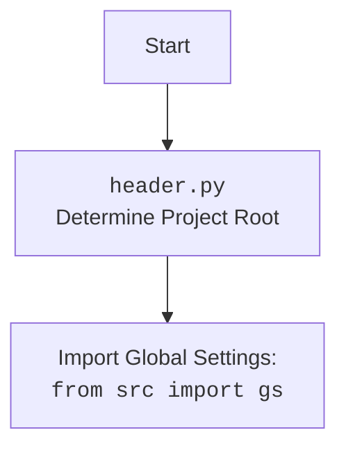

# Анализ кода `hypotez/src/templates/header.py`

## 1. <алгоритм>

**`set_project_root` Function:**

1.  **Начало**: Функция `set_project_root` вызывается без аргументов (используется значение по умолчанию `marker_files = ('__root__')`).
    *   Пример: `set_project_root()`
2.  **Определение текущего пути**: Получение абсолютного пути к директории, содержащей текущий файл (`header.py`), и сохранение его в переменной `current_path`.
    *   Пример: Если `header.py` находится в `/home/user/hypotez/src/templates/`, то `current_path` будет `/home/user/hypotez/src/templates`.
3.  **Инициализация корня**: Инициализация переменной `__root__` текущим путем.
    *   Пример: `__root__` = `/home/user/hypotez/src/templates`.
4.  **Поиск родительских директорий**: Создание списка для итерации, который включает текущий путь и все его родительские директории.
    *   Пример: Список для итерации будет: `['/home/user/hypotez/src/templates', '/home/user/hypotez/src', '/home/user/hypotez', '/home/user', '/home', '/']`
5.  **Цикл проверки маркеров**: Итерация по списку родительских директорий.
6.  **Проверка маркеров**: Для каждой родительской директории проверяется наличие файла или директории с именем из `marker_files` (по умолчанию `__root__`).
    *   Пример: На первой итерации проверяется наличие `/home/user/hypotez/src/templates/__root__`, на второй - `/home/user/hypotez/src/__root__` и т.д.
7.  **Обновление корня**: Если маркер найден, `__root__` обновляется до этой родительской директории.
    *   Пример: Если файл `__root__` найден в `/home/user/hypotez`, то `__root__` станет `/home/user/hypotez`.
8.  **Выход из цикла**: После нахождения маркера, цикл прерывается.
9.  **Обновление `sys.path`**: Проверяется, находится ли `__root__` в `sys.path`. Если нет, то он добавляется в начало `sys.path`.
    *   Пример: Если `/home/user/hypotez` не в `sys.path`, он добавляется в `sys.path`.
10. **Возврат корня**: Функция возвращает значение `__root__`.
    *   Пример: Функция возвращает `/home/user/hypotez`.

**После вызова `set_project_root`:**

1.  Глобальная переменная `__root__` устанавливается в возвращенное значение (корень проекта).
2.  Импортируется `src.gs`.

## 2. <mermaid>

```mermaid
flowchart TD
    Start --> set_project_root_call[Call set_project_root()]
    
    set_project_root_call --> get_current_path[Get Current File Path]
    get_current_path --> init_project_root[Initialize project_root = current_path]
    
    init_project_root --> loop_parents[Loop through Parent Directories]
    
    loop_parents -- For each parent --> check_marker[Check for Marker Files]
    
    check_marker -- Marker Found --> update_project_root[Update project_root]
    update_project_root --> break_loop[Break Loop]
    
    check_marker -- Marker Not Found --> loop_parents
    
    loop_parents -- Loop Finished --> check_sys_path[Check if project_root in sys.path]
    
    break_loop --> check_sys_path
    
    check_sys_path -- Not in sys.path --> add_sys_path[Add project_root to sys.path]
    add_sys_path --> return_project_root[Return project_root]
     
    check_sys_path -- In sys.path --> return_project_root
    
    return_project_root --> set_global_root[Set global __root__ variable]
    set_global_root --> import_gs[Import Global Settings: <br><code>from src import gs</code>]
    import_gs --> End
    
    
    
    
    
```



**Зависимости (объяснение):**

*   **`sys`**: Модуль `sys` используется для доступа к переменным и функциям, взаимодействующим с интерпретатором Python. В данном случае, `sys.path` используется для управления путями поиска модулей.
*   **`json`**:  Этот модуль импортируется, но не используется в данном коде. Вероятно, он предназначен для будущего использования, например, для работы с файлами конфигурации в формате JSON.
*   **`packaging.version`**:  Используется для управления версиями, но в данном коде не используется напрямую. Вероятно, этот модуль предназначен для работы с версиями проекта.
*   **`pathlib.Path`**: Используется для работы с путями файловой системы, предоставляя более объектно-ориентированный подход.
*   **`src.gs`**: Импортируется из пакета `src`, вероятно, для доступа к глобальным настройкам или константам.

## 3. <объяснение>

**Импорты:**

*   `import sys`:  Импортирует модуль `sys`, который предоставляет доступ к некоторым переменным и функциям, тесно связанным с интерпретатором Python. Здесь он используется для изменения `sys.path`, что позволяет Python находить модули в каталоге проекта.
*   `import json`: Импортирует модуль `json`, предназначенный для работы с данными в формате JSON. **В данном коде не используется**.
*   `from packaging.version import Version`: Импортирует класс `Version` из пакета `packaging.version` для управления версиями, но **в данном коде не используется**.
*   `from pathlib import Path`: Импортирует класс `Path` из модуля `pathlib`, который предназначен для объектно-ориентированного управления путями к файлам и директориям.
*   `from src import gs`: Импортирует модуль `gs` из пакета `src`. Вероятно, `gs` содержит глобальные настройки, переменные или функции, общие для всего проекта.

**Переменные:**

*   `MODE`: Глобальная переменная, определяющая режим работы программы. В данном случае, установлена в значение 'dev', что указывает на режим разработки.
*   `__root__`: Глобальная переменная, представляющая путь к корневому каталогу проекта (тип `Path`). Она вычисляется с помощью функции `set_project_root()` и используется для добавления корня проекта в `sys.path` для правильной загрузки модулей.
*   `marker_files`: (в функции)  Кортеж строк, представляющий список маркеров для поиска корня проекта. По умолчанию равен ('\_\_root\_\_').

**Функции:**

*   `set_project_root(marker_files=('__root__')) -> Path:`
    *   **Аргументы:**
        *   `marker_files` (tuple): Кортеж имен файлов или директорий, которые служат маркерами корневого каталога проекта. Значение по умолчанию - `('__root__')`.
    *   **Возвращаемое значение:**
        *   `Path`: Объект `Path`, представляющий путь к корневой директории проекта.
    *   **Назначение:** Функция определяет корневую директорию проекта, начиная с текущей директории файла и поднимаясь вверх по иерархии директорий, пока не найдет директорию, содержащую один из маркеров.
    *   **Пример:** Если `header.py` находится в `/home/user/hypotez/src/templates/`, и маркер `__root__` находится в `/home/user/hypotez`, то функция вернет `/home/user/hypotez`.

**Классы:**

*   Классы в данном коде не используются.

**Потенциальные проблемы и улучшения:**

*   **Неиспользуемые импорты**: Модули `json` и `packaging.version` импортируются, но не используются в предоставленном коде. Их стоит удалить, если они не нужны для дальнейшего использования, или оставить комментарии с объяснением их будущей роли.
*   **Жестко заданный маркер**: Маркер `__root__` задан по умолчанию. Возможно, стоит сделать его более гибким, чтобы можно было использовать другие маркеры.
*   **Условное добавление в `sys.path`**: Добавление корня проекта в `sys.path` выполняется только если его там нет. Это нужно для того, чтобы избежать добавления корня несколько раз, но, возможно, стоит добавить логику для проверки правильности пути или использования более явного способа управления путями поиска.

**Взаимосвязь с другими частями проекта:**

*   `header.py` является общим файлом конфигурации.
*   `__root__` используется для импорта модулей из разных частей проекта, в частности для `from src import gs`.
*   `MODE` может использоваться для переключения между режимами работы приложения, например, `dev`, `prod`, `test`.

В целом, код выполняет важную функцию определения корневого каталога проекта и обеспечивает корректную загрузку модулей при запуске скрипта из любой директории в проекте.