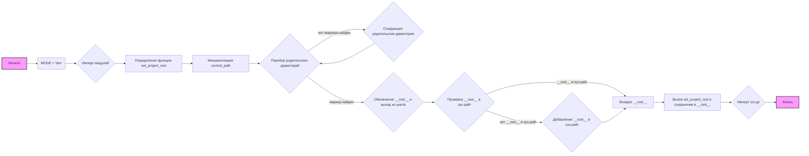

## Анализ кода `hypotez/src/templates/header.py`

### 1. <алгоритм>

**Блок-схема:**

1.  **Начало:**
    *   Установка `MODE = 'dev'`.
    *   Импорт модулей `sys`, `json`, `Version` из `packaging.version` и `Path` из `pathlib`.
2.  **Определение функции `set_project_root`**:
    *   Функция принимает кортеж `marker_files` (по умолчанию `('pyproject.toml', 'requirements.txt', '.git')`) для поиска корневой директории проекта.
    *   Инициализация переменной `__root__` и `current_path` (путь к директории текущего файла).
    *   Перебор родительских директорий:
        *   Проверка, содержит ли текущая родительская директория любой из `marker_files`.
            *   **Пример**: `(parent / 'pyproject.toml').exists()` вернет `True`, если в директории `parent` существует файл `pyproject.toml`.
        *   Если найдена директория с `marker_files`, `__root__` обновляется и цикл прерывается.
    *   Если `__root__` не в `sys.path`, добавляем `__root__` в начало `sys.path`.
    *   Возвращает `__root__`.
3.  **Вызов функции `set_project_root`**:
    *   Вызов `set_project_root()` и сохранение результата в переменную `__root__`.
4. **Импорт модуля `gs` из `src`**:
    * Импорт модуля `gs`.
5.  **Конец.**

**Поток данных:**

1.  Функция `set_project_root` использует `Path(__file__).resolve().parent` для получения пути к директории, в которой находится файл.
2.  `set_project_root` итерирует по родительским директориям (`current_path.parents`).
3.  `set_project_root` проверяет наличие `marker_files` в каждой родительской директории, используя метод `.exists()`.
4.  Если маркер найден, `set_project_root` возвращает путь к этой директории, который сохраняется в `__root__`.
5.  Переменная `__root__` используется для добавления в `sys.path` (если она не является его частью), что позволяет импортировать модули из корневой директории проекта.
6.  Импорт `src.gs` использует `sys.path`, чтобы найти модуль `gs` в каталоге `src`.

### 2. <mermaid>

**Объяснение зависимостей в `mermaid`:**

*   **Начало** (`A`) - начало выполнения скрипта.
*   **MODE = 'dev'** (`B`) - устанавливается глобальная переменная `MODE` в значение `'dev'`.
*  **Импорт модулей** (`C`) - импортируются необходимые модули: `sys`, `json`, `Version`, `Path`.
*  **Определение функции `set_project_root`** (`D`) - объявляется функция `set_project_root`.
* **Инициализация `current_path`** (`E`) - переменная `current_path` инициализируется как путь к каталогу, где находится текущий файл скрипта.
*  **Перебор родительских директорий** (`F`) - цикл перебора родительских каталогов от каталога файла и выше.
*  **Следующая родительская директория** (`G`) - переход к следующей родительской директории в цикле.
*  **Обновление `__root__` и выход из цикла** (`H`) - при нахождении маркера, обновляется `__root__` и цикл завершается.
*  **Проверка `__root__` в `sys.path`** (`I`) - проверка, находится ли путь корневой директории в системном списке путей.
*   **Добавление `__root__` в `sys.path`** (`J`) - если путь корневой директории не в системном списке, то он добавляется.
*   **Возврат `__root__`** (`K`) - функция возвращает путь к корневой директории.
*   **Вызов `set_project_root` и сохранение в `__root__`** (`L`) - вызов функции `set_project_root` и сохранение результата в переменную `__root__`.
*  **Импорт `src.gs`** (`M`) - импортируется модуль `gs` из каталога `src`.
* **Конец** (`N`) - конец выполнения скрипта.

### 3. <объяснение>

**Импорты:**

*   `sys`: Модуль `sys` используется для работы с интерпретатором Python. В данном коде он используется для модификации `sys.path` – списка путей поиска модулей.
*   `json`: Модуль `json` импортирован, но не используется в данном коде.
*   `packaging.version.Version`: Импортируется класс `Version` для работы с версиями пакетов, но не используется в данном файле.
*   `pathlib.Path`: Класс `Path` из модуля `pathlib` используется для работы с путями файловой системы.  Он предоставляет объектно-ориентированный способ работы с путями и является предпочтительным способом по сравнению с обычными строками.

**Переменные:**

*   `MODE`: Глобальная переменная, установленная в значение `'dev'`. Предположительно, используется для определения режима работы приложения (например, разработка или продакшен).
*   `__root__`:  Переменная типа `pathlib.Path`, в которой сохраняется путь к корневой директории проекта, найденный с помощью функции `set_project_root`.

**Функции:**

*   `set_project_root(marker_files: tuple = ('pyproject.toml', 'requirements.txt', '.git')) -> Path`:
    *   **Аргументы:** `marker_files` - кортеж, содержащий имена файлов или каталогов, которые используются для определения корневой директории проекта. По умолчанию используется `('pyproject.toml', 'requirements.txt', '.git')`.
    *   **Возвращает:** Объект `pathlib.Path`, представляющий путь к корневой директории проекта. Если корневая директория не найдена (т.е. маркеры не обнаружены), то возвращает путь к директории, где находится скрипт.
    *   **Назначение:** Находит корневую директорию проекта, поднимаясь вверх по иерархии каталогов, пока не найдет один из маркерных файлов. Используется для добавления корневого пути в `sys.path`, что позволяет импортировать модули из других частей проекта.
    *   **Пример:**
        *   Допустим, скрипт находится в `/path/to/project/src/templates/header.py`, а корневая директория `/path/to/project` содержит файл `pyproject.toml`. В таком случае функция вернет `Path('/path/to/project')`.

**Классы:**

*   Классы не используются в данном файле.

**Взаимосвязь с другими частями проекта:**

*   Данный файл `header.py` является частью шаблона, и поэтому он является точкой входа проекта, который устанавливает путь к корню проекта для импорта модулей из `src`. В данном случае, он используется для импорта `src.gs`. Это позволяет остальному коду проекта находить и импортировать модули, не завися от текущего рабочего каталога.

**Потенциальные ошибки и области для улучшения:**

*   Импорт `json` и `packaging.version` не используются. Их следует удалить, чтобы избежать неиспользуемых импортов.
*   `__root__` может быть переменной уровня модуля, что делает ее доступной извне, не должно быть. Можно сделать ее внутренней переменной, возвращая из функции.

**Цепочка взаимосвязей:**

1.  Скрипт `header.py` определяет корневую директорию проекта с помощью `set_project_root()`.
2.  Полученный путь добавляется в `sys.path`.
3.  После установки `sys.path` скрипт импортирует `src.gs`.
4.  Импорт `src.gs` позволяет использовать функциональность, определенную в модуле `gs`, во всем проекте.