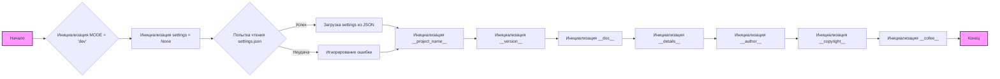

## Анализ кода `hypotez/src/templates/version.py`

### 1. <алгоритм>

**Блок-схема:**

1.  **Начало:** Запуск скрипта.
2.  **Инициализация `MODE`:** Переменной `MODE` присваивается значение 'dev'.
    *   Пример: `MODE = 'dev'`
3.  **Инициализация `settings`:** Переменной `settings` присваивается значение `None`.
    *   Пример: `settings = None`
4.  **Попытка чтения `settings.json`:**
    *   Блок `try`: Попытка открыть файл `../settings.json` для чтения.
    *   Пример: `with open('../settings.json', 'r') as settings_file:`
    *   **Успех:** Если файл открыт успешно, его содержимое загружается в переменную `settings` как словарь JSON.
        *   Пример: `settings = json.load(settings_file)`
    *   **Неудача:** Если возникает `FileNotFoundError` или `json.JSONDecodeError`, блок `except` перехватывает ошибку и ничего не делает (`...`).
5.  **Инициализация `__project_name__`:**
    *   Проверка: Если `settings` не `None` , то берется значение из `settings.get("project_name", 'hypotez')`. Иначе присваивается значение `hypotez`.
    *   Пример: `__project_name__ = settings.get("project_name", 'hypotez') if settings  else 'hypotez'`
6.  **Инициализация `__version__`:**
    *   Проверка: Если `settings` не `None` , то берется значение из `settings.get("version", '')`. Иначе присваивается значение "".
    *   Пример: `__version__ = settings.get("version", '')  if settings  else ''`
7.  **Инициализация `__doc__`:** Переменной `__doc__` присваивается значение "".
    *   Пример: `__doc__ = ''`
8.  **Инициализация `__details__`:** Переменной `__details__` присваивается значение "".
    *   Пример: `__details__ = ''`
9.  **Инициализация `__author__`:**
    *   Проверка: Если `settings` не `None` , то берется значение из `settings.get("author", '')`. Иначе присваивается значение "".
    *   Пример: `__author__ = settings.get("author", '')  if settings  else ''`
10. **Инициализация `__copyright__`:**
    *   Проверка: Если `settings` не `None` , то берется значение из `settings.get("copyrihgnt", '')`. Иначе присваивается значение "".
    *   Пример: `__copyright__ = settings.get("copyrihgnt", '')  if settings  else ''`
11. **Инициализация `__cofee__`:**
    *   Проверка: Если `settings` не `None` , то берется значение из `settings.get("cofee", "Treat the developer to a cup of coffee for boosting enthusiasm in development: https://boosty.to/hypo69")`. Иначе присваивается значение "Treat the developer to a cup of coffee for boosting enthusiasm in development: https://boosty.to/hypo69".
    *   Пример: `__cofee__ = settings.get("cofee", "Treat the developer to a cup of coffee for boosting enthusiasm in development: https://boosty.to/hypo69")  if settings  else "Treat the developer to a cup of coffee for boosting enthusiasm in development: https://boosty.to/hypo69"`
12. **Конец:** Завершение работы скрипта.

### 2. <mermaid>

**Объяснение зависимостей `mermaid`:**

*   `graph LR`: Объявляет граф, который будет отображаться слева направо.
*   `A[Начало]`:  Определяет узел начала.
*   `B{Инициализация MODE = 'dev'}`:  Определяет узел для инициализации переменной `MODE`. `{}` - фигурные скобки для обозначения условий.
*   `C[Инициализация settings = None]`: Определяет узел для инициализации переменной `settings`. `[]` - квадратные скобки для обозначения шага/действия.
*   `D{Попытка чтения settings.json}`: Определяет узел для попытки чтения файла `settings.json`.
*   `D -- Успех --> E`:  Показывает переход при успешном чтении файла.
*   `D -- Неудача --> F`: Показывает переход при неудачном чтении файла.
*   `E[Загрузка settings из JSON]`: Определяет узел для загрузки данных из JSON файла.
*   `F[Игнорирование ошибки]`:  Определяет узел для игнорирования ошибки.
*   `G[Инициализация __project_name__]`: Определяет узел для инициализации переменной `__project_name__`.
*   `H[Инициализация __version__]`: Определяет узел для инициализации переменной `__version__`.
*   `I[Инициализация __doc__]`:  Определяет узел для инициализации переменной `__doc__`.
*   `J[Инициализация __details__]`:  Определяет узел для инициализации переменной `__details__`.
*    `K[Инициализация __author__]`: Определяет узел для инициализации переменной `__author__`.
*    `L[Инициализация __copyright__]`: Определяет узел для инициализации переменной `__copyright__`.
*    `M[Инициализация __cofee__]`: Определяет узел для инициализации переменной `__cofee__`.
*   `N[Конец]`:  Определяет узел конца.
*   `-->`:  Стрелка, указывающая поток выполнения.
*   `style` задает стили для узлов.

### 3. <объяснение>

**Импорты:**

*   `import json`: Импортирует модуль `json`, который используется для работы с данными в формате JSON. В данном случае, он используется для чтения данных конфигурации из файла `settings.json`.

**Переменные:**

*   `MODE`: Строковая переменная, которая устанавливает режим работы скрипта. В данном случае установлена в значение `'dev'`.
*   `settings`: Словарь, который используется для хранения настроек из файла `settings.json`. Изначально установлен в `None`.
*   `__project_name__`: Строковая переменная, которая хранит имя проекта. Если в файле `settings.json` есть значение для ключа `project_name`, то оно будет использовано, в противном случае используется значение по умолчанию `'hypotez'`.
*   `__version__`: Строковая переменная, которая хранит версию проекта. Если в файле `settings.json` есть значение для ключа `version`, то оно будет использовано, в противном случае используется пустая строка.
*   `__doc__`: Строковая переменная, которая хранит документацию проекта. В данном случае устанавливается пустая строка.
*   `__details__`: Строковая переменная, которая хранит детали проекта. В данном случае устанавливается пустая строка.
*   `__author__`: Строковая переменная, которая хранит имя автора проекта. Если в файле `settings.json` есть значение для ключа `author`, то оно будет использовано, в противном случае используется пустая строка.
*  `__copyright__`: Строковая переменная, которая хранит информацию о копирайте. Если в файле `settings.json` есть значение для ключа `copyrihgnt`, то оно будет использовано, в противном случае используется пустая строка.
*   `__cofee__`: Строковая переменная, которая содержит сообщение с предложением поддержать разработчика. Если в файле `settings.json` есть значение для ключа `cofee`, то оно будет использовано, в противном случае используется сообщение по умолчанию.

**Функции:**

*   `json.load(settings_file)`: Функция модуля `json`, которая используется для загрузки JSON данных из открытого файла. В данном случае используется для загрузки настроек из `settings.json` в словарь `settings`.
*   `settings.get(key, default)`:  Метод словаря `settings`, который возвращает значение по ключу `key`, если ключ присутствует в словаре. Если ключа нет, то возвращается значение `default`.

**Объяснение кода:**

1.  Код предназначен для определения и хранения основных настроек проекта (имя, версию, автора и т.д.).
2.  Он пытается загрузить настройки из файла `settings.json`, расположенного на уровень выше текущего файла.
3.  Если файл не найден или имеет неверный формат JSON, то скрипт использует значения по умолчанию.
4.  Переменные `__project_name__`, `__version__`, `__author__`, `__copyright__` и `__cofee__` используются для хранения данных о проекте и могут быть доступны в других частях проекта.
5.  Переменные `__doc__` и `__details__` объявлены, но не инициализируются, что оставляет место для будущей документации.
6.  Переменная `MODE` установлена в `dev`, что может использоваться для управления различными режимами работы приложения (например, для режима разработки).
7.  Скрипт обрабатывает исключения `FileNotFoundError` и `json.JSONDecodeError` при загрузке файла `settings.json`.
8.  Для доступа к значениям в `settings`, используется метод `.get()` с указанием значения по умолчанию, на случай отсутствия ключа.

**Потенциальные ошибки и области для улучшения:**

*   Обработка ошибок: В блоке `except` используется только `...`, что означает отсутствие обработки ошибки. Для удобства отладки и понимания стоит добавить вывод ошибок в лог.
*   Несогласованность в правописании: В файле `settings.json` и в коде используется несогласованность в написании `copyrihgnt`.
*   Файл `settings.json`: Необходимо создать и настроить файл `settings.json`, чтобы можно было использовать настройки из файла, иначе, будут использоваться значения по умолчанию.
*   Отсутствует обработка случая, когда `settings` не является словарем, после попытки загрузки из JSON.
*   Целесообразно рассмотреть добавление валидации загруженных из `settings.json` данных.
*   Следует добавить документацию для переменных `__doc__` и `__details__`, чтобы использовать их по назначению.

**Взаимосвязь с другими частями проекта:**

Данный файл (`version.py`) вероятно предназначен для хранения метаданных проекта, которые могут быть использованы в других модулях для отображения информации о проекте. Например, можно использовать эти переменные в модулях сборки, или при выводе информации в консоль.