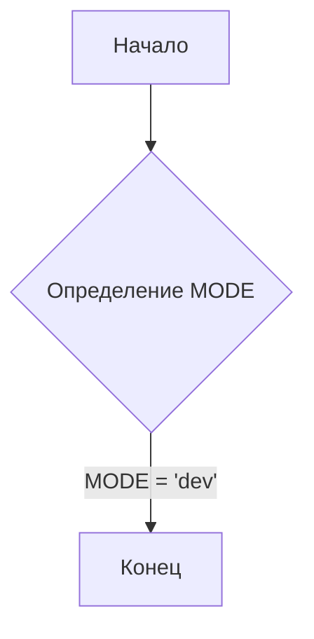
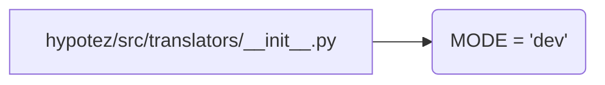

```MD
# Анализ файла hypotez/src/translators/__init__.py

1. **<input code>**:

```python
## \file hypotez/src/translators/__init__.py
# -*- coding: utf-8 -*-
#! venv/Scripts/python.exe
#! venv/bin/python/python3.12

"""
.. module: src.translators 
	:platform: Windows, Unix
	:synopsis:

"""
MODE = 'dev'
```

2. **<algorithm>**:

Этот файл является инициализационным модулем для пакета `translators`.  В нем нет управляемого алгоритма в традиционном смысле. Он просто определяет переменную `MODE`.  Блок-схема в данном случае тривиальна:



Пример:  При импорте модуля `translators` в другом месте проекта, эта переменная будет доступна, и ее значение будет равно `'dev'`.

3. **<mermaid>**:



4. **<explanation>**:

* **Импорты**: Нет импортов. Файл содержит только определение переменной.

* **Классы**: Нет классов.

* **Функции**: Нет функций.

* **Переменные**:
    * `MODE`:  Строковая переменная, которая, скорее всего, используется для определения режима работы (например, "dev" для разработки, "prod" для производства).  Её значение (в данном случае `'dev'`) будет доступно в других модулях пакета `translators` и, возможно, в других частях проекта, которые импортируют этот модуль.

* **Возможные ошибки или области для улучшений**:

    *  Нет явного назначения для переменной `MODE`.  Для лучшей читаемости и понимания, стоит добавить комментарий, описывающий её предназначение.
    * Неясно, как эта переменная используется далее в кодовой базе.   Нужно понимать, где и как она используется в других модулях или функциях.
    *  Использование `#! venv/Scripts/python.exe` и `#! venv/bin/python/python3.12` в начале файла устарело и не рекомендуется. Это указывает интерпретатору Python, какой исполняемый файл использовать для запуска скрипта,  но современные проекты используют virtual environments (как предположено в имени файла) и не должны полагаться на такие директивы.
    * Документация в виде `"""..."""` в начале файла хороша. Можно добавить информацию о том, как использовать `MODE`.


* **Взаимосвязи с другими частями проекта**:

Переменная `MODE` скорее всего используется в других частях проекта `translators` или других модулях, которые импортируют `hypotez/src/translators/__init__.py`.  Например, другой модуль может проверить значение `MODE` и настроить своё поведение в зависимости от него.  Без дальнейшего контекста проекта точный вид взаимодействия остаётся неизвестным.


**Выводы:**

Файл `__init__.py` - это важный компонент, который организует пакет `translators` и делает его доступным для использования.  В данном случае он просто определяет константу `MODE` , что указывает на неполноту реализации или недостаток контекста для дальнейшего анализа.  Для улучшения кода необходимо пояснить назначение `MODE` и убрать устаревшие комментарии.