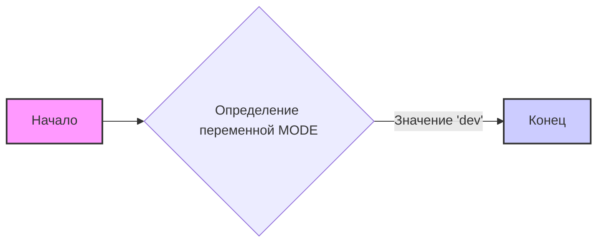
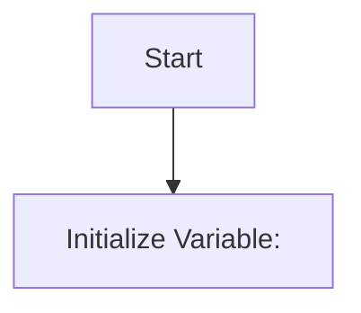

## АНАЛИЗ КОДА: `hypotez/src/translators/__init__.py`

### 1. <алгоритм>

**Описание:**
Файл `__init__.py` в пакете `src.translators` инициализирует этот пакет. В данном коде выполняется лишь одна операция: определение переменной `MODE` со значением `'dev'`. Это указывает на то, что модуль находится в режиме разработки.

**Блок-схема:**


**Пример:**

1. **Начало:**  Начинается выполнение кода файла `__init__.py`.
2. **Определение переменной `MODE`:** Создается переменная `MODE` и ей присваивается строковое значение `'dev'`.
3. **Конец:** Завершается выполнение кода файла.

### 2. <mermaid>


**Объяснение `mermaid` кода:**

*   **`flowchart TD`**: Объявляет диаграмму типа "flowchart" с направлением "Top to Down".
*   **`Start`**: Начальная точка диаграммы.
*   **`InitializeMode[Initialize Variable:  <br><code></code>]`**: Блок, представляющий инициализацию переменной `MODE` со значением `'dev'`.  Внутри блока отображается сам код инициализации.

**Зависимости:**

В данном коде нет импорта каких-либо модулей.

### 3. <объяснение>

**Импорты:**
В данном файле отсутствуют импорты. `__init__.py`  может импортировать другие модули или пакеты, но в данном случае этого не происходит.

**Классы:**
В данном файле классы не определены.

**Функции:**
В данном файле нет функций.

**Переменные:**
*   **`MODE`**: Строковая переменная, задающая режим работы модуля. В данном случае имеет значение `'dev'`, что указывает на режим разработки. Тип: `str`. Это значение может быть использовано другими модулями, чтобы настроить поведение программы в зависимости от режима (например, включить или отключить отладочный вывод).

**Потенциальные ошибки и области для улучшения:**

1.  **Отсутствие docstring пакета:** Хотя есть `module docstring`, он пуст, не информативен. Необходимо его наполнить для облегчения понимания назначения пакета.
2.  **Жестко заданное значение MODE:**  Значение  `` является константой, и для переключения на производственный режим потребует изменений в коде. Стоит предусмотреть способ определения режима извне, например, через переменные окружения или конфигурационный файл.
3.  **Отсутствие  логики инициализации:**  Файл `__init__.py` чаще всего используется для инициализации пакета, определения общих переменных или импорта модулей. В данном случае выполняется только инициализация переменной `MODE`, что недостаточно. Необходимо добавить логику для работы с пакетом.
**Цепочка взаимосвязей с другими частями проекта:**

*   **Глобальные настройки:**  Переменная `MODE`, определенная в данном файле, может быть использована другими модулями проекта для определения режима работы приложения.

**Примеры использования `MODE`:**

```python
# Пример использования MODE в другом модуле
from src.translators import MODE

if MODE == 'dev':
    print("Режим разработки: включен подробный вывод")
    # Выполнение действий, специфичных для режима разработки
else:
    print("Режим производства: оптимизированный вывод")
    # Выполнение действий, специфичных для режима производства
```
```