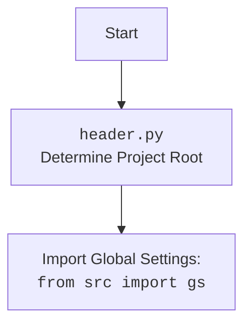

## <алгоритм>

1. **`set_project_root(marker_files)`**:
   - **Начало**: Функция вызывается с кортежем `marker_files` (по умолчанию `('__root__', '.git')`).
   - **Инициализация**: Определяется путь к директории текущего файла (`current_path`), а также начальное значение для корня проекта `__root__`, которое равно `current_path`.
   - **Поиск корня**: 
        - Происходит итерация по текущей директории и всем ее родительским директориям.
        - На каждой итерации проверяется, существует ли в текущей директории хотя бы один из `marker_files`.
        - Если такой файл найден, путь текущей директории становится новым значением `__root__`, и поиск прекращается.
   - **Добавление в `sys.path`**: Если `__root__` не в списке путей поиска модулей (`sys.path`), то он добавляется в начало списка.
   - **Возврат**: Функция возвращает путь к корневой директории проекта (`__root__`).
   - **Пример**:
     - Если текущий файл находится в `/home/user/project/src/translators/header.py`, и в `/home/user/project` есть файл `.git`, то `__root__` будет `/home/user/project`.
     - Если ни один из `marker_files` не найден в родительских каталогах, то `__root__` останется `/home/user/project/src/translators`.

2. **`__root__ = set_project_root()`**:
   - Вызывается функция `set_project_root()`, чтобы определить корень проекта.
   - Возвращенное значение присваивается глобальной переменной `__root__`.

3. **Импорт `from src import gs`**:
   - Импортируется модуль `gs` из пакета `src`, который предположительно содержит глобальные настройки, включая путь к корню проекта.
   - Данные из `gs.path.root` используется в шаге 4.

4. **Загрузка `settings.json`**:
   - **Попытка**: 
        - Открывается файл `settings.json`, находящийся в `src/settings.json` относительно корня проекта.
        - Если файл успешно открыт, содержимое файла загружается в переменную `settings` как словарь `dict`.
   - **Перехват исключений**:
        - Если возникает ошибка `FileNotFoundError` (файл не найден) или `json.JSONDecodeError` (неправильный формат JSON), то исключение перехватывается, и переменная `settings` остается `None`.
   - **Пример**:
     - Если файл `src/settings.json` содержит `{"project_name": "hypotez", "version": "1.0.0"}`, то `settings` станет `{"project_name": "hypotez", "version": "1.0.0"}`.
     - Если файл отсутствует или содержит невалидный JSON, то `settings` будет `None`.

5. **Загрузка `README.MD`**:
   - **Попытка**: 
        - Открывается файл `README.MD`, находящийся в `src/README.MD` относительно корня проекта.
        - Если файл успешно открыт, содержимое файла загружается в переменную `doc_str` как строка.
   - **Перехват исключений**:
       - Если возникает ошибка `FileNotFoundError` (файл не найден) или исключение невалидной кодировки при чтении, то исключение перехватывается, и переменная `doc_str` остается `None`.
   - **Пример**:
     - Если файл `src/README.MD` содержит "This is a project description", то `doc_str` станет "This is a project description".
     - Если файл отсутствует или его нельзя прочитать, то `doc_str` будет `None`.
     
6. **Установка переменных**:
    - Из словаря `settings` извлекаются значения для переменных `__project_name__`, `__version__`, `__author__`, `__copyright__` и `__cofee__`. Если `settings` не содержит нужного ключа или равно `None`, используются значения по умолчанию.
        -  `__project_name__` устанавливается как значение ключа `project_name` в `settings` или 'hypotez' если `settings` не определен.
        -  `__version__` устанавливается как значение ключа `version` в `settings` или '' если `settings` не определен.
        - `__doc__` устанавливается как значение `doc_str` или `''` если `doc_str` не определен.
        -  `__details__` устанавливается как пустая строка.
        - `__author__` устанавливается как значение ключа `author` в `settings` или `''` если `settings` не определен.
        -  `__copyright__` устанавливается как значение ключа `copyrihgnt` в `settings` или `''` если `settings` не определен.
        -  `__cofee__` устанавливается как значение ключа `cofee` в `settings` или строка `Treat the developer to a cup of coffee for boosting enthusiasm in development: https://boosty.to/hypo69` если `settings` не определен.
        
## <mermaid>

```mermaid
flowchart TD
    Start[Start] --> FindProjectRoot[set_project_root() <br> Find Project Root Directory]
    FindProjectRoot --> CheckForMarkerFiles[Check for Marker Files <br> (__root__ or .git)]
    CheckForMarkerFiles -- Marker File Found --> SetProjectRoot[Set Project Root]
    CheckForMarkerFiles -- Marker File Not Found --> UseCurrentDir[Use Current Directory As Project Root]
    SetProjectRoot --> AddToSysPath[Add Project Root To sys.path]
    UseCurrentDir --> AddToSysPath
    AddToSysPath --> ImportGlobalSettings[Import Global Settings: <br> `from src import gs`]
    ImportGlobalSettings --> GetSettingsPath[Get settings.json Path]
    GetSettingsPath --> ReadSettingsFile[Read settings.json]
    ReadSettingsFile -- Success --> LoadSettings[Load settings.json as dict]
    ReadSettingsFile -- Fail --> SetSettingsNone[settings=None]
    LoadSettings --> GetReadmePath[Get README.MD Path]
    SetSettingsNone --> GetReadmePath
    GetReadmePath --> ReadReadmeFile[Read README.MD]
    ReadReadmeFile -- Success --> LoadReadme[Load README.MD as str]
     ReadReadmeFile -- Fail --> SetReadmeNone[doc_str = None]
    LoadReadme --> SetProjectVariables[Set Project Variables]
    SetReadmeNone --> SetProjectVariables
     SetProjectVariables --> End[End]
```


### Объяснение зависимостей `mermaid`:

- **`Start`**: Начало выполнения скрипта.
- **`FindProjectRoot`**: Вызов функции `set_project_root` для определения корневой директории проекта.
- **`CheckForMarkerFiles`**: Проверка наличия маркерных файлов (`__root__` или `.git`) в текущей директории и ее родительских директориях.
- **`SetProjectRoot`**: Установка корневой директории проекта в переменную `__root__`, если маркерный файл найден.
- **`UseCurrentDir`**: Установка корневой директории проекта в текущую директорию, если маркерный файл не найден.
- **`AddToSysPath`**: Добавление корневой директории в список путей поиска модулей `sys.path`.
- **`ImportGlobalSettings`**: Импорт глобальных настроек из `src.gs`.
- **`GetSettingsPath`**: Получение пути к файлу `settings.json`.
- **`ReadSettingsFile`**: Чтение содержимого файла `settings.json`.
- **`LoadSettings`**: Загрузка содержимого `settings.json` в словарь `settings`.
- **`SetSettingsNone`**: Установка переменной `settings` в значение `None`, если чтение файла не удалось.
- **`GetReadmePath`**: Получение пути к файлу `README.MD`.
- **`ReadReadmeFile`**: Чтение содержимого файла `README.MD`.
- **`LoadReadme`**: Загрузка содержимого `README.MD` в строку `doc_str`.
- **`SetReadmeNone`**: Установка переменной `doc_str` в значение `None`, если чтение файла не удалось.
- **`SetProjectVariables`**: Установка глобальных переменных проекта (`__project_name__`, `__version__`, `__doc__`, `__details__`, `__author__`, `__copyright__` и `__cofee__`) на основе данных из `settings` и `doc_str`.
- **`End`**: Конец выполнения скрипта.

### Объяснение `header.py`:

## <объяснение>

### Импорты:

- **`import sys`**: Модуль `sys` используется для работы с системными параметрами и функциями, такими как `sys.path`.
  - `sys.path` используется для добавления корневой директории проекта, чтобы импортировать модули из пакета `src`.
- **`import json`**: Модуль `json` используется для работы с данными в формате JSON, в частности, для загрузки содержимого файла `settings.json` в словарь `dict`.
- **`from packaging.version import Version`**: Импортирует класс `Version` из модуля `packaging.version`.
  -  Назначение - сравнение версий в формате строк. В данном коде пока не используется.
- **`from pathlib import Path`**: Импортирует класс `Path` из модуля `pathlib`.
   -  Назначение - упрощает работу с путями к файлам и директориям. `Path` используется для построения путей к файлам и для манипуляций с директориями.
- **`from src import gs`**: Импортируется модуль `gs` из пакета `src`.
    - `gs` предположительно содержит глобальные настройки проекта, в том числе и путь к корневой директории `gs.path.root`.
    - Это часть внутренней структуры проекта, где `src` является пакетом.

### Функции:

- **`set_project_root(marker_files=('__root__', '.git')) -> Path`**:
  - **Аргументы**:
      - `marker_files` (tuple, по умолчанию: `('__root__', '.git')`): Кортеж имен файлов или директорий, которые используются для идентификации корневой директории проекта.
  - **Возвращает**:
     - `Path`: Объект Path, представляющий путь к корневой директории проекта.
  - **Назначение**:
      - Функция находит корневую директорию проекта, проходя вверх по дереву каталогов от текущего файла.
      - Поиск останавливается, когда находится директория, содержащая хотя бы один из файлов или директорий, перечисленных в `marker_files`.
      - Путь к корневой директории добавляется в `sys.path`, если его там нет, чтобы разрешить импорт модулей из других частей проекта.
      - **Пример**:
        ```python
        root_path = set_project_root()
        print(root_path) # Выведет путь к корневой директории проекта
        ```

### Переменные:

- **`__root__` (Path)**:
  -  Тип: `pathlib.Path`
  -  Использование: Хранит путь к корневой директории проекта. Определяется функцией `set_project_root`.
- **`settings` (dict)**:
  - Тип: `dict` или `None`
  - Использование: Хранит настройки проекта, загруженные из `settings.json`. Если файл не найден или содержит невалидный JSON, переменная будет `None`.
- **`doc_str` (str)**:
  - Тип: `str` или `None`
  - Использование: Хранит содержимое файла `README.MD` в виде строки. Если файл не найден, переменная будет `None`.
- **`__project_name__` (str)**:
  - Тип: `str`
  - Использование: Название проекта, полученное из `settings` или значение по умолчанию `hypotez`.
- **`__version__` (str)**:
  - Тип: `str`
  - Использование: Версия проекта, полученная из `settings` или пустая строка.
- **`__doc__` (str)**:
  - Тип: `str`
  - Использование: Содержимое файла `README.MD`, если оно есть или пустая строка.
- **`__details__` (str)**:
  - Тип: `str`
  - Использование: Пустая строка, временно не используется.
- **`__author__` (str)**:
  - Тип: `str`
  - Использование: Автор проекта, полученный из `settings` или пустая строка.
- **`__copyright__` (str)**:
  - Тип: `str`
  - Использование: Авторские права проекта, полученные из `settings` или пустая строка.
- **`__cofee__` (str)**:
  - Тип: `str`
  - Использование: Строка с информацией о поддержке разработчика, полученная из `settings` или значение по умолчанию.

### Потенциальные ошибки и области для улучшения:

- **Обработка ошибок**:
  - В секции загрузки `settings.json` и `README.MD` ошибки обработки файла (например, отсутствие файла или поврежденный JSON) приводят к `...`, что неинформативно. Лучше логировать эти ошибки или возвращать дефолтные значения.
- **Использование `gs.path.root`**:
  - Зависимость от `gs.path.root` означает, что `gs` должен быть корректно настроен. Возможно, стоит добавить проверку на корректность `gs` или `gs.path.root`.
- **Отсутствие проверок**:
  - Нет проверки на существование файла `settings.json` или `README.MD` перед их открытием.
- **Жестко заданные пути**:
  - Пути к `settings.json` и `README.MD` (`'src' / 'settings.json'` и `'src' / 'README.MD'`) жестко заданы. Возможно, стоит сделать их конфигурируемыми.
- **Неиспользуемые импорты**:
  - Импорт `Version` из `packaging.version` не используется. Стоит удалить его или добавить функционал с версиями.
- **Упрощение кода**:
  - Код можно упростить за счет вынесения логики чтения файлов в отдельные функции.
- **Непоследовательность наименования**:
  - Некоторые переменные имеют префикс `__`, который обычно используется для внутренних переменных класса.

### Взаимосвязь с другими частями проекта:

- **`gs` (global settings)**:
    - Модуль является центральным для конфигурации проекта. `header.py` зависит от него для получения пути к корневой директории и для поиска `settings.json`.
    - Любые изменения в структуре или расположении файлов, на которые указывает `gs.path`, могут привести к ошибкам в `header.py`.
- **`settings.json`**:
  - Этот файл содержит конфигурацию проекта. `header.py` читает его для получения названия, версии и другой метаинформации проекта.
  - Если файл `settings.json` поврежден или отсутствует, это повлияет на инициализацию переменных в `header.py`.
- **`README.MD`**:
  - Этот файл используется для получения документации проекта, которая затем присваивается переменной `__doc__`.
  - Отсутствие или повреждение `README.MD` не является критичным для работы кода, но может привести к отсутствию описания проекта.

Таким образом, `header.py` является важной частью проекта, ответственной за определение корневой директории и загрузку глобальных настроек, необходимых для правильной работы других модулей. Он зависит от `gs` для конфигурации пути и от файлов `settings.json` и `README.MD` для загрузки метаданных проекта.