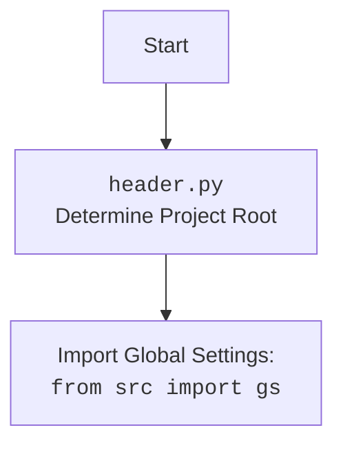

## ИНСТРУКЦИЯ:

Анализируй предоставленный код подробно и объясни его функциональность. Ответ должен включать три раздела:  

1.  **<алгоритм>**: Опиши рабочий процесс в виде пошаговой блок-схемы, включая примеры для каждого логического блока, и проиллюстрируй поток данных между функциями, классами или методами.  
2.  **<mermaid>**: Напиши код для диаграммы в формате `mermaid`, проанализируй и объясни все зависимости,  
    которые импортируются при создании диаграммы.  
    **ВАЖНО!** Убедитесь, что все имена переменных, используемые в диаграмме `mermaid`,  
    имеют осмысленные и описательные имена. Имена переменных вроде `A`, `B`, `C`, и т.д., не допускаются!  
    
    **Дополнительно**: Если в коде есть импорт `import header`, добавьте блок `mermaid` flowchart, объясняющий `header.py`:
    ```mermaid
    flowchart TD
        Start --> Header[<code>header.py</code><br> Determine Project Root]
    
        Header --> import[Import Global Settings: <br><code>from src import gs</code>] 
    ```

3.  **<объяснение>**: Предоставьте подробные объяснения:  
    - **Импорты**: Их назначение и взаимосвязь с другими пакетами `src.`.  
    - **Классы**: Их роль, атрибуты, методы и взаимодействие с другими компонентами проекта.  
    - **Функции**: Их аргументы, возвращаемые значения, назначение и примеры.  
    - **Переменные**: Их типы и использование.  
    - Выделите потенциальные ошибки или области для улучшения.  

Дополнительно, постройте цепочку взаимосвязей с другими частями проекта (если применимо).  

Это обеспечивает всесторонний и структурированный анализ кода.
## Формат ответа: `.md` (markdown)
**КОНЕЦ ИНСТРУКЦИИ**
```
## <алгоритм>
1. **Начало**:
   - Запускается скрипт `header.py`.
   - Устанавливается режим `MODE` в значение 'dev'.

2. **Определение Корневой Директории Проекта**:
   - Вызывается функция `set_project_root` с аргументом `marker_files` (по умолчанию `('__root__',)`).
   - `current_path` устанавливается в абсолютный путь к каталогу, содержащему текущий скрипт.
   - `__root__` инициализируется как `current_path`.
   - Проходим по каталогам, начиная от `current_path` и вверх по дереву каталогов к родительским каталогам.
     - Если в одном из каталогов находится файл с именем `__root__`, устанавливаем `__root__` в этот каталог и прерываем цикл.
   - Если `__root__` не находится в `sys.path`, то добавляем `__root__` в начало `sys.path`, чтобы обеспечить возможность импорта модулей из корневой директории.
   - Возвращаем путь к корневой директории `__root__`.

3. **Инициализация Корневого Пути**:
   - Вызываем функцию `set_project_root()`, результат присваиваем переменной `__root__` (корень проекта).

4. **Импорт Глобальных Настроек**:
   - Импортируется модуль `src.gs` (глобальные настройки).

5. **Загрузка Настроек из JSON**:
   - Пытаемся открыть файл `settings.json`, который находится в каталоге `src` относительно корневой директории.
     - Если файл найден, то загружаем настройки из JSON в переменную `settings`.
     - Если файл не найден или произошла ошибка `json.JSONDecodeError` (например, файл не является корректным JSON), то игнорируем ошибку.

6. **Чтение README.MD**:
   - Пытаемся открыть файл `README.MD`, который находится в каталоге `src` относительно корневой директории.
   - Если файл найден, то читаем его содержимое в переменную `doc_str`.
   - Если файл не найден или произошла ошибка `json.JSONDecodeError`, то игнорируем ошибку.

7. **Установка Основных Переменных**:
   - `__project_name__`: Если `settings` загружены, берется значение из `settings.get("project_name")`, иначе устанавливается в `'hypotez'`.
   - `__version__`: Если `settings` загружены, берется значение из `settings.get("version")`, иначе устанавливается в `''`.
   - `__doc__`: Если `doc_str` загружен, то присваивается значение `doc_str`, иначе `''`.
   - `__details__` устанавливается в `''`.
   - `__author__`: Если `settings` загружены, берется значение из `settings.get("author")`, иначе устанавливается в `''`.
   - `__copyright__`: Если `settings` загружены, берется значение из `settings.get("copyrihgnt")`, иначе устанавливается в `''`.
   - `__cofee__`: Если `settings` загружены, берется значение из `settings.get("cofee")`, иначе устанавливается в стандартную строку.

## <mermaid>
```mermaid
flowchart TD
    Start --> FindRoot[Найти корень проекта с помощью `set_project_root()`]
    FindRoot --> ImportGS[Импорт глобальных настроек: `from src import gs`]
    ImportGS --> LoadSettings[Загрузка настроек из `settings.json`]
    LoadSettings --> ReadReadme[Чтение содержимого `README.MD`]
    ReadReadme --> SetVars[Установка основных переменных: __project_name__, __version__, __doc__, __details__, __author__, __copyright__, __cofee__]
    SetVars --> End
    
    style FindRoot fill:#f9f,stroke:#333,stroke-width:2px
    style ImportGS fill:#ccf,stroke:#333,stroke-width:2px
    style LoadSettings fill:#ccf,stroke:#333,stroke-width:2px
    style ReadReadme fill:#ccf,stroke:#333,stroke-width:2px
    style SetVars fill:#f9f,stroke:#333,stroke-width:2px
```


## <объяснение>
**Импорты:**
- `sys`: Модуль `sys` используется для доступа к переменным и функциям, которые взаимодействуют с интерпретатором Python. В частности, `sys.path` используется для добавления пути к корневой директории проекта, чтобы Python мог находить модули.
- `json`: Модуль `json` используется для работы с данными в формате JSON, в данном случае для загрузки файла настроек `settings.json`.
- `packaging.version.Version`: Этот импорт не используется в данном коде.
- `pathlib.Path`: Модуль `pathlib` используется для представления путей к файлам и каталогам в объектно-ориентированном стиле, что упрощает работу с файловой системой.
- `src.gs`: Импортируется модуль глобальных настроек из пакета `src`. Модуль `gs` (предположительно `global_settings`) содержит пути и настройки проекта.

**Функции:**

- `set_project_root(marker_files: tuple = ('__root__',)) -> Path`:
    - **Аргументы**:
        - `marker_files`: Кортеж с именами файлов/папок, которые используются для определения корневой директории проекта. По умолчанию используется `('__root__',)`.
    - **Возвращаемое значение**:
        - `Path`: Объект `pathlib.Path`, представляющий путь к корневой директории проекта.
    - **Назначение**:
        - Функция находит корневую директорию проекта путем поиска вверх по дереву каталогов, пока не найдет каталог, содержащий файл или папку с именем из `marker_files`. Если не находит, то возвращает путь к каталогу, где находится скрипт. Она также добавляет найденную корневую директорию в `sys.path`, что позволяет импортировать модули из любой части проекта.
    - **Пример**:
        - Если структура проекта такая:
          ```
          project_root/
              __root__
              src/
                  translators/
                      header.py
          ```
          вызов `set_project_root()` вернет `Path('project_root')`.
        - Если `marker_files = ('config.ini',)` и файл `config.ini` есть в `project_root/`, тогда вернётся `Path('project_root')`

**Переменные:**

- `MODE`: Глобальная переменная, устанавливающая режим работы скрипта (в данном случае 'dev').
- `__root__`:  Переменная типа `Path`, хранящая путь к корневой директории проекта, устанавливается через функцию `set_project_root()`.
- `settings`: Словарь (`dict`), содержащий настройки, загруженные из `settings.json`. Если файл не загружен, значение `None`.
- `doc_str`: Строка, содержащая текст из `README.MD`. Если файл не загружен, значение `None`.
- `__project_name__`: Строка, содержащая имя проекта, загруженное из `settings.json` или по умолчанию 'hypotez'.
- `__version__`: Строка, содержащая версию проекта, загруженную из `settings.json` или пустая строка.
- `__doc__`: Строка, содержащая документацию проекта (текст из `README.MD`) или пустая строка.
- `__details__`: Пустая строка.
- `__author__`: Строка, содержащая имя автора проекта, загруженное из `settings.json` или пустая строка.
- `__copyright__`: Строка, содержащая информацию об авторских правах, загруженную из `settings.json` или пустая строка.
- `__cofee__`: Строка, содержащая сообщение для поддержки разработчика, загруженная из `settings.json` или стандартное сообщение.

**Потенциальные ошибки и области для улучшения:**

1. **Обработка ошибок при загрузке настроек**: В блоке `try...except` используется `...`, что может скрыть важные ошибки. Лучше явно обрабатывать исключения, например, записать ошибку в лог.
2. **Отсутствие обработки случаев, когда `settings.json` или `README.MD` не найдены**: Сейчас, при отсутствии файлов, переменные остаются пустыми. Возможно, стоит установить значения по умолчанию или выдать предупреждение.
3. **Использование `json.JSONDecodeError` для чтения `README.MD`**: Файл `README.MD` не является JSON файлом, поэтому в блоке чтения `README.MD` проверка на ошибку `json.JSONDecodeError` избыточна. Достаточно проверить `FileNotFoundError`.
4.  **Зависимость от имени файла `__root__`**: Зависимость от имени файла `__root__` для определения корня проекта может быть хрупкой. Можно предусмотреть возможность передачи списка файлов-маркеров в функцию `set_project_root` через переменную окружения или аргумент командной строки.
5.  **Непоследовательное именование переменных**: Некоторые имена переменных, например, `copyrihgnt` имеют орфографическую ошибку.

**Взаимосвязь с другими частями проекта:**
- `header.py` является важным файлом для всего проекта, так как он устанавливает корень проекта, загружает настройки и предоставляет информацию о проекте (`__project_name__`, `__version__`, `__doc__` и т.д.).
- Зависит от `src.gs` для получения путей к файлам и каталогам.

В целом, `header.py` выполняет важную роль в инициализации проекта, но есть потенциальные возможности для улучшения обработки ошибок, гибкости определения корневой директории проекта и именования переменных.