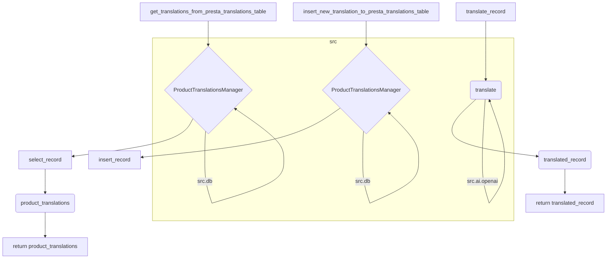

# <input code>

```python
## \file hypotez/src/translators/product_translator.py
# -*- coding: utf-8 -*-\
#! venv/Scripts/python.exe
#! venv/bin/python/python3.12

"""
.. module: src.translators 
	:platform: Windows, Unix
	:synopsis:

"""
MODE = 'dev'


"""
	:platform: Windows, Unix
	:synopsis:

"""


"""
	:platform: Windows, Unix
	:synopsis:

"""


"""
  :platform: Windows, Unix

"""
"""
  :platform: Windows, Unix
  :platform: Windows, Unix
  :synopsis:
"""MODE = 'dev'
  
""" module: src.translators """


""" Модуль управления переводами.
Слой связи между словарем полей товара, таблицей переводов и переводчиками

`get_translations_from_presta_translations_table(product_reference, credentials, i18n)`
    1. получает референс товара, параметры подключения к базе переводов престашоп и язык перевода в формате en_EN, he_HE, ru-RU 
    2. созадет условуе запроса
    3. возвращает результат
    
@todo
    1. Продумать какой нибудж парсер для en_EN, he_HE, ru-RU
"""


from pathlib import Path
from typing import List, Dict
...
from src import gs
from src.logger import logger
from src.utils import j_loads, j_dumps,  pprint
from src.db import ProductTranslationsManager
from src.ai.openai import translate
from src.endpoints.PrestaShop import PrestaShop

# ... (commented-out code)

def get_translations_from_presta_translations_table(product_reference: str, i18n: str = None) -> list:
    """Функция возвращает словарь переводов полей товара."""
    with ProductTranslationsManager() as translations_manager:
        search_filter = {'product_reference': product_reference}
        product_translations = translations_manager.select_record(**search_filter)
    return product_translations

def insert_new_translation_to_presta_translations_table(record):
    with ProductTranslationsManager() as translations_manager:
        translations_manager.insert_record(record)

def translate_record(record: dict, from_locale: str, to_locale: str) -> dict:
    """Функция для перевода полей товара."""
    translated_record = translate(record, from_locale, to_locale)
    ... # Добавить обработку переведенной записи
    return translated_record
```

# <algorithm>

Алгоритм работы кода представлен следующими шагами:

1. **`get_translations_from_presta_translations_table`:**
   - Получает `product_reference` и необязательный параметр `i18n`.
   - Создает словарь `search_filter` для поиска в базе данных.
   - Использует `ProductTranslationsManager` для выборки данных из базы данных по заданному `product_reference`.
   - Возвращает результат поиска.
   * **Пример:** `get_translations_from_presta_translations_table("12345")` возвращает список словарей с переводами для продукта с `product_reference` равным "12345".

2. **`insert_new_translation_to_presta_translations_table`:**
   - Принимает словарь `record` с данными для записи в базу.
   - Использует `ProductTranslationsManager` для вставки данных в таблицу переводов.
   * **Пример:** `insert_new_translation_to_presta_translations_table({"product_reference": "12345", "locale": "ru-RU", "name": "Название"})` записывает запись в базу.

3. **`translate_record`:**
   - Принимает словарь `record`, исходную локаль `from_locale` и целевую локаль `to_locale`.
   - Использует функцию `translate` (из `src.ai.openai`) для перевода данных в `record`.
   - Возвращает переведенную запись.
   * **Пример:** `translate_record({"name": "Product name"}, "en-US", "ru-RU")` переводит значение поля "name" из английского в русский.

# <mermaid>



# <explanation>

**Импорты:**

- `from pathlib import Path`: Импортирует класс `Path` для работы с путями к файлам.
- `from typing import List, Dict`: Импортирует типы данных `List` и `Dict` для задания типов переменных.
- `from src import gs`: Импортирует модуль `gs` из пакета `src`.  Без дополнительного контекста неясно, что он делает.
- `from src.logger import logger`: Импортирует логгер `logger` из пакета `src.logger`.  Логгирование играет важную роль в отладке и мониторинге приложения.
- `from src.utils import j_loads, j_dumps, pprint`: Импортирует функции `j_loads`, `j_dumps`, `pprint` из `src.utils`.  Вероятно, они используются для работы с JSON.
- `from src.db import ProductTranslationsManager`: Импортирует класс `ProductTranslationsManager` из пакета `src.db`.  Этот класс отвечает за взаимодействие с базой данных для хранения и извлечения переводов.
- `from src.ai.openai import translate`: Импортирует функцию `translate` из модуля `openai` в пакете `src.ai`.  Функция отвечает за перевод текста с помощью API OpenAI.
- `from src.endpoints.PrestaShop import PrestaShop`: Импортирует модуль `PrestaShop` из пакета `src.endpoints.PrestaShop`.  Скорее всего, это класс для взаимодействия с API PrestaShop.

**Классы:**

- `ProductTranslationsManager`:  Класс для работы с базой данных, вероятно, реализующий методы `select_record` (для выборки записей) и `insert_record` (для вставки). Этот класс является центральным элементом для доступа к данным о переводах.

**Функции:**

- `get_translations_from_presta_translations_table(product_reference: str, i18n: str = None) -> list`: Получает переводы для указанного `product_reference` из базы данных.  Важным является тип возвращаемого значения - `list`, что указывает на то, что функция вернет список переведенных данных.
- `insert_new_translation_to_presta_translations_table(record)`: Добавляет новую запись в таблицу переводов. Важно проверить формат записи `record` перед вставкой.
- `translate_record(record: dict, from_locale: str, to_locale: str) -> dict`: Переводит запись с помощью API OpenAI.

**Переменные:**

- `MODE`: Переменная, вероятно, хранит режим работы приложения (например, `dev`, `prod`).

**Возможные ошибки и улучшения:**

- Отсутствует проверка входных данных.  Функции `get_translations_from_presta_translations_table` и `translate_record` должны проверять, что входящие данные являются корректными.
- Отсутствует обработка исключений (например, при проблемах с базой данных или API OpenAI).
- Непонятно, как работает комментарий `...` в `translate_record`.  Необходимо добавить обработку переведенной записи.
- Недостаточно комментариев в коде. Добавить описание аргументов и возвращаемых значений функций.
- Не указаны типы данных для переменных. Используйте аннотации типов для большей ясности.


**Цепочка взаимосвязей:**

Код взаимодействует с базами данных (`ProductTranslationsManager`), API OpenAI (`translate`) и вероятно, с API PrestaShop.  Модули `src.logger`, `src.utils`, `gs` служат вспомогательными компонентами.


**Рекомендации:**

- Добавьте обработку ошибок, чтобы избежать аварийных остановок приложения.
- Добавьте более подробные комментарии к коду для лучшей читаемости.
- Проверьте корректность входных данных.
- Разработайте систему тестирования для проверки работы функций.