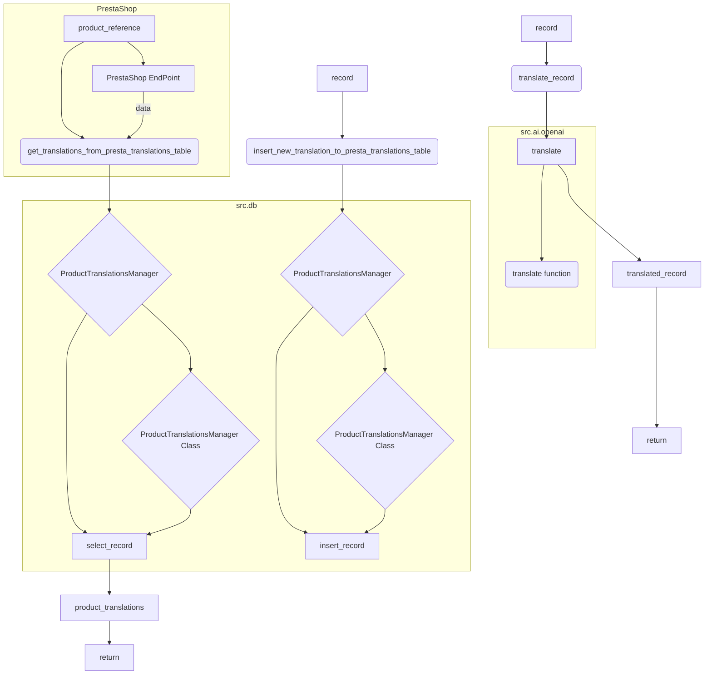

# <input code>

```python
## \file hypotez/src/translators/product_translator.py
# -*- coding: utf-8 -*-
#! venv/Scripts/python.exe
#! venv/bin/python/python3.12

"""
.. module: src.translators 
	:platform: Windows, Unix
	:synopsis:

"""
MODE = 'dev'


"""
	:platform: Windows, Unix
	:synopsis:

"""


"""
	:platform: Windows, Unix
	:synopsis:

"""


"""
  :platform: Windows, Unix

"""
"""
  :platform: Windows, Unix
  :platform: Windows, Unix
  :synopsis:
"""MODE = 'dev'
  
""" module: src.translators """


""" Модуль управления переводами.
Слой связи между словарем полей товара, таблицей переводов и переводчиками

`get_translations_from_presta_translations_table(product_reference, credentials, i18n)`
    1. получает референс товара, параметры подключения к базе переводов престашоп и язык перевода в формате en_EN, he_HE, ru-RU 
    2. созадет условуе запроса
    3. возвращает результат
    
@todo
    1. Продумать какой нибудж парсер для en_EN, he_HE, ru-RU
"""


from pathlib import Path
from typing import List, Dict
...
from src import gs
from src.logger import logger
from src.utils.jjson import j_loads_ns, j_dumps,  pprint
from src.db import ProductTranslationsManager
from src.ai.openai import translate
from src.endpoints.PrestaShop import PrestaShop

# def record(presta_fields:Dict, i18n:str = None, i:int = 0) -> Dict:
#     """ Вытаскивает из словаря полей престашоп 
#     `dict_product_fields` значения мультиязычных полей 
#     @param dict_product_fields престашоп словарь полей товара
#     @param i18n Локаль: en-US, ru-RU, he-IL
#     @param i индекс языка в мультиязычных полях
#     """
#     ...
#     i18n = i18n if i18n else presta_fields.get('locale')
#     if not i18n:
#         text = presta_fields.language[0]['value']
#         i18n = detect(text)
#         ...
#     i = 0 # <- Вытаскивает первый из списка языков в мультиязычных полях
    
#     # словарь record со всеми ключами
#     record = {
#     'product_reference': presta_fields.get('reference'),
#     'locale': i18n,
#     # ... (много полей)
#     }
#     return  record


def get_translations_from_presta_translations_table(product_reference: str, i18n: str = None) -> list:
    """Функция возвращает словарь переводов полей товара."""
    with ProductTranslationsManager() as translations_manager:
        search_filter = {'product_reference': product_reference}
        product_translations = translations_manager.select_record(**search_filter)
    return product_translations


def insert_new_translation_to_presta_translations_table(record):
    with ProductTranslationsManager() as translations_manager:
        translations_manager.insert_record(record)


def translate_record(record: dict, from_locale: str, to_locale: str) -> dict:
    """Функция для перевода полей товара."""
    translated_record = translate(record, from_locale, to_locale)
    ... # Добавить обработку переведенной записи
    return translated_record
```

# <algorithm>

**Шаг 1:** Функция `get_translations_from_presta_translations_table` принимает `product_reference` и (необязательный) `i18n`.

**Шаг 2:** Функция использует `ProductTranslationsManager` для взаимодействия с базой данных.

**Шаг 3:** Создает словарь `search_filter` для поиска по `product_reference`.

**Шаг 4:** Выполняет запрос `translations_manager.select_record(**search_filter)` для получения переводов.

**Шаг 5:** Возвращает найденные `product_translations`.

**Пример:**

```
get_translations_from_presta_translations_table("12345") -> [переводы, если есть]
```

**Шаг 6:** Функция `insert_new_translation_to_presta_translations_table` принимает `record` и добавляет запись в базу данных.

**Шаг 7:** Функция `translate_record` принимает `record`, `from_locale` и `to_locale`.

**Шаг 8:** Использует `translate` из `src.ai.openai` для перевода `record`.

**Шаг 9:** Возвращает `translated_record` (и обрабатывает перевод вставляемой записи).


# <mermaid>



**Объяснение диаграммы:**

- `ProductTranslationsManager` отвечает за взаимодействие с базой данных переводов.
- `translate` из `src.ai.openai` осуществляет перевод.
- `PrestaShop EndPoint` предоставляет данные о товаре.
- Стрелки показывают поток данных и вызовов функций.


# <explanation>

**Импорты:**

- `from pathlib import Path`: Импортирует класс `Path` для работы с путями к файлам. Не используется в данном коде.
- `from typing import List, Dict`: Импортирует типы данных `List` и `Dict` для улучшения читаемости и статического анализа кода.
- `from src import gs`: Импортирует модуль `gs` из пакета `src`. Непонятно, что он делает, так как в коде нет ссылок.
- `from src.logger import logger`: Импортирует логгер из пакета `src.logger` для ведения журнала.
- `from src.utils.jjson import j_loads_ns, j_dumps, pprint`: Импортирует функции для работы с JSON из пакета `src.utils.jjson`.
- `from src.db import ProductTranslationsManager`: Импортирует класс `ProductTranslationsManager` для работы с базой данных переводов из `src.db`.
- `from src.ai.openai import translate`: Импортирует функцию `translate` для перевода текста из пакета `src.ai.openai`.
- `from src.endpoints.PrestaShop import PrestaShop`: Импортирует класс `PrestaShop` для взаимодействия с API PrestaShop.

**Классы:**

- `ProductTranslationsManager`: Класс для управления таблицей переводов в базе данных.  Методы `select_record` и `insert_record` определяют взаимодействие с базой.

**Функции:**

- `get_translations_from_presta_translations_table(product_reference, i18n)`: Получает переводы из базы данных по заданному `product_reference`. Возвращает список переводов или пустой список.
- `insert_new_translation_to_presta_translations_table(record)`: Вставляет новую запись в таблицу переводов.
- `translate_record(record, from_locale, to_locale)`: Переводит запись `record` с `from_locale` на `to_locale` используя `translate` из `src.ai.openai`. Необходимо доработать обработку результата перевода.

**Переменные:**

- `MODE`:  Переменная, вероятно, хранит режим работы приложения ('dev').
- `product_reference`: Строка, представляющая идентификатор товара.
- `i18n`: Локаль (язык) перевода.
- `search_filter`: Словарь с условиями для поиска в базе данных.
- `product_translations`: Список переводов, возвращаемый из базы данных.
- `record`: Словарь, содержащий данные для вставки в базу данных или перевода.
- `from_locale`, `to_locale`: Языки для перевода.


**Возможные ошибки и улучшения:**

- Отсутствует обработка ошибок при взаимодействии с базой данных (`ProductTranslationsManager`).
- Не хватает обработки ошибок при переводе (`translate`).
- Недостаточно информации об обработке результата перевода (`translate_record`).
- Комментарии о `@todo` требуют более подробных деталей и планов по реализации.
- В коде присутствуют комментарии-заглушки в `record`, которые вызывают избыточное скопирование кода. Необходимо пересмотреть структуру хранения данных.

**Взаимосвязи с другими частями проекта:**

Функции из `ProductTranslator` взаимодействуют с классом `ProductTranslationsManager` из `src.db` и `translate` из `src.ai.openai`, а также с `PrestaShop` для получения информации о продуктах.