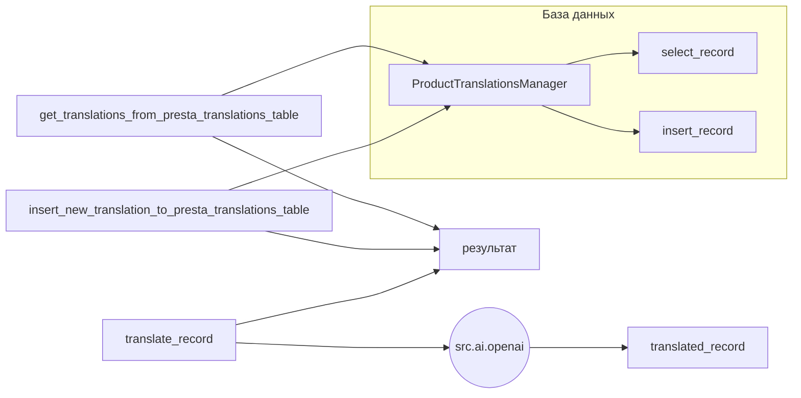

# <input code>

```python
## \file hypotez/src/translators/product_translator.py
# -*- coding: utf-8 -*-\
#! venv/Scripts/python.exe
#! venv/bin/python/python3.12

"""
.. module: src.translators 
	:platform: Windows, Unix
	:synopsis:

"""
MODE = 'dev'


"""
	:platform: Windows, Unix
	:synopsis:

"""


"""
	:platform: Windows, Unix
	:synopsis:

"""


"""
  :platform: Windows, Unix

"""
"""
  :platform: Windows, Unix
  :platform: Windows, Unix
  :synopsis:
"""MODE = 'dev'
  
""" module: src.translators """


""" Модуль управления переводами.
Слой связи между словарем полей товара, таблицей переводов и переводчиками

`get_translations_from_presta_translations_table(product_reference, credentials, i18n)`
    1. получает референс товара, параметры подключения к базе переводов престашоп и язык перевода в формате en_EN, he_HE, ru-RU 
    2. созадет условуе запроса
    3. возвращает результат
    

@todo
    1. Продумать какой нибудж парсер для en_EN, he_HE, ru-RU
"""


from pathlib import Path
from typing import List, Dict
...
from src import gs
from src.logger import logger
from src.utils.jjson import j_loads_ns, j_dumps,  pprint
from src.db import ProductTranslationsManager
from src.ai.openai import translate
from src.endpoints.PrestaShop import PrestaShop

# ... (неактивные функции)

def get_translations_from_presta_translations_table(product_reference: str, i18n: str = None) -> list:
    """Функция возвращает словарь переводов полей товара."""
    with ProductTranslationsManager() as translations_manager:
        search_filter = {'product_reference': product_reference}
        product_translations = translations_manager.select_record(**search_filter)
    return product_translations

def insert_new_translation_to_presta_translations_table(record):
    with ProductTranslationsManager() as translations_manager:
        translations_manager.insert_record(record)

def translate_record(record: dict, from_locale: str, to_locale: str) -> dict:
    """Функция для перевода полей товара."""
    translated_record = translate(record, from_locale, to_locale)
    ... # Добавить обработку переведенной записи
    return translated_record
```

# <algorithm>

**Алгоритм работы:**

1. **`get_translations_from_presta_translations_table(product_reference, i18n)`:**
    * Принимает `product_reference` (идентификатор товара) и `i18n` (язык).
    * Создает словарь `search_filter` с условием поиска по `product_reference`.
    * Использует `ProductTranslationsManager` для выборки данных из базы данных по заданному фильтру.
    * Возвращает полученные `product_translations` (список словарей).

    **Пример:**
    `get_translations_from_presta_translations_table("123", "en_US")` -> список словарей с переводами для товара с `product_reference = "123"` на языке `en_US`.


2. **`insert_new_translation_to_presta_translations_table(record)`:**
    * Принимает `record` (словарь с новыми данными).
    * Использует `ProductTranslationsManager` для добавления данных в базу.
    * Нет возвращаемого значения.

    **Пример:**
    `insert_new_translation_to_presta_translations_table({"product_reference": "456", "name": "New Name", "locale": "en_US"})` -> добавит запись в таблицу.

3. **`translate_record(record, from_locale, to_locale)`:**
    * Принимает `record` (словарь данных), `from_locale` (исходный язык) и `to_locale` (целевой язык).
    * Использует функцию `translate` из модуля `src.ai.openai` для перевода данных.
    * Возвращает `translated_record` (переведенный словарь).
    * Имеет не реализованную часть (`...`) для обработки перевода.

    **Пример:**
    `translate_record({"name": "Original Name", "locale": "en_US"}, "en_US", "fr_FR")` -> словарь с переведенным значением поля `name` на французский.

**Взаимодействие функций:**
Функции `get_translations_from_presta_translations_table` и `insert_new_translation_to_presta_translations_table` взаимодействуют с базой данных через `ProductTranslationsManager`.  Функция `translate_record` использует сторонний API `translate`.

# <mermaid>



**Описание зависимостей на диаграмме:**

* `ProductTranslationsManager` — класс, взаимодействующий с базой данных для работы с таблицами переводов.  Он является ключевым компонентом для работы с данными.
* `translate` — внешняя функция (вероятно, из сторонней библиотеки OpenAI), которая выполняет перевод текста.  Эта зависимость существенна, т.к. код предполагает работу с API.
* Взаимодействие через `ProductTranslationsManager` описывает зависимость от базы данных, а `translate` указывает на внешнюю библиотеку.

# <explanation>

**Импорты:**

* `from pathlib import Path`: Импортирует класс `Path` для работы с путями к файлам.  Не используется в этом коде напрямую.
* `from typing import List, Dict`: Импортирует типы данных `List` и `Dict` для аннотирования типов аргументов и возвращаемых значений функций. Это улучшает читабельность и помогает в статическом анализе.
* `from src import gs`: Импортирует модуль `gs` из пакета `src`. Его назначение неясно без дополнительного контекста.
* `from src.logger import logger`: Импортирует логгер из модуля `src.logger`.  Это позволяет вести логирование для отладки.
* `from src.utils.jjson import j_loads_ns, j_dumps, pprint`: Импортирует функции для работы с JSON данными, включая парсинг, сериализацию и вывод.
* `from src.db import ProductTranslationsManager`: Импортирует класс `ProductTranslationsManager`, который, вероятно, отвечает за взаимодействие с базой данных для работы с таблицами переводов.
* `from src.ai.openai import translate`: Импортирует функцию `translate` для перевода текста с использованием API OpenAI. Это ключевой компонент для работы с переводами.
* `from src.endpoints.PrestaShop import PrestaShop`: Импортирует класс `PrestaShop`. Вероятнее всего, этот класс используется для работы с API Престашоп.


**Классы:**

* `ProductTranslationsManager`: Этот класс, судя по имени, предназначен для управления таблицами переводов.  Без доступа к исходному коду класса `ProductTranslationsManager` невозможно получить полную картину его функциональности, но можно предположить наличие методов для чтения, записи и обновления данных в базе данных.

**Функции:**

* `get_translations_from_presta_translations_table(product_reference, i18n)`: Получает переводы для заданного товара на определённый язык из базы данных.
* `insert_new_translation_to_presta_translations_table(record)`: Добавляет запись в таблицу переводов.
* `translate_record(record, from_locale, to_locale)`: Переводит данные в словаре `record` с исходного языка `from_locale` на целевой `to_locale`. Необходим механизм обработки переведенной записи.


**Переменные:**

* `MODE`: Строковая константа, вероятно, определяет режим работы приложения (`dev`, `prod`).


**Возможные ошибки и улучшения:**

* **Обработка ошибок:** Отсутствует обработка исключений при взаимодействии с базой данных и API.  Добавление обработки исключений (например, `try...except`) крайне важно для надежности кода.
* **Обработка перевода:** Функция `translate_record` имеет недописанную часть (`...`). Необходимо добавить обработку переведенной записи.  Возможно, необходимо проверять результат перевода на наличие ошибок, а также обрабатывать случаи, когда перевод не удаётся.
* **Валидация данных:** Необходимо добавить валидацию входных данных (например, проверка типа и корректности `product_reference` и `i18n`).
* **Локализация:** Необходимо учесть, что `i18n` (язык) может иметь различный формат.  В коде отсутствует механизм валидации и обработки формата `i18n`.
* **Комментарии:** Комментарии в коде, особенно для функции `record`, недостаточно подробные. Потребуется более детальный комментарий с целью понимания логики внутри неё.


**Взаимосвязи с другими частями проекта:**

Код напрямую зависит от классов и функций в `src.db`, `src.ai.openai`, и `src.endpoints.PrestaShop`. Функции взаимодействуют с базой данных, API и, вероятно, с другими компонентами проекта для получения и обработки данных.  Необходимы дополнительные сведения о структуре проекта, чтобы полностью проанализировать взаимосвязи.