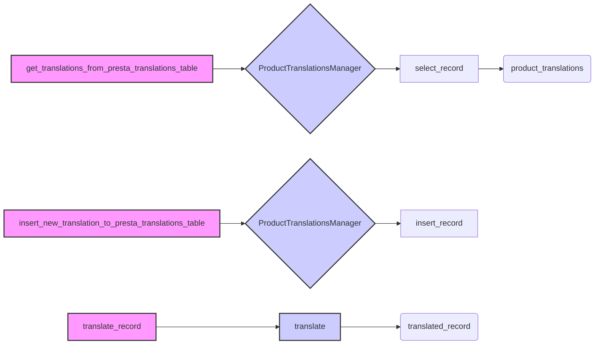

## <алгоритм>

**1. `get_translations_from_presta_translations_table(product_reference, i18n)`**

   - **Вход**: `product_reference` (строка, например, "PROD123") - артикул товара, `i18n` (строка, например "ru-RU", опционально) - язык перевода.
   - **Действие**:
      - Инициализация менеджера `ProductTranslationsManager`.
      - Формирование фильтра `search_filter` для поиска записи в базе данных по `product_reference` (`{'product_reference': 'PROD123'}`).
      - Выборка записи из базы данных, соответствующей фильтру, с помощью `translations_manager.select_record(**search_filter)`.
   - **Выход**: `product_translations` (список словарей) - список найденных переводов или пустой список.

   _Пример:_
   ```
   product_reference = "PROD123"
   i18n = "ru-RU"
   # Результат:  [{'product_reference': 'PROD123', 'locale': 'ru-RU', 'name': 'Название товара', ...}, ...]
   ```
   
**2. `insert_new_translation_to_presta_translations_table(record)`**

   - **Вход**: `record` (словарь, например, `{'product_reference': 'PROD123', 'locale': 'en-US', 'name': 'Product Name', ...}`) - запись с переводом.
   - **Действие**:
      - Инициализация менеджера `ProductTranslationsManager`.
      - Добавление `record` в базу данных через `translations_manager.insert_record(record)`.
   - **Выход**: Нет (функция не возвращает значение).
    
   _Пример:_
   ```
    record = {'product_reference': 'PROD123', 'locale': 'fr-FR', 'name': 'Nom du produit', ...}
    # Результат: запись добавлена в таблицу переводов
   ```

**3. `translate_record(record, from_locale, to_locale)`**

    - **Вход**: `record` (словарь) - запись для перевода, `from_locale` (строка, например "en-US") - исходный язык, `to_locale` (строка, например "ru-RU") - целевой язык.
    - **Действие**:
        - Вызов функции `translate(record, from_locale, to_locale)` для перевода записи.
    - **Выход**: `translated_record` (словарь) - переведенная запись.

    _Пример:_
    ```
    record = {'name': 'Product Name', 'description': 'Product description', ...}
    from_locale = "en-US"
    to_locale = "ru-RU"
    # Результат: {'name': 'Название товара', 'description': 'Описание товара', ...}
    ```

**Поток данных:**

1.  Функция `get_translations_from_presta_translations_table` получает `product_reference` и `i18n` и возвращает  `product_translations` из базы данных.
2.  Функция `insert_new_translation_to_presta_translations_table` получает `record` и добавляет его в базу данных.
3.  Функция `translate_record` получает `record`, `from_locale`, `to_locale`, вызывает `translate` и возвращает `translated_record`.

## <mermaid>


**Описание зависимостей в `mermaid` коде:**

-   `get_translations_from_presta_translations_table` использует `ProductTranslationsManager` для получения переводов из базы данных.
-   `insert_new_translation_to_presta_translations_table` использует `ProductTranslationsManager` для вставки новых переводов в базу данных.
-   `translate_record` использует внешнюю функцию `translate` из `src.ai.openai` для перевода записей.
-   `ProductTranslationsManager` - это класс, управляющий доступом к таблице переводов в базе данных.

## <объяснение>

### Импорты:

-   `pathlib.Path`:  Используется для работы с путями к файлам и директориям, но в данном коде не используется.
-   `typing.List, typing.Dict`: Используется для аннотации типов данных,  указывая, что функция может принимать или возвращать списки и словари.
-   `src.gs`: (Предположительно) Модуль `gs` из `src` используется для работы с глобальными настройками или переменными. В текущем коде напрямую не используется, но импортируется, что говорит о его использовании в других частях проекта.
-   `src.logger.logger.logger`:  Используется для логирования событий, связанных с работой кода. В текущем коде  не используется.
-   `src.utils.jjson.j_loads_ns, src.utils.jjson.j_dumps, src.utils.jjson.pprint`: Функции для работы с JSON. `j_loads_ns` для загрузки JSON, `j_dumps` для преобразования в JSON и `pprint` для красивого вывода. В текущем коде не используется.
-   `src.db.ProductTranslationsManager`: Класс для управления переводами товаров в базе данных. Инкапсулирует логику доступа к базе данных.
-   `src.ai.openai.translate`: Функция для перевода текста с использованием API OpenAI.
-   `src.endpoints.PrestaShop.PrestaShop`: Класс для взаимодействия с API PrestaShop, не используется напрямую в этом коде.

**Взаимосвязи с другими пакетами `src`:**

-   **`src.gs`**: Предположительно, используется для получения глобальных настроек, таких как параметры подключения к базе данных или API ключи.
-   **`src.logger`**: Используется для записи сообщений о событиях в процессе работы программы, что важно для отладки и мониторинга.
-   **`src.utils.jjson`**: Предоставляет инструменты для работы с JSON, что может быть полезно при работе с API PrestaShop или при сохранении данных.
-   **`src.db`**: Содержит логику доступа к базе данных и управления таблицей переводов. `ProductTranslationsManager` является ключевым компонентом для работы с переводами товаров.
-   **`src.ai`**: Содержит логику взаимодействия с AI сервисами, в частности `openai.translate` используется для перевода текста.
-   **`src.endpoints`**: Содержит классы для взаимодействия с API различных сервисов, таких как PrestaShop.

### Классы:

-   `ProductTranslationsManager`:
    -   **Роль**: Управляет доступом к таблице переводов товаров в базе данных.
    -   **Атрибуты**: Содержит логику подключения к базе данных, методы для выборки, вставки и обновления записей. В коде не показаны конкретные атрибуты, но класс реализует контекстный менеджер, который обеспечивает правильное управление ресурсами (соединением с БД).
    -   **Методы**: `select_record()`, `insert_record()` (и, возможно, другие методы для работы с БД).
    -   **Взаимодействие**: Используется функциями `get_translations_from_presta_translations_table` и `insert_new_translation_to_presta_translations_table` для доступа к данным.

### Функции:

-   `get_translations_from_presta_translations_table(product_reference: str, i18n: str = None) -> list`:
    -   **Аргументы**:
        -   `product_reference` (str): Артикул товара.
        -   `i18n` (str, опционально): Язык перевода.
    -   **Возвращаемое значение**: `list` - список словарей с переводами (или пустой список, если нет переводов).
    -   **Назначение**: Получает переводы для товара из базы данных, используя `ProductTranslationsManager`.
    -   **Пример**: `get_translations_from_presta_translations_table("PROD123", "ru-RU")` вернет список переводов для товара "PROD123" на русском языке.
-   `insert_new_translation_to_presta_translations_table(record)`:
    -   **Аргументы**: `record` (dict) - словарь с данными для вставки, включая `product_reference`, `locale` и переведенные значения полей.
    -   **Возвращаемое значение**: None.
    -   **Назначение**: Вставляет новую запись перевода в базу данных через `ProductTranslationsManager`.
    -   **Пример**: `insert_new_translation_to_presta_translations_table({'product_reference': 'PROD123', 'locale': 'en-US', 'name': 'Product Name', ...})` добавит новую запись с переводом товара.
-   `translate_record(record: dict, from_locale: str, to_locale: str) -> dict`:
    -   **Аргументы**:
        -   `record` (dict): Словарь с данными для перевода.
        -   `from_locale` (str): Исходный язык.
        -   `to_locale` (str): Целевой язык.
    -   **Возвращаемое значение**: `dict` - словарь с переведенными данными.
    -   **Назначение**: Переводит поля товара с использованием API OpenAI через функцию `translate` и возвращает новый словарь.
    -   **Пример**: `translate_record({'name': 'Product Name', 'description': 'Product description'}, 'en-US', 'ru-RU')` вернет словарь с переведенными на русский язык `name` и `description`.

### Переменные:
- `MODE = 'dev'` - глобальная переменная, определяющая режим работы (в данном случае, режим разработки).

### Потенциальные ошибки или области для улучшения:

-   **Обработка ошибок**: Отсутствует явная обработка ошибок, что может привести к проблемам в продакшене. Необходимо добавить блоки `try-except` для отлова исключений (особенно при работе с базой данных и API).
-   **Логирование**:  Не используется логгер. Необходимо добавить логирование для отладки.
-   **Обработка результатов `translate`**: Отсутствует  обработка результатов работы функции `translate`. Может потребоваться дополнительная обработка переведенных записей, например, проверка на корректность или приведение к нужному формату.
-   **Управление языками:** В коде есть пометка `@todo` о необходимости парсера для форматов i18n.
-   **Модульность**:  Можно вынести повторяющуюся логику создания `ProductTranslationsManager` в отдельную функцию или контекстный менеджер для переиспользования.

### Цепочка взаимосвязей:

1.  Модуль `product_translator` взаимодействует с базой данных через `ProductTranslationsManager`.
2.  Использует `openai.translate` для перевода текста.
3.  Может быть использован в других частях проекта, где требуется перевод товаров (например, в процессе синхронизации с PrestaShop).
4.  `ProductTranslationsManager` использует абстракцию базы данных, что позволяет переключаться между разными БД (например, PostgreSQL, MySQL и т.д.) без необходимости менять код `product_translator`.