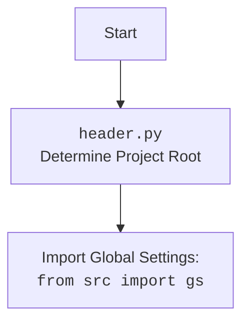

## ИНСТРУКЦИЯ:

Анализируй предоставленный код подробно и объясни его функциональность. Ответ должен включать три раздела:  

1.  **<алгоритм>**: Опиши рабочий процесс в виде пошаговой блок-схемы, включая примеры для каждого логического блока, и проиллюстрируй поток данных между функциями, классами или методами.  
2.  **<mermaid>**: Напиши код для диаграммы в формате `mermaid`, проанализируй и объясни все зависимости,
    которые импортируются при создании диаграммы.
    **ВАЖНО!** Убедитесь, что все имена переменных, используемые в диаграмме `mermaid`,
    имеют осмысленные и описательные имена. Имена переменных вроде `A`, `B`, `C`, и т.д., не допускаются!  
    
    **Дополнительно**: Если в коде есть импорт `import header`, добавьте блок `mermaid` flowchart, объясняющий `header.py`:\
    \`\`\`mermaid\
    flowchart TD\
        Start --> Header[<code>header.py</code><br> Determine Project Root]\
    \
        Header --> import[Import Global Settings: <br><code>from src import gs</code>] \
    \`\`\`

3.  **<объяснение>**: Предоставьте подробные объяснения:
    -   **Импорты**: Их назначение и взаимосвязь с другими пакетами `src.`.
    -   **Классы**: Их роль, атрибуты, методы и взаимодействие с другими компонентами проекта.
    -   **Функции**: Их аргументы, возвращаемые значения, назначение и примеры.
    -   **Переменные**: Их типы и использование.
    -   Выделите потенциальные ошибки или области для улучшения.

Дополнительно, постройте цепочку взаимосвязей с другими частями проекта (если применимо).

Это обеспечивает всесторонний и структурированный анализ кода.
## Формат ответа: `.md` (markdown)
**КОНЕЦ ИНСТРУКЦИИ**

## <алгоритм>

```mermaid
graph LR
    A[Начало] --> B(get_translations_from_presta_translations_table);
    B --> C{Создание экземпляра ProductTranslationsManager};
    C --> D[Формирование фильтра поиска по product_reference];
    D --> E[Выборка записей из базы данных с использованием фильтра];
    E --> F{Возвращение списка найденных переводов};
    F --> G(insert_new_translation_to_presta_translations_table);
    G --> H{Создание экземпляра ProductTranslationsManager};
    H --> I[Вставка новой записи в базу данных];
    I --> J(translate_record);
    J --> K[Вызов функции translate из src.ai.openai];
    K --> L{Возврат переведенного словаря};
     L --> M[Конец];
    
    style A fill:#f9f,stroke:#333,stroke-width:2px
    style M fill:#f9f,stroke:#333,stroke-width:2px

    
```



**Примеры:**

1. **`get_translations_from_presta_translations_table`**:
   - **Входные данные:** `product_reference = "REF123"`, `i18n = "ru-RU"`.
   - **Процесс:** Создается менеджер БД, формируется фильтр `{'product_reference': 'REF123'}`.
   - **Результат:** Возвращается список переводов для товара с `product_reference="REF123"`, например, `[{'name': 'Продукт 123', 'description': 'Описание продукта 123', ...}, ...]`.

2.  **`insert_new_translation_to_presta_translations_table`**:
    -   **Входные данные:** `record = {'product_reference': 'REF456', 'locale': 'en-US', 'name': 'Product 456', ...}`.
    -   **Процесс:** Создается менеджер БД.
    -   **Результат:** Запись `record` вставляется в таблицу переводов.

3.  **`translate_record`**:
    -   **Входные данные:** `record = {'name': 'Product 789', 'description': 'Description 789', ...}`, `from_locale = "en-US"`, `to_locale = "ru-RU"`.
    -   **Процесс:** Вызывается функция `translate` из `src.ai.openai`.
    -   **Результат:** Возвращается словарь `record` с переведенными значениями, например, `{'name': 'Продукт 789', 'description': 'Описание 789', ...}`.

## <mermaid>

```mermaid
flowchart TD
    Start --> ProductTranslator[<code>product_translator.py</code><br>Translation Management Module]
    
    ProductTranslator --> Import_Pathlib[Import: <code>from pathlib import Path</code>]
     ProductTranslator --> Import_Typing[Import: <code>from typing import List, Dict</code>]
    ProductTranslator --> Import_gs[Import: <code>from src import gs</code> <br> Global Settings]
    ProductTranslator --> Import_logger[Import: <code>from src.logger.logger import logger</code> <br> Logging]
    ProductTranslator --> Import_jjson[Import: <code>from src.utils.jjson import j_loads_ns, j_dumps, pprint</code> <br> JSON Utilities]
    ProductTranslator --> Import_ProductTranslationsManager[Import: <code>from src.db import ProductTranslationsManager</code> <br>Database Management]
    ProductTranslator --> Import_openai_translate[Import: <code>from src.ai.openai import translate</code><br>AI Translation]
    ProductTranslator --> Import_PrestaShop[Import: <code>from src.endpoints.PrestaShop import PrestaShop</code> <br>PrestaShop API]
    
    ProductTranslator --> get_translations_from_presta_translations_table[Function: <code>get_translations_from_presta_translations_table(product_reference: str, i18n: str = None)</code><br> Retrieves translations from database]
    ProductTranslator --> insert_new_translation_to_presta_translations_table[Function: <code>insert_new_translation_to_presta_translations_table(record:dict)</code><br> Inserts new translation into database]
    ProductTranslator --> translate_record[Function: <code>translate_record(record: dict, from_locale: str, to_locale: str)</code> <br> Translates a record]

     Import_gs --> GlobalSettings[<code>gs.py</code> <br>Configuration]
    
     style ProductTranslator fill:#ccf,stroke:#333,stroke-width:2px
     
    
```



**Анализ зависимостей:**

*   `pathlib`: Используется для работы с путями к файлам и директориям (не используется в явном виде в предоставленном коде, но может быть использовано в других частях проекта).
*   `typing`: Используется для аннотации типов, улучшает читаемость и позволяет выявлять ошибки на этапе разработки.
*   `src`:
    *   `gs`: Импортирует глобальные настройки проекта.
    *   `logger`: Импортирует модуль логирования.
    *   `jjson`: Импортирует функции для работы с JSON.
    *   `db.ProductTranslationsManager`: Импортирует класс для работы с таблицей переводов в базе данных.
    *   `ai.openai.translate`: Импортирует функцию для перевода текста с использованием OpenAI.
    *   `endpoints.PrestaShop.PrestaShop`: Импортирует класс для взаимодействия с PrestaShop API (не используется в предоставленном коде, но может быть использовано в других частях проекта).

## <объяснение>

**Импорты:**

*   `from pathlib import Path`: Импортирует класс `Path` для работы с путями файловой системы, хотя в данном коде он не используется.
*   `from typing import List, Dict`: Импортирует типы `List` и `Dict` для аннотаций типов, что делает код более читаемым и позволяет проверять типы во время разработки.
*   `from src import gs`: Импортирует глобальные настройки приложения, вероятно, содержащие параметры конфигурации.
*   `from src.logger.logger import logger`: Импортирует объект `logger` для логирования событий и ошибок, что полезно для отладки и мониторинга.
*   `from src.utils.jjson import j_loads_ns, j_dumps, pprint`: Импортирует функции для работы с JSON: `j_loads_ns` для загрузки JSON, `j_dumps` для сериализации в JSON, и `pprint` для форматированного вывода.
*   `from src.db import ProductTranslationsManager`: Импортирует класс `ProductTranslationsManager` для управления операциями с таблицей переводов в базе данных.
*   `from src.ai.openai import translate`: Импортирует функцию `translate` для перевода текста с использованием OpenAI API.
*   `from src.endpoints.PrestaShop import PrestaShop`: Импортирует класс `PrestaShop` для взаимодействия с API PrestaShop (не используется в данном коде).

**Переменные:**

*   `MODE = 'dev'`: Определяет режим работы приложения (разработка или продакшн). В данном случае установлен в режим разработки.

**Функции:**

1.  **`get_translations_from_presta_translations_table(product_reference: str, i18n: str = None) -> list`**:
    *   **Аргументы**:
        *   `product_reference` (str): Референс товара.
        *   `i18n` (str, optional): Локаль (не используется в данной реализации).
    *   **Возвращает**: `list`: Список словарей с переводами для указанного товара.
    *   **Назначение**: Извлекает переводы для товара из таблицы `product_translations`.
    *   **Пример**: `get_translations_from_presta_translations_table("REF123", "ru-RU")` вернет список словарей с переводами для товара "REF123".

2.  **`insert_new_translation_to_presta_translations_table(record)`**:
    *   **Аргументы**:
        *   `record` (dict): Словарь с данными для вставки новой записи перевода.
    *   **Возвращает**: `None`.
    *   **Назначение**: Вставляет новую запись перевода в таблицу `product_translations`.
    *   **Пример**: `insert_new_translation_to_presta_translations_table({'product_reference': 'REF456', 'locale': 'en-US', 'name': 'Product 456', ...})`.

3.  **`translate_record(record: dict, from_locale: str, to_locale: str) -> dict`**:
    *   **Аргументы**:
        *   `record` (dict): Словарь с данными для перевода.
        *   `from_locale` (str): Исходная локаль.
        *   `to_locale` (str): Целевая локаль.
    *   **Возвращает**: `dict`: Словарь с переведенными данными.
    *   **Назначение**: Переводит данные в словаре `record` с использованием OpenAI.
    *   **Пример**: `translate_record({'name': 'Product 789', 'description': 'Description 789'}, "en-US", "ru-RU")` вернет словарь с переведенными значениями.

**Классы:**

*   `ProductTranslationsManager`: Класс для управления записями в таблице переводов. Контекстный менеджер, который автоматически управляет ресурсами базы данных.

**Взаимосвязь с другими частями проекта:**

*   Модуль `product_translator` использует `ProductTranslationsManager` из `src.db` для работы с базой данных, `logger` из `src.logger` для логирования, `j_loads_ns, j_dumps, pprint` из `src.utils.jjson` для работы с JSON, и `translate` из `src.ai.openai` для перевода.
*   `product_translator` может использоваться в других модулях проекта, где требуется работа с переводами товаров.

**Потенциальные ошибки и области для улучшения:**

*   Функция `get_translations_from_presta_translations_table` не использует параметр `i18n`.
*   Не реализована обработка переведенных записей в `translate_record` (отмечено `... # Добавить обработку переведенной записи`).
*   В коде отсутствуют валидации входных данных и обработка исключений, что может привести к ошибкам.
*   Жестко заданный `MODE = 'dev'`. Следует перенести в конфигурационный файл.
*   Отсутствует обработка ошибок при обращении к внешним сервисам (OpenAI) и базе данных.
*   Не используется `PrestaShop` API.

Этот код представляет собой базовый слой для управления переводами товаров, который может быть расширен и улучшен с учетом указанных замечаний.