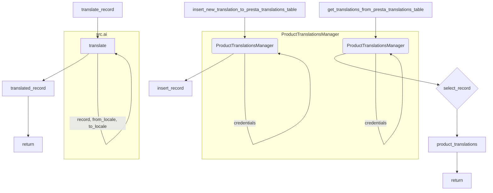

## <input code>

```python
## \file hypotez/src/translators/translate_product_fields.py
# -*- coding: utf-8 -*-
#! venv/Scripts/python.exe
#! venv/bin/python/python3.12

"""
.. module: src.translators 
	:platform: Windows, Unix
	:synopsis:

"""
MODE = 'dev'

"""
	:platform: Windows, Unix
	:synopsis:

"""


"""
	:platform: Windows, Unix
	:synopsis:

"""


"""
  :platform: Windows, Unix

"""
"""
  :platform: Windows, Unix
  :platform: Windows, Unix
  :synopsis:
"""MODE = 'dev'
  
""" module: src.translators """


""" Модуль управления переводами.
Слой связи между словарем полей товара, таблицей переводов и переводчиками

`get_translations_from_presta_translations_table(product_reference, credentials, i18n)`
    1. получает референс товара, параметры подключения к базе переводов престашоп и язык перевода в формате en_EN, he_HE, ru-RU 
    2. созадет условуе запроса
    3. возвращает результат
    

@todo
    1. Продумать какой нибудж парсер для en_EN, he_HE, ru-RU
"""
...
from pathlib import Path
from typing import List, Dict
...
from src import gs
from src.utils.printer import  pprint
from src.product.product_fields.product_fields import record
from src.db import ProductTranslationsManager
from src.ai import translate
from src.endpoints.PrestaShop import PrestaShop
from src import gs
from src.product.product_fields.product_fields import record
from src.db import ProductTranslationsManager
from src.ai import translate
from src.endpoints.PrestaShop import PrestaShop

def get_translations_from_presta_translations_table(product_reference: str, credentials: dict, i18n: str = None) -> list:
    """Функция возвращает словарь переводов полей товара."""
    with ProductTranslationsManager(credentials) as translations_manager:
        search_filter = {'product_reference': product_reference}
        product_translations = translations_manager.select_record(**search_filter)
    return product_translations

def insert_new_translation_to_presta_translations_table(record, credentials):
    with ProductTranslationsManager(credentials) as translations_manager:
        translations_manager.insert_record(record)

def translate_record(record: dict, from_locale: str, to_locale: str) -> dict:
    """Функция для перевода полей товара."""
    translated_record = translate(record, from_locale, to_locale)
    ... # Добавить обработку переведенной записи
    return translated_record
```

## <algorithm>

**Шаг 1:** Функция `get_translations_from_presta_translations_table` получает `product_reference`, `credentials` (данные для подключения к базе) и необязательный параметр `i18n`.

**Шаг 2:** Функция открывает объект `ProductTranslationsManager` с переданными `credentials`.

**Шаг 3:** Формируется `search_filter` для поиска в базе данных по `product_reference`.

**Шаг 4:** Используя `translations_manager.select_record`, выполняется запрос к базе данных.

**Шаг 5:** Возвращается результат запроса - `product_translations`.

**Пример:**
Если `product_reference` = '123', то `search_filter` будет `{'product_reference': '123'}`.  Функция возвращает список словарей с результатами поиска.

**Шаг 6:** Функция `insert_new_translation_to_presta_translations_table` принимает `record` (данные для вставки) и `credentials`.

**Шаг 7:** Открывается `ProductTranslationsManager`.

**Шаг 8:** Используя `translations_manager.insert_record`, производится вставка данных в базу.

**Пример:**
`record` - словарь, представляющий новые данные для вставки.

**Шаг 9:** Функция `translate_record` принимает `record`, `from_locale` (исходный язык) и `to_locale` (целевой язык).

**Шаг 10:** Вызывается функция `translate` из модуля `src.ai` с переданными данными.

**Шаг 11:** Функция возвращает переведённый `translated_record`.

**Пример:**
`record` - словарь с данными, которые нужно перевести. `from_locale` - 'ru-RU', `to_locale` - 'en-EN'. Функция возвращает словарь с переведенными значениями.


## <mermaid>



## <explanation>

**Импорты:**

- `from pathlib import Path`: Импортирует класс `Path` для работы с файловыми путями (хотя в данном коде не используется напрямую).
- `from typing import List, Dict`: Импортирует типы данных `List` и `Dict` для более явного определения типов переменных (статическая типизация).
- `from src import gs`: Импортирует модуль `gs` из пакета `src`.  (Возможно,  управление Google Sheets или другими сервисами).
- `from src.utils.printer import pprint`:  Импортирует функцию `pprint` для красивой печати данных.
- `from src.product.product_fields.product_fields import record`: Импортирует определение `record` из модуля `src.product.product_fields.product_fields`.  Предположительно, это структура для хранения данных о товарах.
- `from src.db import ProductTranslationsManager`: Импортирует класс `ProductTranslationsManager` из модуля `src.db`.  Управление базой данных переводов.
- `from src.ai import translate`: Импортирует функцию `translate` из модуля `src.ai`.  Вероятно, функция для перевода текста с помощью какой-либо AI платформы.
- `from src.endpoints.PrestaShop import PrestaShop`: Импортирует класс `PrestaShop` из модуля `src.endpoints.PrestaShop`,  вероятно, для взаимодействия с API PrestaShop.
- `from src import gs`: Дублированный импорт. Необязательно.

**Классы:**

- `ProductTranslationsManager`: Класс для работы с базой данных переводов.  Должен иметь методы `select_record` (для выборки данных) и `insert_record` (для вставки).  `with`-конструкция гарантирует закрытие соединения с базой.

**Функции:**

- `get_translations_from_presta_translations_table`: Получает данные о переводах из базы данных PrestaShop по указанному `product_reference`. Возвращает список словарей с переводом.
- `insert_new_translation_to_presta_translations_table`: Добавляет новые переводы в базу данных.
- `translate_record`: Переводит данные, используя функцию `translate` из модуля `src.ai`.  Необходимо дополнить обработку переведенных данных и вернуть результат.


**Переменные:**

- `MODE`:  Константа, вероятно, для управления режимом работы.
- `credentials`: Словарь с данными для подключения к базе данных.
- `product_reference`: Строка, идентификатор товара.
- `i18n`: Строка, код языка.
- `search_filter`: Словарь, используется в запросе к базе данных.
- `product_translations`: Список словарей с результатами запроса.
- `record`: Словарь, представляющий данные для вставки/перевода.
- `from_locale`, `to_locale`: Коды языков.
- `translated_record`: Переведённые данные.


**Возможные ошибки и улучшения:**

- Отсутствует обработка ошибок при работе с базой данных (например, проверка успешности запроса).  В `select_record` и `insert_record` должны быть обработан возможные ошибки.
- `... # Добавить обработку переведенной записи` в `translate_record`.  Необходимо обработать результат перевода.
- В функции `translate_record` следует добавить обработку возможных исключений и валидацию входных параметров.
- В коде много комментариев, дублирования импортов и неиспользуемых фрагментов, следует оптимизировать этот код.
- В функции `get_translations_from_presta_translations_table` и `insert_new_translation_to_presta_translations_table`  необходимо вывести логирование для отладки и отслеживания выполнения программы.


**Цепочка взаимосвязей:**

Код взаимодействует с базой данных (`ProductTranslationsManager`), AI сервисом (`translate`), и, вероятно, с API PrestaShop.  Логика построения кода предполагает: сбор данных о переводах из базы PrestaShop, перевод этих данных с помощью API (`translate`) и сохранение результатов в ту же базу.