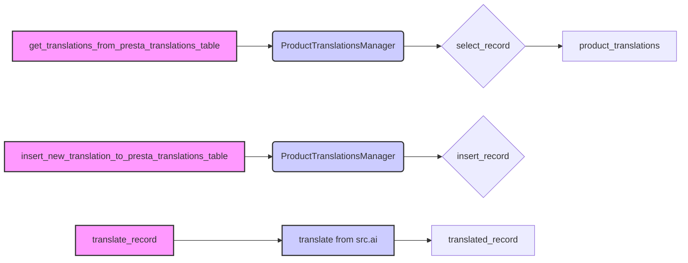

## Анализ кода `hypotez/src/translators/translate_product_fields.py`

### 1. <алгоритм>

**Блок-схема:**

1.  **`get_translations_from_presta_translations_table`**:
    *   **Вход:** `product_reference` (строка, например, "REF123"), `credentials` (словарь, содержащий данные для подключения к БД), `i18n` (строка, например, "en_EN", опционально).
    *   **Действие:**
        *   Создается экземпляр `ProductTranslationsManager` (контекстный менеджер) с использованием `credentials`.
        *   Формируется фильтр `search_filter` для поиска записи в БД по `product_reference`.
        *   Вызывается метод `select_record` менеджера `translations_manager` с `search_filter`.
        *   Результат запроса (список записей) возвращается.
    *   **Выход:** `product_translations` (список словарей, где каждый словарь — запись перевода).

    **Пример:**

    ```python
    product_reference = "REF123"
    credentials = {"host": "localhost", "user": "user", "password": "password", "database": "db"}
    i18n = "ru_RU"
    translations = get_translations_from_presta_translations_table(product_reference, credentials, i18n)
    # translations может быть, например, [{'id': 1, 'product_reference': 'REF123', 'field': 'name', 'locale': 'ru_RU', 'translation': 'Название'}]
    ```

2.  **`insert_new_translation_to_presta_translations_table`**:
    *   **Вход:** `record` (словарь, представляющий запись для вставки в БД), `credentials` (словарь с данными для подключения к БД).
    *   **Действие:**
        *   Создается экземпляр `ProductTranslationsManager` (контекстный менеджер) с использованием `credentials`.
        *   Вызывается метод `insert_record` менеджера `translations_manager` с `record`.
    *   **Выход:** Нет явного возвращаемого значения.

    **Пример:**

    ```python
        record = {'product_reference': 'REF456', 'field': 'description', 'locale': 'en_EN', 'translation': 'Description'}
        credentials = {"host": "localhost", "user": "user", "password": "password", "database": "db"}
        insert_new_translation_to_presta_translations_table(record, credentials)
        # Результат: Новая запись будет добавлена в БД
    ```

3.  **`translate_record`**:
    *   **Вход:** `record` (словарь, представляющий запись для перевода), `from_locale` (строка, язык оригинала, например "en_EN"), `to_locale` (строка, язык перевода, например "ru_RU").
    *   **Действие:**
        *   Вызывается функция `translate` (предположительно из `src.ai`), которая выполняет перевод `record` с `from_locale` на `to_locale`.
        *   (TODO) Добавить обработку переведенной записи (пока не реализовано).
    *   **Выход:** `translated_record` (словарь, представляющий переведенную запись).

    **Пример:**

    ```python
    record = {'name': 'Product Name', 'description': 'Product Description'}
    from_locale = 'en_EN'
    to_locale = 'ru_RU'
    translated_record = translate_record(record, from_locale, to_locale)
    # translated_record может быть, например, {'name': 'Название продукта', 'description': 'Описание продукта'}
    ```

**Поток данных:**

*   `get_translations_from_presta_translations_table` запрашивает данные из БД через `ProductTranslationsManager`.
*   `insert_new_translation_to_presta_translations_table` добавляет данные в БД через `ProductTranslationsManager`.
*   `translate_record` получает данные, передает их в `src.ai.translate` и возвращает результат.

### 2. <mermaid>



**Описание зависимостей:**

*   `get_translations_from_presta_translations_table` и `insert_new_translation_to_presta_translations_table` зависят от класса `ProductTranslationsManager` для взаимодействия с базой данных.
*   `translate_record` зависит от функции `translate` из модуля `src.ai` для выполнения перевода.

**Объяснения:**

*   `get_translations_from_presta_translations_table` (зеленый прямоугольник) является функцией, которая извлекает переводы из базы данных.
*   `insert_new_translation_to_presta_translations_table` (зеленый прямоугольник) — функция, которая добавляет новые переводы в базу данных.
*   `translate_record` (зеленый прямоугольник) — функция, которая переводит запись.
*   `ProductTranslationsManager` (синий прямоугольник) — контекстный менеджер, предоставляющий методы для работы с таблицей переводов в базе данных.
*   `select_record` (ромб) — метод `ProductTranslationsManager`, который выполняет выборку записей из базы данных.
*   `insert_record` (ромб) — метод `ProductTranslationsManager`, который вставляет новые записи в базу данных.
*   `translate from src.ai` (синий прямоугольник) — функция из модуля `src.ai`, которая выполняет перевод текста.
*   `product_translations` (прямоугольник) — результат работы `get_translations_from_presta_translations_table`, список словарей с переводами.
*    `translated_record` (прямоугольник) - результат работы `translate_record` ,словарь с переведенными полями.

### 3. <объяснение>

**Импорты:**

*   `pathlib.Path`: Используется для работы с путями к файлам и каталогам. В данном коде не используется явно, но может быть частью `ProductTranslationsManager`.
*   `typing.List`, `typing.Dict`: Используются для аннотации типов переменных и функций, делая код более читаемым и понятным (непосредственно в коде не используются, но используются аннотации).
*   `src.gs`: Вероятно, содержит глобальные настройки или утилиты, но в коде не используется.
*   `src.utils.printer.pprint`: Используется для красивого вывода данных. В предоставленном коде не используется, но может быть использован при отладке.
*   `src.product.product_fields.product_fields.record`: Представляет структуру данных для полей товара. В коде не используется напрямую, но подразумевается, что записи для перевода имеют эту структуру.
*   `src.db.ProductTranslationsManager`: Класс для управления переводами в базе данных. Предоставляет методы для выборки, вставки, обновления и удаления переводов.
*   `src.ai.translate`: Функция для перевода текста с использованием методов машинного перевода.
*   `src.endpoints.PrestaShop.PrestaShop`: Класс для взаимодействия с API PrestaShop (не используется непосредственно в данном коде).

**Классы:**

*   **`ProductTranslationsManager`**:
    *   **Роль:** Управляет операциями с таблицей переводов в базе данных.
    *   **Атрибуты:** Содержит данные для подключения к базе данных (например, хост, имя пользователя, пароль, имя базы данных).
    *   **Методы:**
        *   `__init__`: Конструктор, принимающий параметры подключения к базе данных.
        *   `__enter__`: Метод для контекстного менеджера, устанавливающий соединение с базой данных.
        *   `__exit__`: Метод для контекстного менеджера, закрывающий соединение с базой данных.
        *   `select_record`: Выбирает запись/записи из таблицы переводов по заданному фильтру.
        *   `insert_record`: Вставляет новую запись в таблицу переводов.
        *   (Возможно, имеет и другие методы для обновления и удаления записей).
    *   **Взаимодействие:** Используется функциями `get_translations_from_presta_translations_table` и `insert_new_translation_to_presta_translations_table` для работы с базой данных.

**Функции:**

*   **`get_translations_from_presta_translations_table(product_reference: str, credentials: dict, i18n: str = None) -> list`**:
    *   **Аргументы:**
        *   `product_reference` (str): Артикул товара.
        *   `credentials` (dict): Параметры для подключения к базе данных.
        *   `i18n` (str, опционально): Локаль, для которой нужно получить переводы (например, "en_EN").
    *   **Возвращаемое значение:** `list`: Список словарей с переводами.
    *   **Назначение:** Получает переводы полей товара из таблицы переводов PrestaShop по артикулу.
    *   **Пример:** Вызов функции с параметрами `product_reference = "REF123", credentials = {"host": "localhost", "user": "user", "password": "password", "database": "db"}, i18n="ru_RU"` вернет список словарей с переводами полей товара `REF123` на русском языке.
*   **`insert_new_translation_to_presta_translations_table(record, credentials)`**:
    *   **Аргументы:**
        *   `record` (dict): Словарь, представляющий запись для вставки.
        *   `credentials` (dict): Параметры для подключения к базе данных.
    *   **Возвращаемое значение:** Нет явного возвращаемого значения.
    *   **Назначение:** Добавляет новую запись с переводом в таблицу переводов PrestaShop.
    *   **Пример:** Вызов функции с параметрами `record = {"product_reference": "REF123", "field": "name", "locale": "en_EN", "translation": "Product Name"}, credentials = {"host": "localhost", "user": "user", "password": "password", "database": "db"}` добавит в БД новую запись перевода для поля "name" товара "REF123" на английском.
*   **`translate_record(record: dict, from_locale: str, to_locale: str) -> dict`**:
    *   **Аргументы:**
        *   `record` (dict): Словарь, представляющий запись для перевода.
        *   `from_locale` (str): Локаль исходного текста (например, "en_EN").
        *   `to_locale` (str): Локаль целевого текста (например, "ru_RU").
    *   **Возвращаемое значение:** `dict`: Словарь с переведенным текстом.
    *   **Назначение:** Переводит запись с одного языка на другой, используя функцию `translate` из `src.ai`.
    *   **Пример:** Вызов функции с параметрами `record = {"name": "Product Name", "description": "Product Description"}, from_locale = "en_EN", to_locale = "ru_RU"` вернет словарь с переведенными полями (например, `{"name": "Название товара", "description": "Описание товара"}`).

**Переменные:**

*   `MODE`: Глобальная переменная, указывающая режим работы (в данном случае "dev"). Возможно, используется для переключения между разными настройками (например, dev/prod).

**Потенциальные ошибки и области для улучшения:**

*   **Обработка ошибок:** Отсутствует явная обработка ошибок при работе с базой данных или при переводе. Следует добавить `try-except` блоки для обработки исключений.
*   **Валидация данных:** Не производится валидация входных данных (например, `product_reference`, `credentials`, `record`).
*   **Обработка переведенной записи:** В `translate_record` имеется комментарий `... # Добавить обработку переведенной записи`. Необходимо добавить логику для обработки переведенных данных (например, запись в БД, сохранение в файл, преобразование).
*   **Неиспользуемые импорты:** Некоторые импорты (`src.gs`, `src.utils.printer.pprint`, `src.endpoints.PrestaShop.PrestaShop`) не используются в представленном коде. Возможно, они используются в других частях проекта или остались от предыдущих версий.
*   **Модульность:** Функция `translate` вызывается напрямую, было бы лучше создать класс с методами перевода.
*   **Формат i18n:** В коде есть `TODO` по парсингу форматов `en_EN, he_HE, ru-RU`. Необходимо реализовать парсер для преобразования этих строк в нужный формат.

**Цепочка взаимосвязей с другими частями проекта:**

*   Модуль `translate_product_fields.py` зависит от:
    *   `src.db.ProductTranslationsManager` для работы с базой данных.
    *   `src.ai.translate` для выполнения перевода.
    *   `src.product.product_fields.product_fields.record` для определения структуры данных.
*   Он, вероятно, является частью слоя `src.translators`, который, в свою очередь, может использоваться более высокоуровневыми частями проекта, например, для синхронизации данных между PrestaShop и другими системами или для предоставления переведенных данных в веб-интерфейсе.

В целом, код представляет собой базовую функциональность для управления переводами полей товаров. Он требует доработки в части обработки ошибок, валидации данных и реализации обработки переведенных записей. Также необходимо обратить внимание на неиспользуемые импорты и форматирование кода.