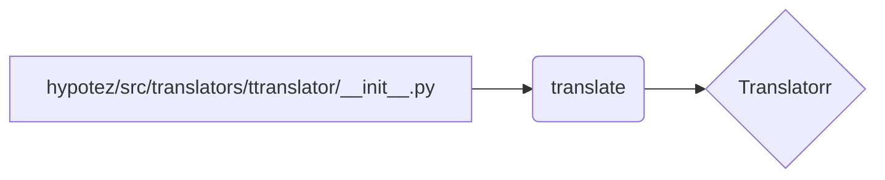

```MD
1. <input code>

```python
## \file hypotez/src/translators/ttranslator/__init__.py
# -*- coding: utf-8 -*-\
#! venv/Scripts/python.exe
#! venv/bin/python/python3.12

"""
.. module: src.translators.ttranslator 
	:platform: Windows, Unix
	:synopsis:

"""
MODE = 'dev'

"""
	:platform: Windows, Unix
	:synopsis:

"""


"""
	:platform: Windows, Unix
	:synopsis:

"""


"""
  :platform: Windows, Unix

"""
"""
  :platform: Windows, Unix
  :platform: Windows, Unix
  :synopsis:
"""MODE = 'dev'
  
""" module: src.translators.ttranslator """


# https://github.com/terryyin/translate-python?tab=readme-ov-file

from translate import Translatorr
```

2. <algorithm>

Этот код представляет собой инициализацию модуля `ttranslator` внутри пакета `translators` проекта `hypotez`.  Поскольку он содержит только импорт, алгоритм работы сводится к одному шагу: импорту модуля `Translatorr`.  Нет циклов, ветвлений или вычислений.  Данные не передаются между функциями или классами.

```mermaid
graph TD
    A[Импорт модуля "Translatorr"] --> B(Инициализация модуля);
```

3. <mermaid>



4. <explanation>

* **Импорты**:  Код импортирует класс `Translatorr` из внешней библиотеки `translate`.  Строка `from translate import Translatorr` указывает, что используется модуль, который, по всей видимости, содержит инструменты для перевода текста. Подключаемый пакет `translate` не из `src` (локального проекта). Эта библиотека внешняя и нужна для выполнения перевода, если предполагается, что `Translatorr` в ней определён. Связь с `src` только в том, что данный файл (`__init__.py`) используется в рамках пакета `translators`.

* **Классы**: Код не определяет новых классов. Он импортирует уже готовый класс `Translatorr` из внешнего модуля.

* **Функции**:  Нет определённых функций.

* **Переменные**: Переменная `MODE` определена с значением `'dev'`. Вероятно, это конфигурационная переменная, определяющая режим работы (например, `dev`, `prod`).

* **Возможные ошибки или области для улучшений**:
    * Нет обработки ошибок при импорте `translate`.  Если библиотека не найдена, то возникнет исключение `ImportError`.
    * Отсутствует описание того, как будет использоваться импортированный класс. Это лишь импорт. Необходимо посмотреть на функции, которые будут использовать этот импорт для понимания, как это будет использоваться.
    * Отсутствует документация по использованию класса `Translatorr` из модуля `translate`. Это важный момент, поскольку без документации непонятно, как использовать `Translatorr`.

* **Цепочка взаимосвязей**: Файл `__init__.py` в папке `translators` внутри пакета `src` проекта `hypotez` импортирует класс из внешнего пакета `translate`.  Дальнейшее использование класса `Translatorr` будет зависеть от функций и классов, которые будут его использовать в других частях проекта.  Вероятнее всего, этот класс будет использоваться для выполнения функций перевода.


**Заключение**: Данный файл является инициализационной частью модуля, устанавливающей необходимую внешнюю зависимость для дальнейшей работы с переводом.  Для полноценного понимания необходимо просмотреть код функций, которые будут использовать `Translatorr`.