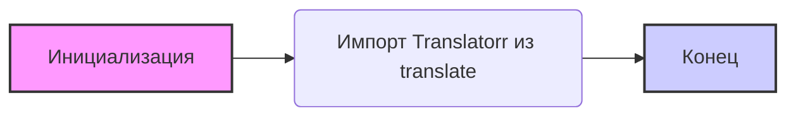

## Анализ кода `hypotez/src/translators/ttranslator/__init__.py`

### <алгоритм>

1.  **Инициализация переменной `MODE`**: 
    -  Переменной `MODE` присваивается строковое значение `'dev'`. Это может указывать на то, что текущая среда разработки (development).
    -  *Пример*: `` 
2.  **Импорт модуля `Translatorr`**:
    -  Импортируется класс `Translatorr` из внешнего пакета `translate`. Этот класс, вероятно, используется для выполнения переводов.
    -  *Пример*: `from translate import Translatorr`

### <mermaid>

**Описание `mermaid` диаграммы:**

*   **graph LR**:  Указывает, что это ориентированный граф, и поток идет слева направо.
*   **A[Инициализация ]**:  Представляет блок инициализации переменной `MODE` со значением `'dev'`. Стиль указывает на начало процесса.
*   **B(Импорт Translatorr из translate)**:  Представляет блок импорта класса `Translatorr` из модуля `translate`.
*  **C[Конец]**:  Представляет окончание выполнения кода. Стиль указывает на завершение процесса.
*   **A --> B**:  Поток выполнения идёт от инициализации переменной к импорту модуля.
*   **B --> C**:  Поток выполнения идёт от импорта модуля к окончанию выполнения.

**Зависимости:**

*   Импортируется класс `Translatorr` из внешнего пакета `translate`. Это означает, что для работы данного модуля требуется установка пакета `translate` (`pip install translate`).

### <объяснение>

**Импорты:**

*   `from translate import Translatorr`: Импортирует класс `Translatorr` из пакета `translate`. Пакет `translate` (https://github.com/terryyin/translate-python) предоставляет функциональность для перевода текста между языками. Этот импорт устанавливает зависимость от внешнего пакета.

**Переменные:**

*   `MODE`: Строковая переменная, которая устанавливается в `'dev'`. Эта переменная, вероятно, используется для определения режима работы программы (например, разработка, тестирование, продакшн). На основе этой переменной можно переключать логику или параметры приложения.

**Файл `__init__.py`:**

*   Этот файл `__init__.py` делает директорию `ttranslator` пакетом в Python. Он может содержать инициализацию переменных, импорты, а также выполнять другие действия, необходимые для настройки пакета.
*   Наличие docstring в начале файла намекает на то, что данный пакет должен быть задокументирован и в дальнейшем использоваться другими частями проекта.

**Потенциальные области для улучшения:**

*   **Использование `MODE`**:  Использование переменной `MODE` только с одним значением `'dev'` в production-коде не имеет смысла. Необходимо добавить возможность выбора режима (production, staging, development и т.д.) на основе переменных окружения или конфигурационных файлов.
*   **Обработка ошибок импорта**:  В коде нет обработки ошибок при импорте `Translatorr`. В случае, если пакет `translate` не установлен, приложение может завершиться с ошибкой. Необходимо предусмотреть обработку таких ситуаций, например, при помощи try/except.
*   **Документация**:  Docstring  содержит незавершенные строки и дублирование. Необходимо доработать описание модуля.

**Цепочка взаимосвязей с другими частями проекта:**

*   Этот модуль `ttranslator` является частью пакета `translators`, который, вероятно, отвечает за перевод текста в проекте `hypotez`.
*   Предполагается, что класс `Translatorr` будет использоваться в других частях проекта для реализации функциональности перевода.
*   Другие модули проекта, импортируя этот пакет и класс `Translatorr`, будут использовать функциональность перевода, которую он предоставляет. Например, для перевода пользовательского ввода, сообщений или другой информации, требующей локализации.
*   `MODE` может влиять на логику работы, как-то использовать тестовый API или использовать заглушки вместо настоящего сервиса.