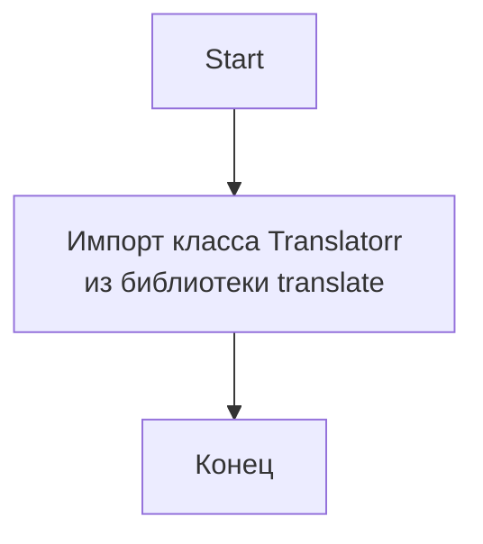

# АНАЛИЗ КОДА: `src/translators/ttranslator/__init__.py`

## <алгоритм>

1.  **Импорт `Translatorr`**:
    *   Импортируется класс `Translatorr` из внешней библиотеки `translate`.
    *   Пример: `from translate import Translatorr`

2. **Конец**: На этом этапе код завершает выполнение.

## <mermaid>

## <объяснение>

### Импорты
*   `from translate import Translatorr`: Импортирует класс `Translatorr` из библиотеки `translate`, которая, судя по комментарию, предназначена для работы с переводами.
    -   **Назначение:** Класс `Translatorr` является ключевым компонентом этой библиотеки и, вероятно, предоставляет методы для осуществления перевода текста с одного языка на другой.
    -   **Взаимосвязь:** Пакет `src` не связан напрямую с библиотекой `translate`.  `translate` является внешней зависимостью, которую проект использует для перевода.

### Классы
*   Класс `Translatorr`:
    -   **Роль:** Этот класс, вероятно, содержит логику для перевода текста с одного языка на другой. Он может включать методы для установки языка перевода, выбора движка перевода и выполнения перевода.
    -  **Атрибуты:** Атрибуты данного класса нам не известны, поскольку код данного класса не представлен.
    -  **Методы:** Методы данного класса нам не известны, поскольку код данного класса не представлен.
    - **Взаимодействие:** Класс взаимодействует с внешними ресурсами для осуществления перевода (например, API сервисов перевода).

### Функции
*   Функций в данном файле нет.

### Переменные
*   Переменных в данном файле нет.

### Потенциальные ошибки и улучшения
*   **Недостаток документации:** Файл содержит много пустых строк и комментариев, которые не несут смысловой нагрузки. Это может затруднить понимание кода.
*   **Отсутствие функциональности:** Файл импортирует `Translatorr`, но не использует его, не создаёт экземпляры и не вызывает методы. Таким образом, этот файл на данный момент не выполняет никаких операций, связанных с переводом.
*   **Зависимость от внешней библиотеки:** Проект зависит от библиотеки `translate`. Для обеспечения стабильной работы необходимо убедиться, что эта зависимость правильно управляется.

### Взаимосвязи с другими частями проекта
*   Файл `__init__.py` обычно используется для инициализации пакета. В данном случае, он импортирует `Translatorr`, но не использует его. Это говорит о том, что дальнейшая работа с переводом будет происходить в других модулях пакета `src.translators.ttranslator`.

**Предполагаемая цепочка взаимосвязей:**
1. Другие модули в пакете `src.translators.ttranslator` будут импортировать класс `Translatorr` из `__init__.py`.
2. Эти модули создадут экземпляры класса `Translatorr` и будут использовать его для перевода текста.
3. Результаты перевода могут быть использованы в других частях проекта.

**Дополнительные замечания:**

*   Необходимо добавить реализацию для создания экземпляров Translatorr и его использования.
*   Нужно удалить неинформативные комментарии.
*   Добавить docstring для модуля.