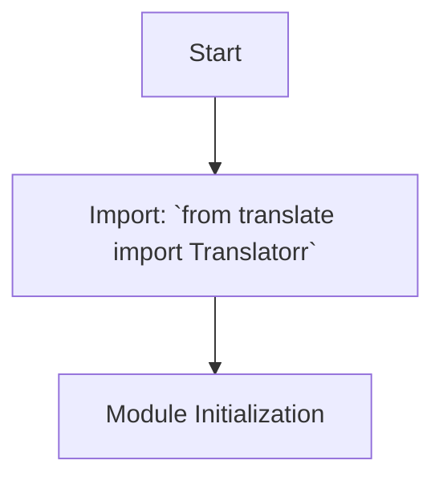

## АНАЛИЗ КОДА `hypotez/src/translators/ttranslator/__init__.py`

### <алгоритм>

1.  **Импорт библиотеки `Translatorr`:**
    *   Пример: `from translate import Translatorr`.  
    *   Цель: Импортируется класс `Translatorr` из внешней библиотеки `translate`. Эта библиотека предположительно используется для выполнения операций перевода текста. 

2.  **Инициализация модуля:**
    *   В коде нет явной инициализации, только импорт. Модуль `__init__.py` создает пакет `ttranslator`, но не определяет функциональность пакета напрямую, полагаясь на другие модули в пакете.
    *   Пример: Отсутствует код для инициализации. В основном, этот файл создает пакет (директорию).
  
### <mermaid>

### <объяснение>

**Импорты:**
* `from translate import Translatorr`:
    *   Импортирует класс `Translatorr` из библиотеки `translate`. Эта библиотека, судя по ссылке в коде, является сторонней библиотекой для выполнения перевода текста.
    *   Эта зависимость вводит внешнюю функциональность в пакет `ttranslator`, позволяя использовать методы и атрибуты класса `Translatorr` в модулях этого пакета.
    *   Взаимосвязь с другими пакетами `src`: Этот импорт не влияет напрямую на другие пакеты в `src`, но позволяет использовать функциональность перевода в рамках пакета `ttranslator`.

**Классы:**
    *   В коде нет определения классов. Класс `Translatorr` импортируется из сторонней библиотеки.

**Функции:**
    *   В коде нет определения функций. Предполагается, что функционал предоставляется импортированным классом `Translatorr`

**Переменные:**
    *   В коде не определены переменные.

**Потенциальные ошибки и области для улучшения:**

1.  **Отсутствие документации:**  Модуль не имеет описания (docstring) в начале файла, что затрудняет понимание его назначения.
2.  **Отсутствие функционала:**  Модуль на данный момент только импортирует внешнюю библиотеку, не предоставляя никакого собственного функционала.  
3.  **Зависимость от сторонней библиотеки:**  Зависимость от внешней библиотеки `translate` может стать проблемой, если эта библиотека перестанет поддерживаться или изменит свой API. Рекомендуется проверить лицензию и стабильность `translate`.
4. **Неиспользуемый импорт:** Импортированный класс `Translatorr` не используется внутри этого файла. Это может свидетельствовать о том, что либо файл не закончен, либо импорт не нужен.

**Цепочка взаимосвязей с другими частями проекта:**

*   Предполагается, что этот модуль `ttranslator` предназначен для предоставления функциональности перевода текста другим модулям проекта, предположительно в пакете `src`. Он импортирует `Translatorr`, чтобы затем использовать его в других модулях этого пакета.
*   Другие модули в `src` могут импортировать и использовать `ttranslator`, чтобы получить доступ к функциональности перевода. 

**Улучшения:**
1. **Добавить функциональность:** необходимо добавить функциональность в модуль `__init__.py` или в другие модули пакета `ttranslator`, например, создать класс-обертку для `Translatorr`.
2. **Добавить документацию:**  Необходимо добавить описание в начале файла, чтобы сделать его более понятным.
3.  **Проверка импорта:**  Если импорт `Translatorr` не используется в `__init__.py`, то, возможно, его нужно перенести в другой модуль.