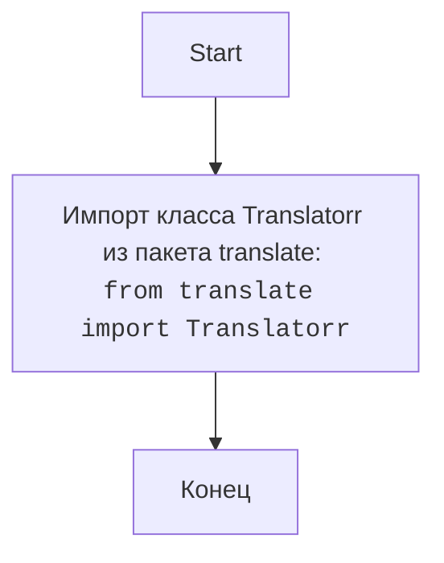

## АНАЛИЗ КОДА: `src/translators/ttranslator/__init__.py`

### <алгоритм>
1. **Импорт:**
    - Импортируется класс `Translatorr` из пакета `translate`.
    - Пример: `from translate import Translatorr`
2.  **Инициализация пакета:**
    -  Файл `__init__.py` в Python служит для того, чтобы интерпретатор считал директорию `ttranslator` пакетом. В данном случае `__init__.py` минимален.
    - `__init__.py` не содержит исполняемого кода, кроме импорта `Translatorr`.

### <mermaid>

### <объяснение>

**Импорты:**
- `from translate import Translatorr`: Импортирует класс `Translatorr` из внешнего пакета `translate`. Этот пакет, вероятно, предоставляет функциональность для перевода текста.  Использование `translate-python` (судя по комментарию) подразумевает внешнюю библиотеку. Библиотека позволяет создавать экземпляры Translator, которые могут переводить текст с одного языка на другой.

**Классы:**
- В данном коде нет определения собственных классов. Здесь используется внешний класс `Translatorr` из импортированной библиотеки.

**Функции:**
- Файл `__init__.py` обычно не содержит функций. В данном случае здесь нет определения функций.

**Переменные:**
- В данном коде нет переменных.

**Объяснение:**
- Файл `__init__.py` в Python используется для обозначения директории как пакета. Когда выполняется импорт из пакета, например, `from src.translators.ttranslator import ...`, интерпретатор Python ищет файл `__init__.py` в директории `src/translators/ttranslator/`.
- В данном случае, файл `__init__.py` содержит только импорт класса `Translatorr` из стороннего пакета `translate`. Это делает класс `Translatorr` доступным для импорта из пакета `src.translators.ttranslator` , например, так: `from src.translators.ttranslator import Translatorr`.
- Судя по названию файла и импорту класса `Translatorr`, пакет `ttranslator` в `src/translators` предназначен для предоставления функциональности перевода.
- Пакет `translate` нужно установить отдельно, например, `pip install translate`.

**Потенциальные ошибки и улучшения:**
- Зависимость от сторонней библиотеки `translate` требует ее явной установки. Необходимо указать это в требованиях проекта (например, в `requirements.txt`).
-  Пакет `ttranslator` в `src.translators` может расширяться для инкапсуляции или добавления специфических настроек для перевода. Например, можно создать класс-обертку для `Translatorr`, чтобы настроить поведение перевода под конкретные нужды проекта.

**Взаимосвязь с другими частями проекта:**
- Пакет `src.translators.ttranslator` является частью более крупного проекта, в котором он используется как модуль для предоставления функции перевода.
-  Другие модули в проекте могут импортировать класс `Translatorr` из этого пакета для перевода текста, например:
```python
from src.translators.ttranslator import Translatorr

def translate_text(text, from_lang, to_lang):
    translator = Translatorr(to_lang=to_lang, from_lang=from_lang)
    return translator.translate(text)

# Пример использования
translated_text = translate_text("Hello", "en", "ru")
print(translated_text)
```
- В дальнейшем можно добавить более сложную логику и классы в пакет `ttranslator`.
```