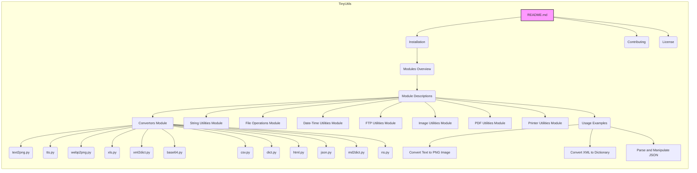

## Анализ кода `hypotez/src/utils/README.MD`

### <алгоритм>

1.  **Начало**: Пользователь знакомится с файлом `README.md` для библиотеки `tiny_utils`.
2.  **Обзор**: Пользователь читает общее описание библиотеки, её назначения и структуры модулей.
    *   Пример: *Tiny Utils - это библиотека утилит, предоставляющая набор легких вспомогательных функций для различных общих задач.*
3.  **Установка**: Пользователь узнает, как установить библиотеку `tiny_utils`.
    *   Пример: Пользователь выполняет команды `git clone ...`, `cd tiny_utils`, `pip install -r requirements.txt`.
4.  **Модули**: Пользователь изучает краткий обзор модулей и их назначение.
    *   Пример: *`Convertors`: Модули для преобразования форматов данных, таких как текст в изображение, webp в png, JSON, XML, кодирование Base64 и многое другое.*
5.  **Описание модулей**: Пользователь изучает подробное описание каждого модуля, включая назначение и файлы в каждом модуле.
    *   Пример:  Модуль `convertors` содержит `text2png.py`, `tts.py`, `webp2png.py`, `xls.py`, `xml2dict.py`, `base64.py`, `csv.py`, `dict.py`, `html.py`, `json.py`, `md2dict.py`, `ns.py`.
    *   Пример: Модуль `string` предоставляет расширенные функции для работы со строками.
    *   Пример: Модуль `file` включает функции для чтения, записи, копирования, удаления и перемещения файлов.
    *   Пример: Модуль `date_time` позволяет форматировать и преобразовывать даты и время.
    *   Пример: Модуль `ftp` включает функции для операций с FTP.
    *   Пример: Модуль `image` предоставляет инструменты для базовой обработки изображений.
    *   Пример: Модуль `pdf` предоставляет функции для работы с PDF файлами.
    *   Пример: Модуль `printer` включает функции для отправки данных на принтер.
6.  **Примеры использования**: Пользователь изучает примеры использования библиотеки.
    *   Пример: Преобразование текста в PNG изображение.
    *   Пример: Преобразование XML в словарь.
    *   Пример: Разбор и манипуляции JSON.
7.  **Завершение**: Пользователь получает общее представление о возможностях библиотеки `tiny_utils` и может начать её использовать.

### <mermaid>

**Анализ зависимостей `mermaid`:**

*   **TinyUtils**:  Представляет собой общую структуру библиотеки `tiny_utils`.
*   **README.md**: Главный файл, который содержит всю информацию о библиотеке.
*   **Installation**: Раздел, описывающий процесс установки библиотеки.
*   **Modules Overview**: Раздел, дающий краткий обзор модулей.
*   **Module Descriptions**: Раздел, подробно описывающий каждый модуль.
*   **Convertors Module**: Модуль для конвертации различных форматов данных.
*   **String Utilities Module**: Модуль с утилитами для работы со строками.
*  **File Operations Module**: Модуль с утилитами для работы с файлами.
*  **Date-Time Utilities Module**: Модуль с утилитами для работы с датами и временем.
*  **FTP Utilities Module**: Модуль с утилитами для работы с FTP.
*  **Image Utilities Module**: Модуль с утилитами для обработки изображений.
*  **PDF Utilities Module**: Модуль с утилитами для работы с PDF.
*  **Printer Utilities Module**: Модуль с утилитами для работы с принтером.
*   **text2png.py**: Скрипт для преобразования текста в PNG.
*   **tts.py**: Скрипт для преобразования текста в речь.
*   **webp2png.py**: Скрипт для преобразования WebP в PNG.
*   **xls.py**: Скрипт для работы с XLS файлами.
*   **xml2dict.py**: Скрипт для преобразования XML в словарь.
*   **base64.py**: Скрипт для кодирования/декодирования Base64.
*   **csv.py**: Скрипт для работы с CSV файлами.
*   **dict.py**: Скрипт для работы со словарями.
*   **html.py**: Скрипт для работы с HTML файлами.
*   **json.py**: Скрипт для работы с JSON файлами.
*   **md2dict.py**: Скрипт для преобразования Markdown в словарь.
*   **ns.py**: Скрипт для работы с пространствами имен.
*   **Usage Examples**: Раздел с примерами использования.
*   **Convert Text to PNG Image**: Пример преобразования текста в PNG.
*   **Convert XML to Dictionary**: Пример преобразования XML в словарь.
*   **Parse and Manipulate JSON**: Пример разбора и манипуляции JSON.
*   **Contributing**: Раздел об участии в проекте.
*   **License**: Раздел с информацией о лицензии.

### <объяснение>

**Импорты:**
*   Данный файл `README.md` не содержит импортов. Он является документацией, а не кодом.

**Классы:**
*   `README.md` не содержит классов, так как это файл документации.

**Функции:**
*   `README.md` не содержит функций. Это файл документации, поэтому функции не определяются.

**Переменные:**
*   `README.md` не содержит переменных. Это файл документации, поэтому переменные не используются.

**Подробные объяснения:**

*   **README.md**: Этот файл служит входной точкой для понимания структуры и функциональности библиотеки `tiny_utils`. Он содержит описание библиотеки, инструкцию по установке, обзор модулей, примеры использования, а также информацию о лицензировании и способах участия в проекте.
*   **Структура модулей:** Библиотека разделена на несколько модулей, каждый из которых отвечает за определенный тип задач. Это делает код более организованным и упрощает его использование. Каждый модуль содержит файлы с функциями, классами и утилитами, специфичными для данного набора задач.
*   **Примеры использования:** Примеры демонстрируют, как можно использовать функции библиотеки на практике, что упрощает понимание их назначения и облегчает начало работы с библиотекой.
*   **Файлы:** Файлы, такие как `text2png.py`, `tts.py` и другие, являются модулями или скриптами, которые предоставляют конкретные функции в рамках своей области.
*   **Взаимосвязи с другими частями проекта:** Файл `README.md` предоставляет информацию о том, как использовать библиотеку, и является входной точкой для новых пользователей, которые хотят ознакомиться с её функциональностью. Он связан с остальными частями проекта через структуру папок, описанных в нём, и предоставляет документацию для модулей.

**Потенциальные ошибки и области для улучшения:**
*   **Недостаток подробной документации**:  Хотя `README.md` дает общий обзор,  подробная документация по каждому модулю и функции, вероятно, должна быть в отдельных файлах, например, в Wiki или в отдельных файлах `README.md` каждого модуля.
*   **Отсутствие тестов**:  Файл `README.md` не упоминает о наличии или отсутствии тестов для библиотеки.
*   **Примеры использования**: Примеры использования ограничены, и было бы полезно добавить больше примеров для демонстрации возможностей библиотеки.

**Цепочка взаимосвязей с другими частями проекта:**

1.  `README.md` -> `tiny_utils` (основная библиотека): `README.md` является точкой входа для понимания библиотеки и предоставляет информацию о её структуре и назначении.
2.  `README.md` -> Модули (`convertors`, `string`, `file`, `date_time` и др.): `README.md` описывает структуру модулей и предоставляет информацию о том, какие функциональные возможности доступны в каждом модуле.
3.  `README.md` -> Примеры использования: `README.md` предоставляет примеры кода, которые показывают, как использовать библиотеку, что связывает документацию с реальным кодом.
4.  `README.md` -> Файлы модулей (`text2png.py`, `tts.py` и др.):  `README.md` ссылается на эти файлы в описании модулей, указывая на то, какие именно файлы содержат реализацию функциональности.
5.  `README.md` -> [Tiny Utils Wiki](https://github.com/hypo69/tiny-utils/wiki): `README.md` ссылается на дополнительную документацию, расширяя информацию о библиотеке.
6.  `README.md` -> `requirements.txt`: Указывает на необходимые зависимости для установки библиотеки.
7.  `README.md` -> `LICENSE`: Указывает на тип лицензии, под которой распространяется библиотека.

В целом, `README.md` является важной частью проекта, так как он обеспечивает документацию и служит отправной точкой для пользователей, которые хотят использовать библиотеку.