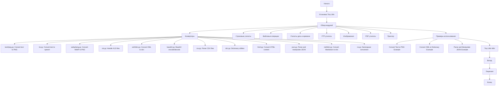

## <алгоритм>

1. **Начало**: Документ начинается с общей информации о библиотеке `Tiny Utils`.

2. **Оглавление**: Представлено оглавление, которое помогает пользователю ориентироваться в документе.

3. **Установка**: Инструкции по установке `Tiny Utils` с использованием `git clone` и `pip install`.

4. **Обзор модулей**: Краткое описание основных модулей библиотеки:
   - **Конверторы (Convertors)**: Модули для преобразования данных между форматами (например, text-to-image, XML-to-dictionary, JSON-to-python).
   - **Строковые утилиты (String Utilities)**: Инструменты для расширенной работы со строками.
   - **Файловые операции (File Operations)**: Функции для обработки файлов (чтение, запись, копирование и т.д.).
   - **Утилиты даты и времени (Date-Time Utilities)**: Функции для работы с датами и временем.
   - **FTP утилиты (FTP Utilities)**: Функции для работы с FTP.
   - **Изображения (Image Utilities)**: Базовые функции обработки изображений.
   - **PDF утилиты (PDF Utilities)**: Функции для работы с PDF файлами.
   - **Принтер (Printer Utilities)**: Функции для отправки данных на печать.

5. **Описание модулей**: Подробное описание каждого модуля, включая:
    - **Convertors**: 
      -  **text2png.py**:  Преобразует текст в PNG изображение.
          *Пример:* `text = "Привет, мир!"; output = "image.png"; text2png.convert(text, output)`
      -  **tts.py**:  Преобразует текст в речь (аудио файл).
          *Пример:* `text = "Запишите это"; output = "audio.mp3"; tts.convert(text, output)`
      -  **webp2png.py**:  Преобразует WebP изображение в PNG.
          *Пример:* `input = "image.webp"; output = "image.png"; webp2png.convert(input, output)`
      -  **xls.py**:  Обрабатывает XLS файлы.
          *Пример:* `input = "file.xls"; data = xls.parse(input)`
      -  **xml2dict.py**:  Преобразует XML в словарь Python.
          *Пример:* `xml = "<root><item>value</item></root>"; dictionary = xml2dict.convert(xml)`
      -  **base64.py**:  Кодирование/декодирование Base64.
          *Пример:* `data = "example"; encoded = base64.encode(data); decoded = base64.decode(encoded)`
      -  **csv.py**:  Разбор и работа с CSV файлами.
          *Пример:* `input = "data.csv"; csv_data = csv.parse(input)`
      -  **dict.py**: Утилиты для работы со словарями.
          *Пример:* `data = {'a': 1}; dict.merge(data, {'b': 2})`
      -  **html.py**:  Конвертирует HTML контент.
          *Пример:* `input = "<html>...</html>"; output = html.convert(input)`
      -  **json.py**:  Разбор и работа с JSON.
          *Пример:* `input = '{"key":"val"}'; json_data = json.parse(input)`
      -  **md2dict.py**:  Преобразует Markdown в словарь.
          *Пример:* `input = "# Header\nText"; dictionary = md2dict.convert(input)`
      -  **ns.py**:  Конвертация пространств имен.
          *Пример:* `ns.convert(data, from_ns, to_ns)`
    - **String Utilities**: Функции для обработки строк.
    - **File Operations**: Функции для обработки файлов.
    - **Date-Time Utilities**: Функции для работы с датами и временем.
    - **FTP Utilities**: Функции для работы с FTP.
    - **Image Utilities**: Функции для работы с изображениями.
    - **PDF Utilities**: Функции для работы с PDF.
    - **Printer Utilities**: Функции для работы с принтерами.

6. **Примеры использования**: Приведены примеры использования модулей:
   - Конвертация текста в PNG изображение.
   - Конвертация XML в словарь.
   - Разбор и работа с JSON.

7. **Ссылка на Wiki**: Ссылка на Wiki для подробной документации.
8.  **Вклад**: Условия для участия в разработке проекта.
9. **Лицензия**: Информация о лицензии MIT.

## <mermaid>

**Описание зависимостей `mermaid`:**

- **`Start`**: Начало процесса описания библиотеки.
- **`Install`**: Шаг, который описывает процесс установки библиотеки Tiny Utils.
- **`Modules`**: Описывает общую структуру библиотеки, разделие на модули.
- **`Convertors`**: Описывает модуль конвертации различных форматов данных.
    - **`TextToPng`**:  Указывает на модуль `text2png.py` и его назначение.
    -  **`Tts`**:  Указывает на модуль `tts.py` и его назначение.
    -  **`WebpToPng`**:  Указывает на модуль `webp2png.py` и его назначение.
    -  **`Xls`**:  Указывает на модуль `xls.py` и его назначение.
    -  **`XmlToDict`**:  Указывает на модуль `xml2dict.py` и его назначение.
    -  **`Base64`**:  Указывает на модуль `base64.py` и его назначение.
    -  **`Csv`**:  Указывает на модуль `csv.py` и его назначение.
    -  **`Dict`**:  Указывает на модуль `dict.py` и его назначение.
    -  **`Html`**:  Указывает на модуль `html.py` и его назначение.
    -  **`Json`**:  Указывает на модуль `json.py` и его назначение.
     -  **`MdToDict`**:  Указывает на модуль `md2dict.py` и его назначение.
      -  **`Ns`**:  Указывает на модуль `ns.py` и его назначение.
-  **`StringUtils`**: Описывает модуль строковых утилит.
-  **`FileOps`**: Описывает модуль файловых операций.
-  **`DateTimeUtils`**: Описывает модуль утилит даты и времени.
-  **`FTPUtils`**: Описывает модуль FTP утилит.
-  **`ImageUtils`**: Описывает модуль обработки изображений.
-  **`PDFUtils`**: Описывает модуль работы с PDF.
-  **`PrinterUtils`**: Описывает модуль работы с принтером.
- **`UsageExamples`**: Раздел с примерами использования библиотеки.
    - **`TextToPngExample`**: Пример конвертации текста в PNG.
    - **`XmlToDictExample`**: Пример конвертации XML в словарь.
    - **`JsonExample`**: Пример работы с JSON.
- **`WikiLink`**: Ссылка на документацию Wiki.
- **`Contribute`**: Раздел, посвященный вкладу в проект.
- **`License`**: Информация о лицензии проекта.
- **`End`**: Завершение описания.

## <объяснение>

**Импорты:**

В данном файле README.MD нет импортов, так как это файл документации, а не код на Python. Он предоставляет обзор структуры и функциональности библиотеки `Tiny Utils`.

**Классы:**

Файл README.MD не содержит классов, так как это документационный файл, а не исходный код.

**Функции:**

Файл README.MD не содержит функций, так как это документационный файл, а не исходный код. В данном файле описываются функции, которые находятся в модулях библиотеки Tiny Utils.

**Переменные:**

Файл README.MD не содержит переменных, так как это документационный файл, а не исходный код. В данном файле описываются переменные, которые используются в примерах, но они являются частью кода, который находится в других файлах.

**Объяснение:**

- **README.MD**: Этот файл представляет собой документацию к библиотеке `Tiny Utils`. Он содержит обзор всех модулей, предоставляет инструкции по установке, описывает функциональность каждого модуля, и приводит примеры использования.
- **Структура библиотеки**: Библиотека `Tiny Utils` разделена на несколько модулей, каждый из которых отвечает за определенную область задач. Это позволяет пользователям легко находить нужные функции и использовать их в своих проектах.
- **Примеры использования**: Примеры показывают, как можно использовать библиотеку для решения конкретных задач, таких как конвертация текста в изображение, преобразование XML в словарь, и разбор JSON данных.
- **Область применения**: Библиотека предназначена для широкого круга задач, включая обработку данных различных форматов, работу со строками и файлами, а также интеграцию с внешними сервисами, такими как FTP и принтеры.
- **Улучшения**:
   - Добавить более подробные примеры использования для каждого модуля.
   - Указать зависимости для каждого модуля, если таковые имеются.
   - Добавить описание ошибок, которые могут возникнуть при использовании библиотеки.
   - Улучшить структуру и форматирование документа для более удобного чтения.

**Взаимосвязь с другими частями проекта:**

- **`src/`**: Этот файл README.MD находится в директории `src/utils`, что означает, что он относится к утилитам проекта. Этот файл является частью общего проекта и взаимодействует с кодом, который находится в других директориях.
- **`requirements.txt`**: Файл `requirements.txt` указан в инструкциях по установке, что указывает на зависимость проекта от внешних библиотек.
- **`LICENSE`**: Файл `LICENSE` содержит информацию о лицензии, что указывает на то, что проект имеет открытую лицензию.

В целом, этот файл README.MD является важной частью проекта, так как он предоставляет всю необходимую информацию о библиотеке, ее структуре и функциональности. Он позволяет пользователям быстро начать использовать библиотеку в своих проектах.