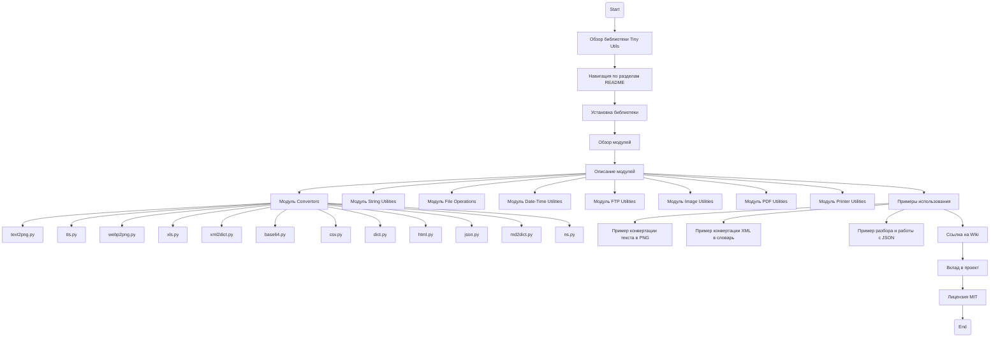

## <алгоритм>

1.  **Начало**: Пользователь знакомится с описанием библиотеки `Tiny Utils` в файле `README.MD`.
2.  **Обзор**: Пользователь узнаёт о назначении библиотеки как коллекции вспомогательных функций для различных задач.
3.  **Навигация**: Пользователь может перемещаться по разделам с помощью оглавления.
4.  **Установка**: Пользователь клонирует репозиторий и устанавливает зависимости, как указано в разделе "Installation".
    *   Пример:
        ```bash
        git clone https://github.com/hypo69/tiny-utils.git
        cd tiny_utils
        pip install -r requirements.txt
        ```
5.  **Обзор модулей**: Пользователь изучает список модулей `Tiny Utils`, каждый из которых отвечает за определенную функциональность.
    *   Примеры модулей: `Convertors`, `String Utilities`, `File Operations`, `Date-Time Utilities` и т.д.
6.  **Описание модулей**: Пользователь подробно изучает описание каждого модуля:
    *   `Convertors`: Описание функций конвертации данных между форматами (текст-в-изображение, webp-в-png, JSON, XML, Base64, и т.д.).
        *   Примеры файлов: `text2png.py`, `tts.py`, `webp2png.py`, `xml2dict.py`, `base64.py`, `json.py`, и т.д.
    *   `String Utilities`: Инструменты для расширенной работы со строками.
    *   `File Operations`: Операции с файлами (чтение, запись, копирование, удаление, перемещение).
    *   `Date-Time Utilities`: Функции для работы с датой и временем.
    *   `FTP Utilities`: Функции для работы с FTP.
    *   `Image Utilities`: Базовые операции с изображениями (изменение размера, кадрирование, форматирование).
    *   `PDF Utilities`: Функции для работы с PDF.
    *   `Printer Utilities`: Функции для отправки данных на печать.
7.  **Примеры использования**: Пользователь изучает примеры использования библиотеки:
    *   Пример 1: Конвертация текста в PNG изображение
        ```python
        from tiny_utils.convertors import text2png
        
        text = "Hello, World!"
        output_path = "output_image.png"
        text2png.convert(text, output_path)
        ```
    *   Пример 2: Конвертация XML в словарь Python
        ```python
        from tiny_utils.convertors import xml2dict
        
        xml_data = "<root><item>Hello</item></root>"
        dictionary = xml2dict.convert(xml_data)
        print(dictionary)
        ```
    *   Пример 3: Разбор и работа с JSON
        ```python
        from tiny_utils.convertors import json
        
        json_data = '{"name": "John", "age": 30}'
        parsed_data = json.parse(json_data)
        print(parsed_data)
        ```
8.  **Документация**: Пользователь направляется к вики-странице для получения более подробной информации.
9.  **Вклад**: Пользователь приглашается внести свой вклад в развитие библиотеки.
10. **Лицензия**: Пользователь узнает о лицензии MIT, под которой распространяется библиотека.
11. **Конец**: Завершение ознакомления с библиотекой.

## <mermaid>



**Описание `mermaid` диаграммы:**

*   `Start`: Начало процесса ознакомления с файлом `README.MD`.
*   `Overview`: Общее описание библиотеки `Tiny Utils`.
*   `Navigation`: Этап навигации по разделам файла.
*   `Installation`: Шаг, описывающий установку библиотеки.
*   `ModulesOverview`: Этап, где рассматривается обзор модулей библиотеки.
*   `ModuleDescriptions`: Подробное описание каждого модуля.
*   `ConvertorsModule`, `StringUtilitiesModule`, `FileOperationsModule`, `DateTimeUtilitiesModule`, `FTPUtilitiesModule`, `ImageUtilitiesModule`, `PDFUtilitiesModule`, `PrinterUtilitiesModule`: Описание модулей.
*   `Text2Png`, `Tts`, `Webp2Png`, `Xls`, `Xml2Dict`, `Base64`, `Csv`, `Dict`, `Html`, `Json`, `Md2Dict`, `Ns`: Файлы, входящие в модуль `Convertors`.
*   `UsageExamples`: Раздел с примерами использования.
*   `Example1`, `Example2`, `Example3`: Примеры кода для различных операций.
*   `DocumentationLink`: Ссылка на вики-документацию.
*   `Contribution`: Раздел, приглашающий к участию в проекте.
*   `License`: Информация о лицензии MIT.
*  `End`: Конец процесса ознакомления с `README.MD`.

## <объяснение>

**Импорты:**

В данном файле `README.MD` нет импортов, так как это Markdown-файл, а не Python-код. Тем не менее, в примерах использования библиотеки `tiny_utils` демонстрируются импорты из пакета `tiny_utils.convertors`, например:

*   `from tiny_utils.convertors import text2png` - импортирует модуль `text2png` из подпакета `convertors`.
*   `from tiny_utils.convertors import xml2dict` - импортирует модуль `xml2dict` из подпакета `convertors`.
*    `from tiny_utils.convertors import json` - импортирует модуль `json` из подпакета `convertors`.

**Классы:**

В этом файле `README.MD` нет классов. Описание классов может присутствовать в файлах, на которые ссылается этот файл, таких как `text2png.py`, `xml2dict.py`, и т.д.

**Функции:**

В данном файле `README.MD` нет функций. Однако в примерах использования вызываются функции из модулей `tiny_utils`:

*   `text2png.convert(text, output_path)`: Функция для преобразования текста в PNG изображение.
    *   Аргументы: `text` (текст для преобразования) и `output_path` (путь к выходному файлу).
    *   Возвращает: Сохраняет изображение в файл.
*   `xml2dict.convert(xml_data)`: Функция для преобразования XML данных в словарь Python.
    *   Аргументы: `xml_data` (строка с XML данными).
    *   Возвращает: Словарь Python, представляющий XML данные.
*   `json.parse(json_data)`: Функция для разбора JSON данных.
    *   Аргументы: `json_data` (строка с JSON данными).
    *   Возвращает: Объект Python, представляющий JSON данные.

**Переменные:**

В файле `README.MD` используются переменные в примерах кода, например:
* `text`, `output_path` - это переменные, которые используются в примере конвертации текста в изображение.
*   `xml_data`, `dictionary` - это переменные, которые используются в примере конвертации XML в словарь.
* `json_data`, `parsed_data` - это переменные, которые используются в примере разбора JSON.

**Объяснение:**

Файл `README.MD` предназначен для предоставления общего обзора и документации по использованию библиотеки `Tiny Utils`. Он структурирован таким образом, чтобы пользователь мог легко понять назначение библиотеки, её модули, и примеры использования. Основные разделы включают:

*   **Описание библиотеки**: Общее назначение и возможности библиотеки.
*   **Установка**: Инструкции по установке и настройке.
*   **Обзор модулей**: Краткое описание каждого модуля.
*   **Описание модулей**: Подробное описание функционала каждого модуля.
*   **Примеры использования**: Демонстрация использования библиотеки через код.
*   **Документация**: Ссылка на подробную вики-документацию.
*   **Вклад**: Приглашение к участию в проекте.
*   **Лицензия**: Информация о лицензировании проекта.

**Потенциальные ошибки и области для улучшения:**

*   **Отсутствие подробной документации:** `README.MD` предоставляет лишь общее представление о библиотеке. Подробная документация, включая примеры и пояснения к каждой функции, должна быть доступна через вики-документацию, на которую дана ссылка.
*   **Неполные примеры:** Приведенные примеры являются базовыми и могут не охватывать все возможности библиотеки.
*   **Недостаток тестирования:** В `README.MD` нет информации о модульном или интеграционном тестировании. Это является важной частью любого проекта.
*   **Не указана поддержка Python версий:** Не указаны поддерживаемые версии Python, что может привести к проблемам совместимости.
*   **Различные форматы документации**: Информация раскидана между `README.MD` и вики-страницей.

**Цепочка взаимосвязей с другими частями проекта:**

`README.MD` является отправной точкой для взаимодействия с библиотекой `Tiny Utils`. Он связан с остальными частями проекта следующим образом:

1.  **Исходный код**: `README.MD` описывает модули и функции, код которых находится в каталоге `src/utils`.
2.  **`requirements.txt`**: Файл, упомянутый в разделе "Installation", содержит зависимости, необходимые для работы библиотеки.
3.  **Вики-документация**: `README.MD` содержит ссылку на вики-страницу, где находится более подробная информация по использованию библиотеки.
4.  **Лицензионный файл**: Ссылка на лицензионный файл `LICENSE` подтверждает условия использования библиотеки.

В целом, `README.MD` выполняет свою роль в качестве отправной точки для знакомства с библиотекой `Tiny Utils`, но требует дополнения в виде подробной документации, примеров и тестирования.