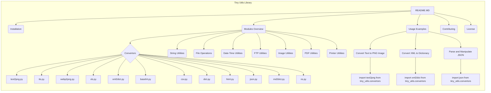

## Анализ кода README.MD

### 1. <алгоритм>
1. **Начало**: Пользователь открывает файл `README.MD` в репозитории `tiny-utils`.
2. **Навигация**: Пользователь видит структуру документа с оглавлением, которое включает:
    - Tiny Utils
    - Table of Contents
    - Installation
    - Modules Overview
    - Module Descriptions
        - Convertors
            - Files:
        - String Utilities
        - File Operations
        - Date-Time Utilities
        - FTP Utilities
        - Image Utilities
        - PDF Utilities
        - Printer Utilities
    - Usage Examples
        - Convert Text to PNG Image
        - Convert XML to Dictionary
        - Parse and Manipulate JSON
    - Contributing
    - License
3.  **Установка**: Пользователь переходит к разделу **Installation** и видит инструкцию по клонированию репозитория и установке зависимостей.
    - Пример: `git clone https://github.com/hypo69/tiny-utils.git`
    - Пример: `cd tiny_utils`
    - Пример: `pip install -r requirements.txt`
4. **Обзор модулей**: Пользователь переходит к разделу **Modules Overview** и получает общее представление о структуре библиотеки и её модулях:
    - `Convertors`: Модули для преобразования данных различных форматов.
    - `String Utilities`: Инструменты для продвинутой работы со строками.
    - `File Operations`: Функции для работы с файлами.
    - `Date-Time Utilities`: Инструменты для работы с датой и временем.
    - `FTP Utilities`: Функции для работы с FTP.
    - `Image Utilities`: Основные функции для работы с изображениями.
    - `PDF Utilities`: Функции для работы с PDF.
    - `Printer Utilities`: Функции для работы с принтером.
5.  **Описание модулей**: Пользователь переходит к разделу **Module Descriptions** для более подробной информации о модулях:
    - **Convertors**:
        -  **text2png.py**:  Конвертирует текст в изображение PNG.
        -  **tts.py**:  Преобразует текст в речь.
        -  **webp2png.py**:  Конвертирует изображения из WebP в PNG.
        - **xls.py**:  Обрабатывает файлы XLS.
        -  **xml2dict.py**: Конвертирует XML в словарь Python.
        -  **base64.py**: Кодирует и декодирует данные Base64.
        -  **csv.py**:  Инструменты для работы с CSV.
        -  **dict.py**:  Инструменты для работы со словарями.
        -  **html.py**: Конвертирует HTML в различные форматы.
        -  **json.py**:  Инструменты для работы с JSON.
        - **md2dict.py**: Конвертирует Markdown в словарь.
        - **ns.py**: Утилиты для преобразования пространств имен.
    -   **String Utilities**: Продвинутые функции для работы со строками.
    -   **File Operations**: Функции для работы с файлами (чтение, запись, копирование, удаление и т.д.).
    -   **Date-Time Utilities**: Функции для работы с датой и временем.
    -   **FTP Utilities**: Функции для работы с FTP.
    -   **Image Utilities**: Базовые функции для работы с изображениями.
    -   **PDF Utilities**: Функции для работы с PDF.
    -  **Printer Utilities**: Функции для работы с принтерами.
6. **Примеры использования**: Пользователь переходит к разделу **Usage Examples** и видит примеры кода:
   -  **Convert Text to PNG Image**: Использует `text2png.convert` для преобразования текста в PNG.
   -  **Convert XML to Dictionary**: Использует `xml2dict.convert` для преобразования XML в словарь.
    -   **Parse and Manipulate JSON**: Использует `json.parse` для разбора JSON данных.
7.  **Вклад**: Пользователь читает раздел **Contributing** о том, как внести свой вклад в проект (форк и pull request).
8.  **Лицензия**: Пользователь читает раздел **License** о том, что проект лицензирован по MIT лицензии.
9.  **Конец**: Пользователь завершает ознакомление с документацией.

### 2. <mermaid>

### <объяснение>

#### Импорты
В файле `README.MD` отсутствуют импорты Python. Он представляет собой документацию, а не исполняемый код. Тем не менее, в разделе **Usage Examples** представлены примеры импортов из модулей `tiny_utils`:
   -   `from tiny_utils.convertors import text2png`: Импортирует модуль `text2png` для преобразования текста в PNG.
   -   `from tiny_utils.convertors import xml2dict`: Импортирует модуль `xml2dict` для преобразования XML в словарь.
   -   `from tiny_utils.convertors import json`: Импортирует модуль `json` для работы с JSON.

#### Классы
В файле `README.MD` не описываются классы, но упоминаются модули, которые вероятно содержат классы. Описание модулей `convertors`, `string`, `file`, `date_time`, `ftp`, `image`, `pdf` и `printer` предполагает, что каждый из них содержит классы или функции для выполнения своих задач.

#### Функции
В файле `README.MD` не приводятся конкретные определения функций, но упоминаются используемые функции на примерах. Например:
    -   `text2png.convert(text, output_path)`: функция для преобразования текста в изображение PNG.
    -   `xml2dict.convert(xml_data)`: функция для преобразования XML в словарь Python.
    -   `json.parse(json_data)`: функция для разбора JSON данных.
**Описание функций**:
- `text2png.convert`: Принимает на вход `text` (строку) и `output_path` (путь к файлу). Возвращает - None. Преобразует входной текст в PNG изображение и сохраняет по указанному пути.
- `xml2dict.convert`: Принимает на вход `xml_data` (строку, содержащую XML). Возвращает - словарь Python, представляющий структуру XML.
- `json.parse`: Принимает на вход `json_data` (строку в формате JSON). Возвращает - объект Python, представляющий структуру JSON.

#### Переменные
В примерах кода используются переменные:
    -   `text`: Строка для преобразования в изображение.
    -   `output_path`: Строка, содержащая путь к файлу вывода.
    -   `xml_data`: Строка, содержащая XML-данные.
    -   `dictionary`: Словарь, полученный после преобразования XML.
    -  `json_data`: Строка, содержащая JSON-данные.
    - `parsed_data`: Объект Python, полученный после разбора JSON.

#### Потенциальные ошибки и области для улучшения
- **Отсутствие подробностей**: В `README.MD` нет полного описания каждого модуля, класса и функции. Необходимо более подробное описание в wiki (как указано в `README.MD`).
- **Примеры использования**: Примеры использования ограничены. Следует добавить больше примеров для демонстрации всех возможностей библиотеки.
- **Отсутствие документации по зависимостям**: Не указаны точные версии библиотек, которые используются в `requirements.txt` (обновление зависимостей может вызвать ошибки).

#### Цепочка взаимосвязей
Файл `README.MD` является точкой входа в библиотеку `tiny-utils`. Он описывает структуру проекта, модули, их назначение и примеры использования. Связи с другими частями проекта:
-   Модули (например, `text2png.py`, `xml2dict.py`, `json.py`): `README.MD` описывает структуру и назначение модулей.
-   Wiki: Ссылка на Wiki, где должна быть более подробная документация.
-   `requirements.txt`: Файл с зависимостями, упоминается в разделе установки.

`README.MD` связывает все компоненты библиотеки, предоставляя общее понимание и инструкции по использованию.