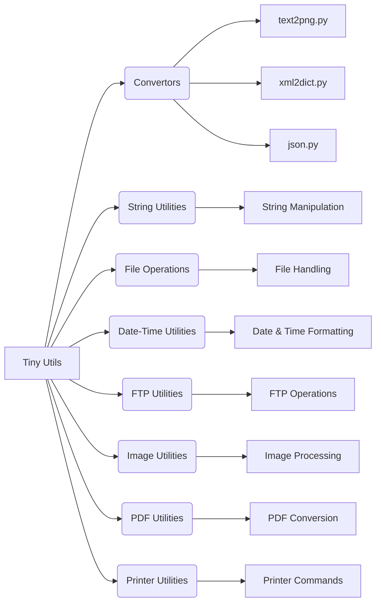

# <input code>

```
# Tiny Utils

**Tiny Utils** is a utility library providing a collection of lightweight helper functions for various common tasks. This library includes utilities for data format conversion, text and file manipulation, string operations, date-time formatting, image processing, and more. It is organized into several modules for easy access to specific functionalities.

## Table of Contents

- [Tiny Utils](#tiny-utils)
  - [Table of Contents](#table-of-contents)
  - [Installation](#installation)
  - [Modules Overview](#modules-overview)
  - [Module Descriptions](#module-descriptions)
    - [Convertors](#convertors)
      - [Files:](#files)
    - [String Utilities](#string-utilities)
    - [File Operations](#file-operations)
    - [Date-Time Utilities](#date-time-utilities)
    - [FTP Utilities](#ftp-utilities)
    - [Image Utilities](#image-utilities)
    - [PDF Utilities](#pdf-utilities)
    - [Printer Utilities](#printer-utilities)
  - [Usage Examples](#usage-examples)
    - [Convert Text to PNG Image](#convert-text-to-png-image)
    - [Convert XML to Dictionary](#convert-xml-to-dictionary)
    - [Parse and Manipulate JSON](#parse-and-manipulate-json)
  - [Contributing](#contributing)
  - [License](#license)

## Installation

To use **Tiny Utils**, clone the repository and install any necessary dependencies as specified in the `requirements.txt` file.

```bash
git clone https://github.com/hypo69/tiny-utils.git
cd tiny_utils
pip install -r requirements.txt
```

## Modules Overview

This library contains several sub-modules, each handling a specific task:

- **Convertors**: Modules for converting data formats, such as text-to-image, webp-to-png, JSON, XML, Base64 encoding, and more.
- **String Utilities**: Tools for advanced string manipulation.
- **File Operations**: Functions for file handling and manipulation.
- **Date-Time Utilities**: Tools for date and time formatting.
- **FTP Utilities**: FTP file handling functions.
- **Image Utilities**: Basic image processing functions.
- **PDF Utilities**: PDF file manipulation and conversion.
- **Printer Utilities**: Functions for sending data to a printer.

## Module Descriptions

### Convertors

The `convertors` module contains utilities for converting data between formats. These modules can handle diverse data types, from CSV to JSON and text to images.

#### Files:

- **text2png.py**: Converts text data to a PNG image file.
- **tts.py**: Converts text to speech and saves it as an audio file.
- **webp2png.py**: Converts images from WebP format to PNG format.
- **xls.py**: Handles conversions and manipulations of XLS files.
- **xml2dict.py**: Converts XML data to a Python dictionary.
- **base64.py**: Encodes or decodes data using Base64 encoding.
- **csv.py**: Provides CSV parsing and manipulation tools.
- **dict.py**: Utilities for handling Python dictionaries.
- **html.py**: Converts HTML content to various formats.
- **json.py**: Utilities for JSON parsing and manipulation.
- **md2dict.py**: Converts Markdown content to a dictionary.
- **ns.py**: Specialized namespace conversion utilities.


```

# <algorithm>

This code doesn't contain executable code, it's a README file describing a Python library.  There's no algorithm to describe in terms of a step-by-step process.  It outlines the structure, modules, and intended functionality of the library.

# <mermaid>



**Explanation:**

The diagram shows the overall structure of the Tiny Utils library. `Tiny Utils` is the main library, which contains various modules (Convertors, String Utilities, etc.). Each module has specific functions (e.g., `text2png.py`, `xml2dict.py`).  These functions likely perform tasks related to the module's purpose (converting data formats, manipulating strings, handling files, etc.). Dependencies are implicit - they exist within the functions and the library design itself but are not explicitly modeled here. The file structure, module organization, and functions within them are described but not shown in detail.


# <explanation>

This README file is a documentation for a Python library called `Tiny Utils`. It describes the purpose of the library, its installation process, the different modules (like `Convertors`, `String Utilities`), their respective functionalities, and how to use some of them via examples.

* **Imports:**  There are no explicit import statements shown in the code snippet; this is a README, not a Python file.  Import statements would be within the Python files that implement the modules (e.g., `text2png.py`, `xml2dict.py`).

* **Classes:** No classes are defined in the provided code, only modules/utilities.  The classes would be implemented in the `.py` files that are referred to in the documentation.

* **Functions:** The README describes many functions available in the various modules (`text2png.convert`, `xml2dict.convert`, `json.parse`). Example usage is shown.  The exact function signatures, arguments, return types, and error handling would be defined in the Python code itself (not present in this README).

* **Variables:** The README describes variables used in the usage examples (e.g., `text`, `output_path`). Their types (strings, file paths) would be determined by how they're used within the Python functions (e.g., in `text2png.convert`).

* **Possible Errors/Improvements:** The README doesn't explicitly outline potential errors.  However, it mentions error handling in `File Operations` which suggests the library will handle potential file-related issues.  Good documentation of error conditions would significantly improve the library.  Additionally, specific module documentation (inside each `.py` file) should be more detailed to help users understand use cases and potential return values.

**Relationships with other parts of the project:** The README implicitly describes the relationships between different modules in the library. For example, `Convertors` depend on other modules for data handling (`File Operations`) and potentially on external libraries for specific format conversions (not listed here). This library structure and documentation likely support a larger project.  The `requirements.txt` file specifies external dependencies that the library uses, making it independent of the rest of the project (outside the library).