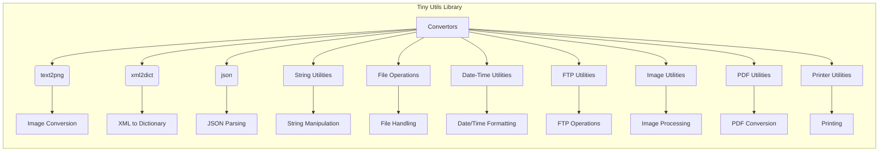

```MD
# <input code>

```
# Tiny Utils

**Tiny Utils** is a utility library providing a collection of lightweight helper functions for various common tasks. This library includes utilities for data format conversion, text and file manipulation, string operations, date-time formatting, image processing, and more. It is organized into several modules for easy access to specific functionalities.

## Table of Contents

- [Tiny Utils](#tiny-utils)
  - [Table of Contents](#table-of-contents)
  - [Installation](#installation)
  - [Modules Overview](#modules-overview)
  - [Module Descriptions](#module-descriptions)
    - [Convertors](#convertors)
      - [Files:](#files)
    - [String Utilities](#string-utilities)
    - [File Operations](#file-operations)
    - [Date-Time Utilities](#date-time-utilities)
    - [FTP Utilities](#ftp-utilities)
    - [Image Utilities](#image-utilities)
    - [PDF Utilities](#pdf-utilities)
    - [Printer Utilities](#printer-utilities)
  - [Usage Examples](#usage-examples)
    - [Convert Text to PNG Image](#convert-text-to-png-image)
    - [Convert XML to Dictionary](#convert-xml-to-dictionary)
    - [Parse and Manipulate JSON](#parse-and-manipulate-json)
  - [Contributing](#contributing)
  - [License](#license)

## Installation

To use **Tiny Utils**, clone the repository and install any necessary dependencies as specified in the `requirements.txt` file.

```bash
git clone https://github.com/hypo69/tiny-utils.git
cd tiny_utils
pip install -r requirements.txt
```

## Modules Overview

This library contains several sub-modules, each handling a specific task:

- **Convertors**: Modules for converting data formats, such as text-to-image, webp-to-png, JSON, XML, Base64 encoding, and more.
- **String Utilities**: Tools for advanced string manipulation.
- **File Operations**: Functions for file handling and manipulation.
- **Date-Time Utilities**: Tools for date and time formatting.
- **FTP Utilities**: FTP file handling functions.
- **Image Utilities**: Basic image processing functions.
- **PDF Utilities**: PDF file manipulation and conversion.
- **Printer Utilities**: Functions for sending data to a printer.


## Module Descriptions

... (rest of the documentation)

```

# <algorithm>

A flowchart or step-by-step description of the *algorithm* is not possible since the code provided is documentation, not executable code.  It outlines the modules and functionalities of a library, not a specific program.


# <mermaid>



This mermaid diagram illustrates the modules and their relationships within the Tiny Utils library.  The library is structured around different utility modules (Convertors, String Utilities, etc.) that presumably contain functions for specific tasks.


# <explanation>

The provided code is a README file, not a Python script.  It's the documentation for a Python library named "Tiny Utils."  It details the library's purpose, installation instructions, modules, functions, and usage examples.

* **Purpose**: The library aims to provide a collection of utility functions for common tasks like data format conversion, file manipulation, and more.
* **Modules**: The library is organized into modules like `convertors`, `string`, `file`, `date_time`, `ftp`, `image`, `pdf`, and `printer`, each focusing on a specific area of utility functions.
* **Installation**: It explains how to clone the repository and install the required dependencies using `pip`.
* **Usage Examples**: Example code snippets demonstrate how to use the library's functions to perform specific tasks (converting text to PNG, XML to dictionary, JSON parsing).
* **Documentation Structure**: The README uses markdown for clear headings, descriptions, and code examples. It provides a table of contents to navigate the documentation.


**Missing Code Analysis:**

Since this is documentation, there's no Python code to analyze in terms of variables, imports, functions, errors, and potential improvements.  To do that, you need the actual Python files that define the functions, classes, and methods documented in the README.  For example, `text2png.py`, `xml2dict.py`, etc., are referenced but not provided here.


**Relationships to Other Parts of the Project:**

The relationships depend on the actual code in the Python modules.  The documentation suggests potential dependencies on external libraries for tasks like image processing, PDF manipulation, and FTP handling. The `requirements.txt` file, if available, would specify the exact external libraries needed.


**Possible Errors/Improvements (inferred from the documentation):**

* **Lack of Robustness**: The documentation doesn't explicitly detail error handling. The functions might require more checks for invalid inputs (e.g., files not found, incorrect format).
* **Documentation Needs**: The documentation needs to be complete with detailed parameters, return values, and examples.


In summary, this README file serves as a comprehensive outline of the library's design and intended functionalities, but without the actual code, a deeper analysis is not possible.