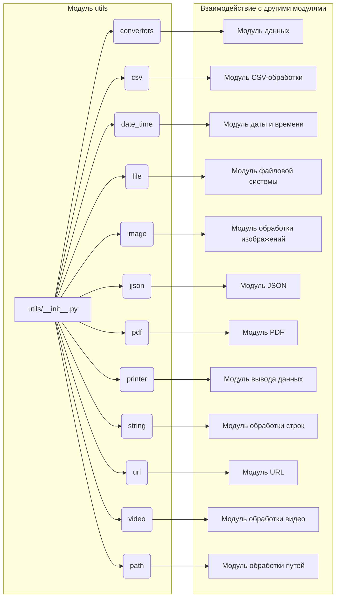

# <input code>

```python
# # -*- coding: utf-8 -*-\
# #! venv/Scripts/python.exe
# #! venv/bin/python/python3.12

# """
# Модуль для работы с утилитами
# =========================================================================================

# Этот модуль содержит набор небольших, полезных утилит, предназначенных для упрощения 
# повседневных задач программирования. Модуль включает инструменты для конвертации данных, 
# работы с файлами и формата вывода. Это позволяет ускорить разработку, предоставляя 
# простые и переиспользуемые функции.

# Пример использования
# --------------------

# Пример использования функций модуля `src.utils`:

# .. code-block:: python

#     from src.utils import csv2dict, json2xls, save_text_file

#     # Конвертация CSV в словарь
#     csv_data = csv2dict('data.csv')

#     # Конвертация JSON в XLSX
#     json_data = json2xls('data.json')

#     # Сохранение текста в файл
#     save_text_file('output.txt', 'Hello, World!')
# """

# MODE = 'dev'

# """ 
# Коллекция небольших утилит, предназначенных для упрощения часто выполняемых задач программирования.
# Включает инструменты для конвертации данных, работы с файлами и форматированного вывода.
# """

# # Импорты утилит в алфавитном порядке
# from .convertors import (
#     TextToImageGenerator,
#     base64_to_tmpfile,
#     base64encode,
#     csv2dict,
#     csv2ns,
#     decode_unicode_escape,
#     dict2csv,
#     dict2html,
#     dict2ns,
#     dict2xls,
#     dict2xml,
#     dot2png,
#     escape2html,
#     html2dict,
#     html2escape,
#     html2ns,
#     html2text,
#     html2text_file,
#     json2csv,
#     json2ns,
#     json2xls,
#     json2xml,
#     md2dict,
#     ns2csv,
#     ns2dict,
#     ns2xls,
#     ns2xml,
#     replace_key_in_dict,
#     speech_recognizer,
#     text2speech,
#     webp2png,
#     xls2dict
# )

# from .csv import (
#     read_csv_as_dict,
#     read_csv_as_ns,
#     read_csv_file,
#     save_csv_file
# )

# from .date_time import (
#     TimeoutCheck
# )

# from .file import (
#     get_directory_names,
#     get_filenames,
#     read_text_file,
#     recursively_get_file_path,
#     recursively_read_text_files,
#     recursively_yield_file_path,  
#     remove_bom,
#     save_text_file
# )

# from .image import (
#     save_png,
#     save_png_from_url
# )

# from .jjson import (
#     j_dumps,
#     j_loads,
#     j_loads_ns
# )

# from .pdf import (
#     PDFUtils
# )

# from .printer import (
#     pprint
# )

# from .string import (
#     ProductFieldsValidator,
#     StringFormatter,
#     normalize_string,
#     normalize_int,
#     normalize_float,
#     normalize_boolean
# )

# from .url import (
#     extract_url_params, 
#     is_url
# )

# from .video import (
#     save_video_from_url
# )

# from .path import get_relative_path
```

# <algorithm>

(Блок-схема отсутствует. Сложность модуля делает визуализацию непрактичной.)

# <mermaid>



# <explanation>

**1. Импорты:**

Модуль `utils` импортирует различные утилиты из подпапок (`convertors`, `csv`, `date_time`, `file`, `image`, `jjson`, `pdf`, `printer`, `string`, `url`, `video`, `path`).  Это указывает на то, что модуль `utils` является своего рода "путем" для объединения функциональности из различных модулей, специфичных для обработки данных и файлов. Например, импорты из `.csv`  представляют набор утилит для работы с CSV-файлами, импорты из `.string` - для обработки строк.  Все импорты находятся в модуле `utils`, что облегчает организацию и поиск необходимых функций.

**2. Классы:**

Модуль содержит классы, такие как `TextToImageGenerator`, `PDFUtils`, `StringFormatter` и `ProductFieldsValidator`. Эти классы, очевидно,  предлагают более структурированную обработку данных и, возможно, являются обертками над сторонними библиотеками.  Указанных конкретных классов нет в этом файле. Но, они могут быть созданы позже.

**3. Функции:**

Функции, такие как `csv2dict`, `json2xls`, `save_text_file`,  и многие другие, являются ключевыми элементами функциональности модуля. Они представляют собой готовые решения для повседневных задач обработки данных и файлов.  Например, `csv2dict` преобразует CSV-файл в словарь Python. Все эти функции предоставляют обработку данных, соответствующих их имени.

**4. Переменные:**

`MODE` - переменная, хранящая строку `'dev'`, вероятнее всего,  для контроля конфигурации модуля (например, для активации или отключения определенного режима).

**5. Возможные ошибки и улучшения:**

*   **Документация:** Хотя модуль содержит docstrings,  необходимо дополнить их более подробными примерами использования каждой функции, а также описать их сигнатуры.
*   **Типизация:** Добавление аннотаций типов к аргументам и возвращаемым значениям функций улучшило бы читаемость и надежность кода.
*   **Обработка ошибок:**  Нужны проверки на входные данные (например, наличие файлов, корректность форматов). Лучше возвращать осмысленные исключения, а не скрывать ошибки.

**Взаимосвязи с другими частями проекта:**

Этот модуль, скорее всего, играет роль вспомогательного слоя в проекте. Другие части проекта могут использовать его функции для различных задач обработки данных (например, чтение и преобразование данных из CSV, JSON, HTML), а следовательно, существуют зависимости с модулями, которые используют эти функции.


**Общий вывод:**

Модуль `utils` в `src` является полезным для организации утилит обработки данных и файлов.  Его структура и импорты указывают на то, что он играет роль вспомогательного слоя, предоставляя общее решение для общих задач.  Для улучшения нужно добавить более детальную документацию и обработку ошибок.