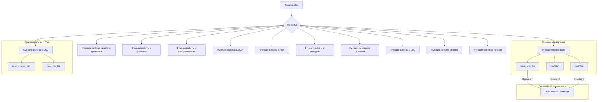
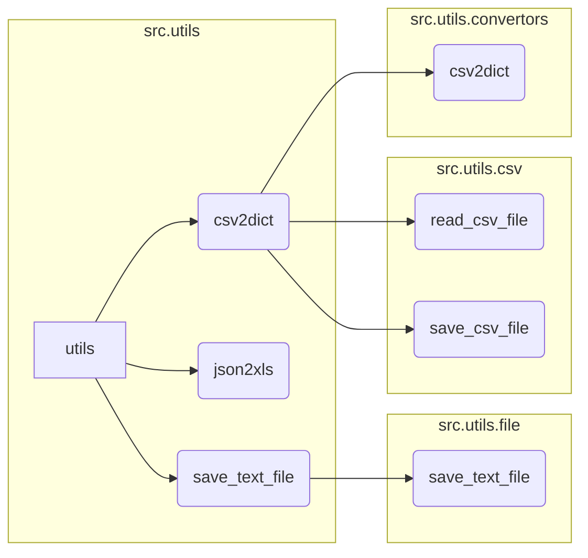

# <input code>

```python
# -*- coding: utf-8 -*-\
#! venv/Scripts/python.exe
#! venv/bin/python/python3.12

"""
Модуль для работы с утилитами
=========================================================================================

Этот модуль содержит набор небольших, полезных утилит, предназначенных для упрощения 
повседневных задач программирования. Модуль включает инструменты для конвертации данных, 
работы с файлами и формата вывода. Это позволяет ускорить разработку, предоставляя 
простые и переиспользуемые функции.

Пример использования
--------------------

Пример использования функций модуля `src.utils`:

.. code-block:: python

    from src.utils import csv2dict, json2xls, save_text_file

    # Конвертация CSV в словарь
    csv_data = csv2dict('data.csv')

    # Конвертация JSON в XLSX
    json_data = json2xls('data.json')

    # Сохранение текста в файл
    save_text_file('output.txt', 'Hello, World!')
"""

MODE = 'dev'

""" 
Коллекция небольших утилит, предназначенных для упрощения часто выполняемых задач программирования.
Включает инструменты для конвертации данных, работы с файлами и форматированного вывода.
"""


# Импорты утилит в алфавитном порядке
from .convertors import (
    TextToImageGenerator,
    base64_to_tmpfile,
    base64encode,
    csv2dict,
    csv2ns,
    decode_unicode_escape,
    dict2csv,
    dict2html,
    dict2ns,
    dict2xls,
    dict2xml,
    dot2png,
    escape2html,
    html2dict,
    html2escape,
    html2ns,
    html2text,
    html2text_file,
    json2csv,
    json2ns,
    json2xls,
    json2xml,
    md2dict,
    ns2csv,
    ns2dict,
    ns2xls,
    ns2xml,
    replace_key_in_dict,
    speech_recognizer,
    text2speech,
    webp2png,
    xls2dict
)

from .csv import (
    read_csv_as_dict,
    read_csv_as_ns,
    read_csv_file,
    save_csv_file
)

from .date_time import (
    TimeoutCheck
)

from .file import (
    get_directory_names,
    get_filenames,
    read_text_file,
    recursively_get_file_path,
    recursively_read_text_files,
    recursively_yield_file_path,  
    remove_bom,
    save_text_file
)

from .image import (
    save_png,
    save_png_from_url
)

from .jjson import (
    j_dumps,
    j_loads,
    j_loads_ns
)

from .pdf import (
    PDFUtils
)

from .printer import (
    pprint
)

from .string import (
    ProductFieldsValidator,
    StringFormatter,
    normalize_string,
    normalize_int,
    normalize_float,
    normalize_boolean
)

from .url import (
    extract_url_params, 
    is_url
)

from .video import (
    save_video_from_url
)

from .path import get_relative_path
```

# <algorithm>



Пример: Функция `csv2dict` принимает путь к CSV-файлу, читает его, парсит и возвращает словарь.


# <mermaid>



# <explanation>

**Импорты:** Модуль `utils` импортирует функции и классы из других модулей внутри пакета `src.utils`.  Это типичная организация для Python, где функции и классы, связанные по функциональности, группируются в отдельных модулях.  Например, `from .convertors import csv2dict` импортирует функцию `csv2dict` из подпапки `convertors`.  Важно, что импорты внутри пакета `src` (`src.utils`, `src.utils.convertors`) указывают на структуру пакета проекта, позволяя коду быть организованным и повторно используемым в других частях приложения.

**Классы:** В примере кода присутствуют классы, такие как `TextToImageGenerator`, `TimeoutCheck`, `PDFUtils`, и другие.  Подробное описание этих классов, методов и атрибутов требуется для анализа работы с ними, что не указано в самом коде.

**Функции:** Функции, такие как `csv2dict`, `json2xls`, `save_text_file`, представляют собой обёртки для других функций (вероятно, из внешних библиотек) для упрощения работы с данными.  Функции импортируются в алфавитном порядке из разных подмодулей (например, `utils.convertors`). Их назначение понятно из имён.  Они часто принимают путь к файлу или данные как аргументы и возвращают результат в зависимости от операции.

**Переменные:** `MODE` - строковая переменная, задающая режим работы, по-видимому, для разработки ('dev') или производства ('prod').

**Возможные ошибки/улучшения:**

* **Отсутствие документации:** Недостаточно документации внутри функций, для понимания их параметров, типов данных, ожидаемых значений и возможных исключений.
* **Обработка ошибок:** Не все функции могут обрабатывать ошибки (например, ошибки ввода-вывода при работе с файлами). Это важно для надежности приложения. Необходимо учитывать, что вложенные функции могут возвращать различные типы ошибок, которые нужно контролировать в коде.
* **Использование `from ... import *`:** В данном примере импорты идут из конкретных модулей (например, `from .file import ...`), что предпочтительнее, чем `from ... import *`, так как это более контролируемый импорт и уменьшает риск совпадения имён.

**Взаимосвязь с другими частями проекта:** Код `utils` предполагается использовать в других частях проекта, например, для обработки данных из CSV или JSON файлов, что будет зависеть от того, как этот модуль используется в основной части проекта.