## Анализ кода `hypotez/src/utils/__init__.py`

### 1. <алгоритм>

**Общая схема:**

1.  **Импорт модулей и функций:** Файл импортирует различные функции и классы из подмодулей пакета `src.utils`. Эти подмодули сгруппированы по категориям (конвертация данных, работа с CSV, работа с датой и временем, файловые операции, работа с изображениями, JSON, PDF, печать, строки, URL, видео, пути).
2.  **Предоставление утилит:** Импортированные функции и классы предоставляются как часть пакета `src.utils`, делая их доступными для использования в других частях проекта.
3.  **Примеры использования:** В комментариях к коду приведены примеры использования некоторых функций, демонстрирующие их назначение.

**Блок-схема с примерами:**

```
[Начало] --> [Импорт модулей]
[Импорт модулей] --> [Импорт функций из convertors]
    [Импорт функций из convertors] -- Пример: csv2dict, json2xls, base64_to_tmpfile --> [Функции для конвертации данных]
[Импорт модулей] --> [Импорт функций из csv]
    [Импорт функций из csv] -- Пример: read_csv_as_dict, save_csv_file --> [Функции для работы с CSV файлами]
[Импорт модулей] --> [Импорт классов из date_time]
     [Импорт классов из date_time] -- Пример: TimeoutCheck --> [Функции для работы с датой и временем]
[Импорт модулей] --> [Импорт функций из file]
    [Импорт функций из file] -- Пример: read_text_file, save_text_file --> [Функции для работы с файлами]
[Импорт модулей] --> [Импорт функций из image]
    [Импорт функций из image] -- Пример: save_png, random_image --> [Функции для работы с изображениями]
[Импорт модулей] --> [Импорт функций из jjson]
    [Импорт функций из jjson] -- Пример: j_dumps, j_loads --> [Функции для работы с JSON]
[Импорт модулей] --> [Импорт классов из pdf]
    [Импорт классов из pdf] -- Пример: PDFUtils --> [Классы для работы с PDF]
[Импорт модулей] --> [Импорт функций из printer]
    [Импорт функций из printer] -- Пример: pprint --> [Функции для вывода данных]
[Импорт модулей] --> [Импорт классов из string]
    [Импорт классов из string] -- Пример: StringFormatter, ProductFieldsValidator --> [Классы для работы со строками]
[Импорт модулей] --> [Импорт функций из url]
    [Импорт функций из url] -- Пример: extract_url_params, is_url --> [Функции для работы с URL]
[Импорт модулей] --> [Импорт функций из video]
    [Импорт функций из video] -- Пример: save_video_from_url --> [Функции для работы с видео]
[Импорт модулей] --> [Импорт функций из path]
    [Импорт функций из path] -- Пример: get_relative_path --> [Функции для работы с путями]
[Конец]
```

### 2. <mermaid>



```mermaid
graph LR
    subgraph utils_package [src.utils]
        direction TB
        utils_init["__init__.py"]

        subgraph convertors_module [convertors.py]
            convertors_module_content(TextToImageGenerator,base64_to_tmpfile,base64encode,csv2dict,csv2ns,decode_unicode_escape,dict2csv,dict2html,dict2ns,dict2xls,dict2xml,dot2png,escape2html,html2dict,html2escape,html2ns,html2text,html2text_file,json2csv,json2ns,json2xls,json2xml,md2dict,ns2csv,ns2dict,ns2xls,ns2xml,replace_key_in_dict,speech_recognizer,text2speech,webp2png,xls2dict)
        end

         subgraph csv_module [csv.py]
            csv_module_content(read_csv_as_dict, read_csv_as_ns, read_csv_file, save_csv_file)
        end

        subgraph date_time_module [date_time.py]
           date_time_module_content(TimeoutCheck)
        end

        subgraph file_module [file.py]
            file_module_content(get_directory_names, get_filenames, read_text_file, recursively_get_file_path, recursively_read_text_files, recursively_yield_file_path, remove_bom, save_text_file)
        end

         subgraph image_module [image.py]
            image_module_content(save_png, save_png_from_url, random_image)
        end

         subgraph jjson_module [jjson.py]
            jjson_module_content(j_dumps, j_loads, j_loads_ns)
        end

         subgraph pdf_module [pdf.py]
            pdf_module_content(PDFUtils)
        end

         subgraph printer_module [printer.py]
            printer_module_content(pprint)
        end

        subgraph string_module [string.py]
            string_module_content(ProductFieldsValidator, StringFormatter, normalize_string, normalize_int, normalize_float, normalize_boolean)
        end

         subgraph url_module [url.py]
            url_module_content(extract_url_params, is_url)
        end

         subgraph video_module [video.py]
            video_module_content(save_video_from_url)
        end

          subgraph path_module [path.py]
            path_module_content(get_relative_path)
        end

        utils_init --> convertors_module_content
        utils_init --> csv_module_content
        utils_init --> date_time_module_content
        utils_init --> file_module_content
         utils_init --> image_module_content
        utils_init --> jjson_module_content
        utils_init --> pdf_module_content
        utils_init --> printer_module_content
        utils_init --> string_module_content
        utils_init --> url_module_content
        utils_init --> video_module_content
        utils_init --> path_module_content
    end
    
    style utils_package fill:#f9f,stroke:#333,stroke-width:2px
    style utils_init fill:#ccf,stroke:#333,stroke-width:1px
    style convertors_module fill:#eee,stroke:#333,stroke-width:1px
    style csv_module fill:#eee,stroke:#333,stroke-width:1px
    style date_time_module fill:#eee,stroke:#333,stroke-width:1px
    style file_module fill:#eee,stroke:#333,stroke-width:1px
    style image_module fill:#eee,stroke:#333,stroke-width:1px
    style jjson_module fill:#eee,stroke:#333,stroke-width:1px
    style pdf_module fill:#eee,stroke:#333,stroke-width:1px
    style printer_module fill:#eee,stroke:#333,stroke-width:1px
    style string_module fill:#eee,stroke:#333,stroke-width:1px
    style url_module fill:#eee,stroke:#333,stroke-width:1px
    style video_module fill:#eee,stroke:#333,stroke-width:1px
    style path_module fill:#eee,stroke:#333,stroke-width:1px
```

**Объяснение зависимостей в mermaid диаграмме:**

-   `utils_package`: Представляет пакет `src.utils`, внутри которого находится файл `__init__.py` и все подмодули.
-   `utils_init`:  Файл `__init__.py`, который импортирует функции и классы из подмодулей.
-   Подмодули (`convertors_module`, `csv_module`, `date_time_module`, `file_module`, `image_module`, `jjson_module`, `pdf_module`, `printer_module`, `string_module`, `url_module`, `video_module`, `path_module`): Каждый из них содержит набор функций или классов, сгруппированных по их функциональному назначению.
-   `*_content`: Содержимое каждого подмодуля, отображающее имена импортированных функций и классов.
-   Стрелки: Показывают, что файл `__init__.py` импортирует (включает) содержимое из каждого подмодуля, делая их доступными через пакет `src.utils`.

### 3. <объяснение>

**Импорты:**

-   Файл `__init__.py`  используется для определения структуры пакета `src.utils`. Он импортирует функции и классы из различных подмодулей.
-   **`convertors`**: Содержит функции для преобразования данных между различными форматами (например, CSV, JSON, HTML, XML, base64, изображения и т.д.).
-   **`csv`**: Предоставляет функции для чтения и записи CSV файлов.
-   **`date_time`**: Содержит утилиты для работы с датой и временем, включая класс `TimeoutCheck`.
-   **`file`**: Содержит функции для работы с файлами, такие как чтение, запись, получение списка файлов и каталогов.
-   **`image`**: Содержит функции для работы с изображениями, включая сохранение PNG, сохранение из URL и генерацию случайных изображений.
-   **`jjson`**: Содержит функции для работы с JSON, включая `j_dumps` (сериализация) и `j_loads` (десериализация).
-   **`pdf`**: Содержит класс `PDFUtils` для работы с PDF файлами.
-   **`printer`**: Содержит функцию `pprint` для красивой печати данных.
-   **`string`**: Содержит классы и функции для работы со строками, такие как форматирование и валидация.
-   **`url`**: Содержит функции для работы с URL, такие как извлечение параметров и проверка валидности.
-   **`video`**: Содержит функции для работы с видео, такие как сохранение видео с URL.
-   **`path`**: Содержит функции для работы с путями, такие как получение относительного пути.

**Классы:**

-   **`TextToImageGenerator`**: из модуля `convertors` - Класс для генерации изображений из текста.
-   **`TimeoutCheck`**: из модуля `date_time` - Класс для проверки времени ожидания.
-   **`PDFUtils`**: из модуля `pdf` - Класс для работы с PDF файлами.
-    **`ProductFieldsValidator`**: из модуля `string` - Класс для валидации полей продукта.
-    **`StringFormatter`**: из модуля `string` - Класс для форматирования строк.

**Функции:**

-   Множество функций для конвертации данных (например, `csv2dict`, `json2xls`, `base64_to_tmpfile`, `dict2csv` и т.д.) в модуле `convertors`.
-   Функции для чтения и записи CSV файлов (например, `read_csv_as_dict`, `save_csv_file`) в модуле `csv`.
-   Функции для работы с файлами (например, `read_text_file`, `save_text_file`) в модуле `file`.
-   Функции для работы с изображениями (например, `save_png`, `random_image`) в модуле `image`.
-   Функции для работы с JSON (например, `j_dumps`, `j_loads`) в модуле `jjson`.
-   Функция `pprint` для красивого вывода данных в модуле `printer`.
-   Функции для нормализации строк (например, `normalize_string`, `normalize_int`, `normalize_float`, `normalize_boolean`) в модуле `string`.
-    Функции для работы с URL (например, `extract_url_params`, `is_url`) в модуле `url`.
-    Функции для работы с видео (например, `save_video_from_url`) в модуле `video`.
-    Функции для работы с путями (например, `get_relative_path`) в модуле `path`.

**Переменные:**

-   `MODE`: Глобальная переменная, закомментирована, использовалась для определения режима работы (`dev`).

**Потенциальные ошибки и области для улучшения:**

-   Много импортов, что может усложнить понимание. Возможно, стоит разбить на более мелкие пакеты/модули для большей модульности.
-   Некоторые импорты могут быть не нужны. Стоит провести анализ зависимостей, чтобы убрать лишнее.
-   Отсутствуют явные определения типов для функций, что может затруднить использование и отладку. Рекомендуется добавить аннотации типов.
-  Все функции импортируются через `*`, что может привести к конфликтам имен, лучше импортировать явно.
- Отсутствуют docstring для функций, классов и модулей, необходимо добавить документацию для лучшего понимания и использования кода.

**Взаимосвязь с другими частями проекта:**

-   Пакет `src.utils` предоставляет широкий набор утилит, которые могут быть использованы в разных частях проекта, например:
    -   Для обработки данных, полученных из API, используется конвертация из JSON в различные форматы.
    -   Для чтения и сохранения данных из файлов (например, CSV, TXT, JSON).
    -   Для работы с изображениями, видео и PDF файлами.
    -   Для форматирования и валидации строк.
    -   Для работы с URL.

В целом, данный файл `__init__.py`  используется для импорта и агрегации различных утилит, делая их доступными для использования во всем проекте.