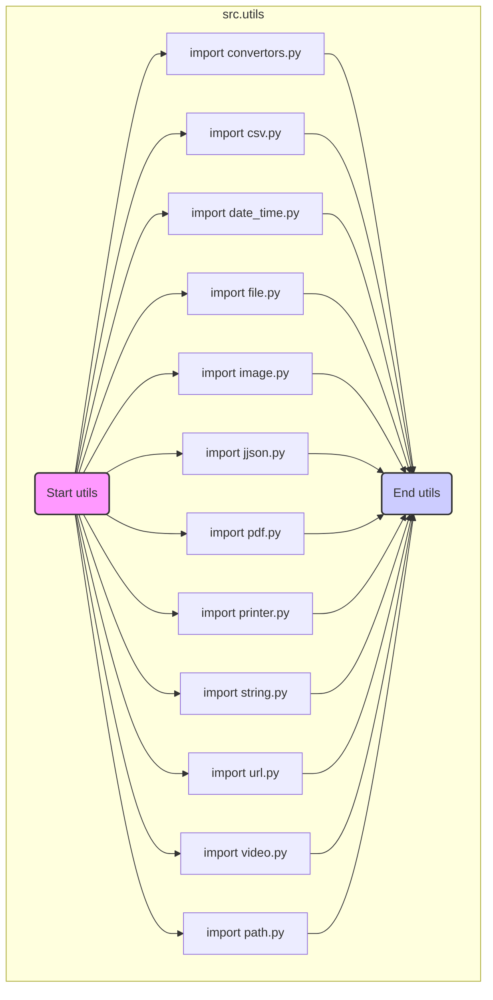

## <алгоритм>

1. **Импорт модулей:**
   - Из текущего пакета (`.`) импортируются подмодули: `convertors`, `csv`, `date_time`, `file`, `image`, `jjson`, `pdf`, `printer`, `string`, `url`, `video`, `path`.
   - Каждый подмодуль содержит набор функций, классов или переменных, которые предоставляют определенную функциональность.
   - Пример: `from .convertors import csv2dict` импортирует функцию `csv2dict` из файла `convertors.py` в текущем пакете.

2. **Импорт функций/классов из модулей:**
   - Из каждого импортированного подмодуля импортируются конкретные функции, классы или переменные, которые будут использоваться в других частях проекта.
   - Пример: `from .file import read_text_file` импортирует функцию `read_text_file` из файла `file.py` в текущем пакете.
   - Происходит связывание конкретных функций, классов и переменных с именами, под которыми они будут использоваться в других модулях, которые импортируют этот модуль.

3. **Конец:**
   - Модуль `__init__.py` завершает свою работу. Он предоставляет централизованную точку доступа к различным утилитам, делая их доступными для других частей проекта.

## <mermaid>

**Описание зависимостей `mermaid`:**

-   **`utils` (src.utils):** Это внешний блок, представляющий пакет `src.utils`.
-   **`start_utils`:** Начальная точка импорта утилит.
-   **`import_convertors`, `import_csv`, `import_date_time`, `import_file`, `import_image`, `import_jjson`, `import_pdf`, `import_printer`, `import_string`, `import_url`, `import_video` , `import_path`:** Эти узлы представляют импорт соответствующих подмодулей из текущего пакета (`.`)
-   **`end_utils`:**  Конечная точка, обозначающая завершение импорта.

## <объяснение>

**Импорты:**

-   `from .convertors import ...`: Импортирует функции для преобразования данных (текста в изображение, кодирование base64, CSV в словарь и т.д.) из модуля `convertors.py` в текущем пакете `src.utils`.
    - `TextToImageGenerator` -  класс для генерации изображений из текста.
    - `base64_to_tmpfile` -  функция для преобразования base64 в временный файл.
    - `base64encode` -  функция для кодирования данных в base64.
    - `csv2dict` -  функция для конвертации CSV в словарь.
    - `csv2ns` -  функция для конвертации CSV в NamedTuple.
    - `decode_unicode_escape` -  функция для декодирования Unicode escape.
    - `dict2csv` - функция для конвертации словаря в CSV.
    - `dict2html` - функция для конвертации словаря в HTML.
    - `dict2ns` - функция для конвертации словаря в NamedTuple.
    - `dict2xls` - функция для конвертации словаря в Excel.
    - `dict2xml` - функция для конвертации словаря в XML.
    - `dot2png` -  функция для преобразования графа DOT в PNG.
    - `escape2html` -  функция для преобразования escape-последовательностей в HTML.
    - `html2dict` -  функция для конвертации HTML в словарь.
    - `html2escape` -  функция для преобразования HTML в escape-последовательности.
    - `html2ns` -  функция для конвертации HTML в NamedTuple.
    - `html2text` -  функция для конвертации HTML в текст.
    - `html2text_file` - функция для конвертации HTML файла в текст.
    - `json2csv` - функция для конвертации JSON в CSV.
    - `json2ns` - функция для конвертации JSON в NamedTuple.
    - `json2xls` - функция для конвертации JSON в Excel.
    - `json2xml` - функция для конвертации JSON в XML.
    - `md2dict` -  функция для конвертации Markdown в словарь.
    - `ns2csv` - функция для конвертации NamedTuple в CSV.
    - `ns2dict` - функция для конвертации NamedTuple в словарь.
    - `ns2xls` - функция для конвертации NamedTuple в Excel.
    - `ns2xml` - функция для конвертации NamedTuple в XML.
    - `replace_key_in_dict` - функция для замены ключа в словаре.
    - `speech_recognizer` -  функция для распознавания речи.
    - `text2speech` -  функция для преобразования текста в речь.
    - `webp2png` -  функция для преобразования WebP в PNG.
    - `xls2dict` -  функция для конвертации Excel в словарь.

-   `from .csv import ...`: Импортирует функции для работы с CSV-файлами (чтение, сохранение) из модуля `csv.py` в текущем пакете `src.utils`.
    - `read_csv_as_dict` - функция для чтения CSV файла как словаря.
    - `read_csv_as_ns` - функция для чтения CSV файла как NamedTuple.
    - `read_csv_file` - функция для чтения CSV файла.
    - `save_csv_file` - функция для сохранения CSV файла.

-   `from .date_time import ...`: Импортирует класс `TimeoutCheck` для проверки таймаутов из модуля `date_time.py` в текущем пакете `src.utils`.
    - `TimeoutCheck` - класс для проверки таймаутов.

-   `from .file import ...`: Импортирует функции для работы с файлами (получение имен файлов, чтение, сохранение) из модуля `file.py` в текущем пакете `src.utils`.
    - `get_directory_names` -  функция для получения имен каталогов.
    - `get_filenames` -  функция для получения имен файлов.
    - `read_text_file` - функция для чтения текстового файла.
    - `recursively_get_file_path` - функция для рекурсивного поиска путей файлов.
    - `recursively_read_text_files` - функция для рекурсивного чтения текстовых файлов.
    - `recursively_yield_file_path` - функция для рекурсивного получения путей файлов (генератор).
    - `remove_bom` - функция для удаления BOM из файла.
    - `save_text_file` - функция для сохранения текстового файла.

-   `from .image import ...`: Импортирует функции для работы с изображениями (сохранение, получение случайного изображения) из модуля `image.py` в текущем пакете `src.utils`.
     - `save_png` - функция для сохранения PNG файла.
    - `save_png_from_url` - функция для сохранения PNG из URL.
    - `random_image` - функция для получения случайного изображения.

-   `from .jjson import ...`: Импортирует функции для работы с JSON (сериализация, десериализация) из модуля `jjson.py` в текущем пакете `src.utils`.
    - `j_dumps` - функция для сериализации в JSON.
    - `j_loads` - функция для десериализации из JSON.
    - `j_loads_ns` - функция для десериализации из JSON в NamedTuple.

-   `from .pdf import ...`: Импортирует класс `PDFUtils` для работы с PDF-файлами из модуля `pdf.py` в текущем пакете `src.utils`.
    - `PDFUtils` - класс для работы с PDF файлами.

-   `from .printer import ...`: Импортирует функцию `pprint` для красивого вывода данных из модуля `printer.py` в текущем пакете `src.utils`.
    -  `pprint` - функция для красивого вывода данных.

-   `from .string import ...`: Импортирует классы и функции для работы со строками (валидация, форматирование) из модуля `string.py` в текущем пакете `src.utils`.
    -  `ProductFieldsValidator` - класс для валидации полей продукта.
    - `StringFormatter` - класс для форматирования строк.
    - `normalize_string` - функция для нормализации строк.
    - `normalize_int` - функция для нормализации целых чисел.
    - `normalize_float` - функция для нормализации чисел с плавающей точкой.
    - `normalize_boolean` - функция для нормализации булевых значений.

-   `from .url import ...`: Импортирует функции для работы с URL (извлечение параметров, проверка) из модуля `url.py` в текущем пакете `src.utils`.
    - `extract_url_params` - функция для извлечения параметров из URL.
    - `is_url` - функция для проверки, является ли строка URL.

-  `from .video import ...`: Импортирует функцию для сохранения видео из URL из модуля `video.py` в текущем пакете `src.utils`.
    - `save_video_from_url` - функция для сохранения видео из URL.

- `from .path import ...`: Импортирует функцию `get_relative_path` для работы с путями из модуля `path.py` в текущем пакете `src.utils`.
    - `get_relative_path` - функция для получения относительного пути.

**Классы:**

-   `TextToImageGenerator`: Класс для генерации изображений из текста.
-  `TimeoutCheck`: Класс для проверки таймаутов.
- `PDFUtils`: Класс для работы с PDF-файлами.
-  `ProductFieldsValidator`: Класс для валидации полей продукта.
-  `StringFormatter`: Класс для форматирования строк.

**Функции:**

-   Множество функций для преобразования данных (CSV, JSON, HTML, XML), работы с файлами, датами, строками, URL, изображениями, видео, PDF, представленные в соответствующих подмодулях.

**Переменные:**

-   В явном виде не определены переменные, только импортируются функции и классы.

**Потенциальные ошибки и области для улучшения:**

-   Большое количество импортируемых функций может сделать модуль `__init__.py` громоздким. Возможно, стоит рассмотреть вариант разбиения на более мелкие модули.
-   Имена функций в основном интуитивно понятны, но документация в виде docstring в каждом модуле и функции была бы полезна.
-   Стоит добавить обработку исключений в функциях, чтобы они были более устойчивы к ошибкам.
-   Отсутствуют явные тесты для каждой из функций. Было бы хорошо добавить unit тесты для проверки правильности работы каждой утилиты.
-   При добавлении новой утилиты необходимо не только создать файл с реализацией, но и добавить его в `__init__.py`, что требует внимания разработчика. Возможно следует автоматизировать этот процесс, если проект становится большим.

**Взаимосвязи с другими частями проекта:**

-   Этот модуль является центральным хранилищем утилит, которые используются в других частях проекта.
-   Модули, импортирующие этот модуль (`src.utils`), будут иметь доступ ко всем импортированным функциям, классам и переменным.
-   Например, модуль `src.parser` может использовать `csv2dict` из `src.utils.convertors`, а `src.exporter` может использовать `json2xls`.
-   Модуль `src.api` может использовать функции для работы с URL и JSON, предоставляемые данным модулем.

В целом, модуль `__init__.py` в `src.utils` служит удобным интерфейсом для доступа к различным утилитам, что способствует переиспользованию кода и ускоряет разработку.