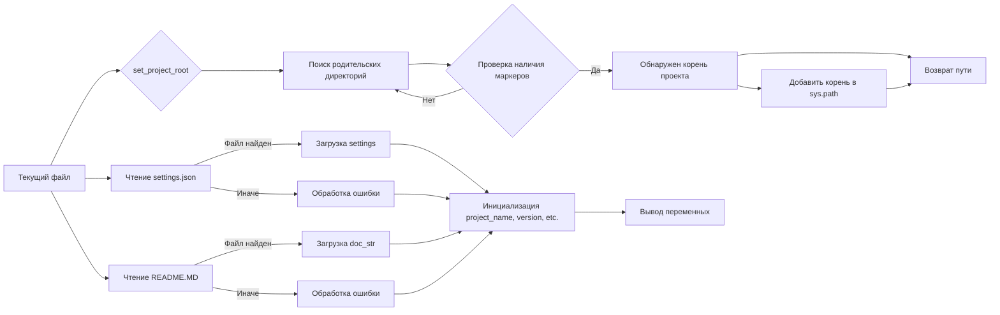

# Анализ кода из файла hypotez/src/logger/header.py

## <input code>

```python
## \file hypotez/src/logger/header.py
# -*- coding: utf-8 -*-\
#! venv/Scripts/python.exe
#! venv/bin/python/python3.12

"""
.. module: src.logger 
	:platform: Windows, Unix
	:synopsis:

"""
MODE = 'dev'

"""
	:platform: Windows, Unix
	:synopsis: Модуль определяющий корневой путь к проекту. Все импорты строятся относительно этого пути.
    :TODO: В дальнейшем перенести в системную переменную"""

import sys
import json
from packaging.version import Version
from pathlib import Path
def set_project_root(marker_files=('pyproject.toml', 'requirements.txt', '.git')) -> Path:
    """
    Finds the root directory of the project starting from the current file's directory,
    searching upwards and stopping at the first directory containing any of the marker files.

    Args:
        marker_files (tuple): Filenames or directory names to identify the project root.
    
    Returns:
        Path: Path to the root directory if found, otherwise the directory where the script is located.
    """
    __root__:Path
    current_path:Path = Path(__file__).resolve().parent
    __root__ = current_path
    for parent in [current_path] + list(current_path.parents):
        if any((parent / marker).exists() for marker in marker_files):
            __root__ = parent
            break
    if __root__ not in sys.path:
        sys.path.insert(0, str(__root__))
    return __root__


# Get the root directory of the project
__root__ = set_project_root()
"""__root__ (Path): Path to the root directory of the project"""

from src import gs

settings:dict = None
try:
    with open(gs.path.root / 'src' /  'settings.json', 'r') as settings_file:
        settings = json.load(settings_file)
except (FileNotFoundError, json.JSONDecodeError):
    ...

doc_str:str = None
try:
    with open(gs.path.root / 'src' /  'README.MD', 'r') as settings_file:
        doc_str = settings_file.read()
except (FileNotFoundError, json.JSONDecodeError):
    ...


__project_name__ = settings.get("project_name", 'hypotez') if settings  else 'hypotez'
__version__: str = settings.get("version", '')  if settings  else ''
__doc__: str = doc_str if doc_str else ''
__details__: str = ''
__author__: str = settings.get("author", '')  if settings  else ''
__copyright__: str = settings.get("copyrihgnt", '')  if settings  else ''
__cofee__: str = settings.get("cofee", "Treat the developer to a cup of coffee for boosting enthusiasm in development: https://boosty.to/hypo69")  if settings  else "Treat the developer to a cup of coffee for boosting enthusiasm in development: https://boosty.to/hypo69"
```

## <algorithm>

**Шаг 1:** Функция `set_project_root`:
- Принимает кортеж `marker_files` с именами файлов/папок, которые указывают на корень проекта.
- Начинает поиск корня проекта с текущего файла.
- Перебирает родительские директории до тех пор, пока не найдет директорию, содержащую один из файлов/папок из `marker_files`.
- Если корень проекта найден, добавляет его в `sys.path`, чтобы импорты работали корректно.
- Возвращает путь к корню проекта.

**Пример:** Если текущий файл находится в `hypotez/src/logger/header.py`, и корень проекта в `hypotez`, функция найдет `hypotez` и вернет его путь.


**Шаг 2:** Получение `__root__`:
- Вызывается `set_project_root()`, возвращая путь к корню проекта.


**Шаг 3:** Чтение `settings.json`:
- Использует путь `gs.path.root / 'src' / 'settings.json'` для чтения файла `settings.json` в корне проекта.
- Если файл найден и успешно загружен, `settings` сохраняет его содержимое в виде словаря.
- Обрабатывает `FileNotFoundError` или `json.JSONDecodeError`, если файл не найден или некорректный.

**Пример:** Если файл `settings.json` содержит `{"project_name": "MyProject"}`, то `settings` будет содержать этот словарь.


**Шаг 4:** Чтение `README.MD`:
- Аналогично шагу 3, но считывает `README.MD` в переменную `doc_str`.


**Шаг 5:** Инициализация переменных:
- Использует `settings.get()` для безопасного извлечения значений из `settings` словаря.
- Если `settings` нет, используются значения по умолчанию (например, 'hypotez').
- Заполняет переменные `__project_name__`, `__version__`, `__doc__`, `__details__`, `__author__`, `__copyright__`, `__cofee__`.


## <mermaid>



## <explanation>

**Импорты:**
- `sys`: Для доступа к системным переменным, в частности `sys.path`.
- `json`: Для работы с файлами JSON.
- `packaging.version`: Для работы с версиями пакетов (не используется напрямую в этом примере).
- `pathlib`: Для работы с путями к файлам.
- `gs`:  Не определен в предоставленном коде, предполагается, что это другой модуль из проекта (`hypotez/src/gs`).  Без контекста `gs` неясен.  Эта зависимость критически важна для поиска корневой директории проекта.

**Классы:**
- Нет определенных классов.

**Функции:**
- `set_project_root(marker_files)`: Ищет корень проекта, принимает кортеж с маркерами файлов/папок и возвращает путь к корню.
- Функции `open` и `json.load` - стандартные функции Python для работы с файлами.


**Переменные:**
- `MODE`: Строковая константа, вероятно, для выбора режима работы.
- `__root__`: Путь к корневой директории проекта.
- `settings`: Словарь, содержащий настройки из `settings.json` файла.
- `doc_str`: Строка содержимого `README.MD`.
- `__project_name__`, `__version__`, `__doc__`, `__details__`, `__author__`, `__copyright__`, `__cofee__`:  Переменные, содержащие информацию о проекте, полученную из `settings.json`, или значения по умолчанию.

**Возможные ошибки и улучшения:**
- Неясно, что делает `gs.path.root`. Необходимо знать его реализацию.
- Блок обработки ошибок `try...except` в `settings` и `doc_str` читаем, но можно указать более конкретные исключения, если они требуются (например `json.JSONDecodeError`).
- Значение по умолчанию для `__cofee__` выглядит слишком длинным и может быть более кратким.


**Взаимосвязи с другими частями проекта:**

Этот файл служит для получения важной информации о проекте (имя, версия, README) и корневой директории. Это необходимо для импорта других модулей проекта (`from src import gs`).  `gs` модуль должен определять `gs.path.root`, который является ключевым для определения корня проекта. Этот код устанавливает основу для работы других модулей.