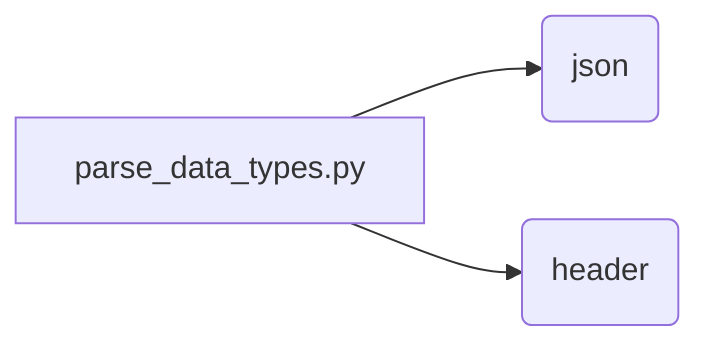

```MD
# Анализ кода из файла hypotez/src/utils/ai/parse_data_types.py

## <input code>

```python
## \file /src/utils/ai/parse_data_types.py
# -*- coding: utf-8 -*-\
#! venv/Scripts/python.exe
#! venv/bin/python/python3.12

"""
module: src.utils.ai.parse_data_types
	:platform: Windows, Unix
	:synopsis: Модуль определяющий корневой путь к проекту. Все импорты строятся относительно этого пути.
    :TODO: В дальнейшем перенести в системную переменную"""
MODE = 'dev'
...
import json
import header
...
```

## <algorithm>

Алгоритм работы представленного кода не может быть определен, так как фрагмент кода содержит только заголовочные части, комментарии и импорты.  Отсутствуют функции или классы, которые можно проанализировать.  Блок-схема не может быть построена.


## <mermaid>



## <explanation>

**Импорты:**

- `import json`: Импортирует модуль `json`, который используется для работы с JSON-данными.  Он необходим для парсинга или сериализации данных в формате JSON. Связь с `src` определяется в глобальном scope.
- `import header`: Импортирует модуль `header`. Без контекста кода невозможно точно определить роль `header` и его связь с другими частями проекта. Возможно, `header` содержит конфигурационные параметры, пути или другие вспомогательные данные.  Непосредственной связи с `src` не наблюдается.  Связь устанавливается вне данного фрагмента кода.

**Классы:**

В представленном фрагменте кода нет определений классов.

**Функции:**

Нет функций.

**Переменные:**

- `MODE`:  Переменная, вероятно, хранит режим работы приложения ('dev' в данном случае).  Её тип - строка.  Без контекста использования не известно, как она используется дальше.

**Возможные ошибки и области для улучшений:**

- **Недостающая информация:** Фрагмент кода слишком мал для определения назначения модуля и его взаимодействия с другими частями проекта.  Не хватает тела функций, методов и примеров использования.
- **Неуказанный путь к `header`:** Импорт `header` не определяет его точный путь, что может вызвать ошибки при импорте. Необходимо использование относительных путей для корректного импорта.
- **Отсутствие документации:**  Недостаточная документация для импорта `header`,  что затрудняет понимание его функции.

**Цепочка взаимосвязей:**

Связи между `parse_data_types` и другими частями проекта не могут быть определены. В `header` содержится информация, которая требуется для обработки в `parse_data_types.py`. Но как эта информация используется - не видно.  Предполагается, что `header` определяет параметры и пути, необходимые модулю для работы, или содержит импорты, которые используются в `parse_data_types`.  Без дополнительного кода трудно дать полную картину.

**Вывод:**

Данный фрагмент кода показывает только импорт необходимых модулей. Для полного понимания его роли и взаимодействия с другими частями проекта требуется дополнительный код и контекст проекта.