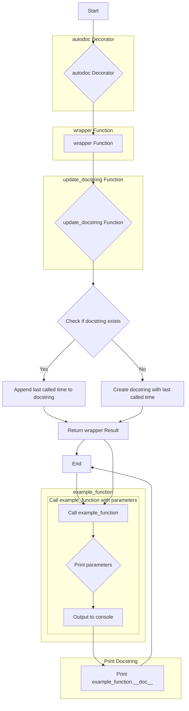

## <алгоритм>

1.  **`autodoc(func)` декоратор:**
    *   Принимает функцию `func` в качестве аргумента.
    *   Создает внутреннюю функцию `wrapper(*args, **kwargs)`.
    *   Внутри `wrapper`:
        *   Вызывает `update_docstring(func)` для обновления docstring переданной функции.
        *   Вызывает исходную функцию `func` с переданными аргументами `*args` и `**kwargs`.
        *   Возвращает результат вызова `func`.
    *   Использует `@functools.wraps(func)` для сохранения метаданных оборачиваемой функции.
    *   Возвращает функцию `wrapper`.
    *   **Пример:**
        ```python
        @autodoc
        def my_function():
            """Docstring."""
            pass

        my_function()
        ```
        В данном примере декоратор `@autodoc` обернет `my_function` функцией `wrapper`, и при вызове `my_function()` будет сначала вызываться `wrapper`.

2.  **`update_docstring(func)` функция:**
    *   Принимает функцию `func` в качестве аргумента.
    *   Получает текущее время с помощью `time.strftime("%Y-%m-%d %H:%M:%S")` и сохраняет его в `current_time`.
    *   Проверяет, существует ли docstring у функции `func`.
        *   Если docstring существует, добавляет к нему строку `\n\nLast called at: {current_time}`.
        *   Если docstring не существует, создает его со значением `Last called at: {current_time}`.
    *   **Пример:**
        ```python
        def my_function():
            """Initial docstring."""
            pass
        update_docstring(my_function)
        print(my_function.__doc__) # Выведет Initial docstring.\n\nLast called at: YYYY-MM-DD HH:MM:SS
        ```

3.  **`example_function` функция:**
    *   Определена с декоратором `@autodoc`.
    *   Имеет docstring с описанием параметров.
    *   Принимает два параметра: `param1` (int) и `param2` (str).
    *   Выводит на печать строку с параметрами.
    *   **Пример:**
        ```python
        example_function(1, "test") # Выведет Processing 1 and test. Обновится docstring
        print(example_function.__doc__) # Выведет обновленный docstring
        ```

4.  **Тестирование:**
    *   Вызывает `example_function` несколько раз с разными аргументами.
    *   Выводит docstring `example_function` после каждого вызова для демонстрации обновления.

## <mermaid>



**Разбор `mermaid` диаграммы:**

*   **`flowchart TD`**: Объявляет тип диаграммы как блок-схему (flowchart) с направлением сверху вниз (TD).
*   **`A[Start]`**: Начальная точка процесса.
*   **`B{autodoc Decorator}`**: Обозначает применение декоратора `autodoc` к функции.
*   **`C[wrapper Function]`**: Представляет внутреннюю функцию `wrapper`, созданную декоратором.
*   **`D{update_docstring Function}`**: Обозначает вызов функции `update_docstring`.
*   **`E{Check if docstring exists}`**: Условный блок, проверяющий наличие docstring у функции.
*   **`F[Append last called time to docstring]`**: Блок, добавляющий информацию о последнем вызове в существующий docstring.
*   **`G[Create docstring with last called time]`**: Блок, создающий docstring с информацией о последнем вызове, если его не было.
*   **`H[Return wrapper Result]`**: Возврат результата работы оборачиваемой функции.
*  **`I[End]`**: Конечная точка процесса.
*  **`J[Call example_function]`**: Вызов функции example_function с аргументами
* **`K{Print parameters}`**: Вывод на печать строки с параметрами
* **`L[Output to console]`**: Вывод в консоль
* **`M[Print example_function.__doc__]`**: Вывод docstring функции в консоль

**Импорты для `mermaid`:**

Диаграмма `mermaid` не импортирует никаких модулей, она является просто описанием потока выполнения программы.

## <объяснение>

### Импорты:

*   **`import functools`**: Этот модуль предоставляет функции для работы с функциями более высокого порядка, такими как декораторы. В данном коде используется `functools.wraps` для сохранения метаданных (имя, docstring и т.д.) оборачиваемой функции при использовании декоратора. Это позволяет избежать потери информации о декорируемой функции.
*   **`import time`**: Этот модуль предоставляет функции для работы со временем. В данном коде используется `time.strftime("%Y-%m-%d %H:%M:%S")` для получения текущего времени в формате "год-месяц-день часы:минуты:секунды".

### Классы:

В данном коде нет классов.

### Функции:

*   **`autodoc(func)`**:
    *   **Аргументы**:
        *   `func`: Функция, к которой применяется декоратор.
    *   **Возвращаемое значение**: Функция `wrapper`.
    *   **Назначение**: Это декоратор, который оборачивает функцию и автоматически обновляет её docstring при каждом вызове, добавляя информацию о времени последнего вызова.
    *   **Пример использования**:
        ```python
        @autodoc
        def my_function():
            """Initial docstring"""
            pass
        my_function() # Обновит docstring функции my_function
        ```
*   **`update_docstring(func)`**:
    *   **Аргументы**:
        *   `func`: Функция, docstring которой нужно обновить.
    *   **Возвращаемое значение**: `None`.
    *   **Назначение**: Обновляет docstring заданной функции, добавляя информацию о времени последнего вызова. Если docstring не существует, то создает его.
    *   **Пример использования**:
        ```python
        def my_function():
            pass
        update_docstring(my_function) # Обновит docstring
        ```
*   **`example_function(param1: int, param2: str) -> None`**:
    *   **Аргументы**:
        *   `param1` (int): Первое целое число.
        *   `param2` (str): Строка.
    *   **Возвращаемое значение**: `None`.
    *   **Назначение**: Примерочная функция, которая использует декоратор `autodoc`, для демонстрации работы.
    *   **Пример вызова**:
        ```python
        example_function(10, "hello") # Выведет "Processing 10 and hello". Обновит docstring
        ```

### Переменные:

*   **`current_time`**: Строка, содержащая текущее время в формате "год-месяц-день часы:минуты:секунды". Используется внутри функции `update_docstring` для добавления в docstring.

### Потенциальные ошибки и области для улучшения:

*   **Обновление docstring**: Обновление docstring при каждом вызове может быть нежелательным в некоторых случаях. Возможно, следует добавить возможность выбора или настройки момента обновления docstring.
*   **Формат времени**: Формат времени `"%Y-%m-%d %H:%M:%S"` может быть не универсальным. Возможно, следует добавить возможность настройки формата.
*   **Обработка исключений**: В коде нет обработки исключений. Можно добавить try-except блоки для обработки возможных ошибок.
*   **Многопоточность**:  Данный декоратор не является потокобезопасным, так как он модифицирует `__doc__` объекта функции. При вызове одной и той же функции одновременно из разных потоков возможны гонки данных.
*   **Использование `__doc__` для метаданных**: Использование `__doc__` для хранения информации о последнем вызове может рассматриваться как неправильная практика. Возможно, лучше использовать атрибуты объекта функции для этой цели, например `func._last_called`.
*   **Диапазон применения**: Декоратор изменяет `__doc__`, что может вызвать проблемы при использовании других инструментов для анализа документации.

### Цепочка взаимосвязей с другими частями проекта:

*   **`src`**: Данный модуль `autodoc.py` находится в пакете `src.utils`, что подразумевает, что он является частью утилитного функционала проекта `src`. Модуль не зависит от других частей `src`, кроме стандартных библиотек.

В целом, код выполняет свою задачу по автоматическому обновлению docstring, но может быть улучшен с точки зрения гибкости, безопасности и архитектурной чистоты.